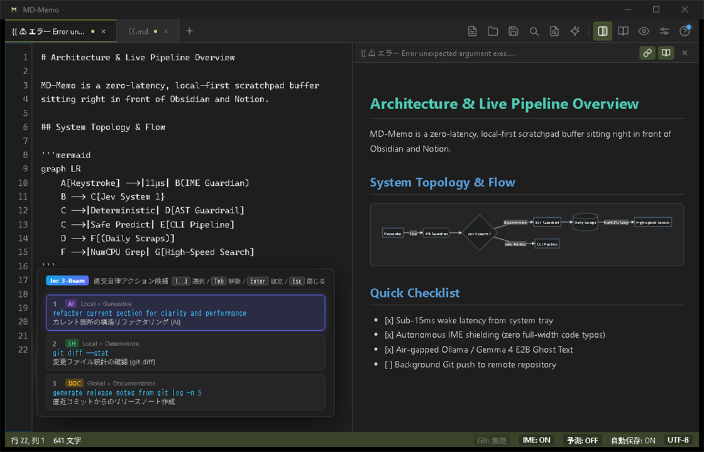
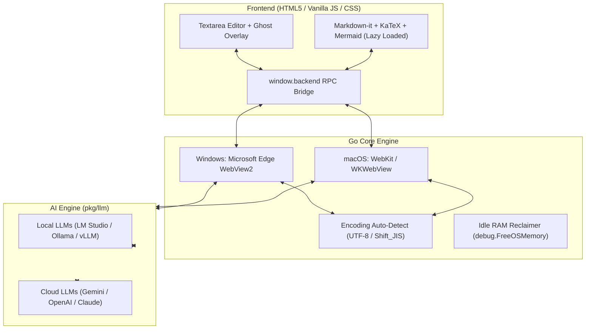

# 📝 MD-Memo

> **Ultra-lightweight, High-speed, AI-Native Markdown & Text Editor for Windows & macOS**  
> Super fast (<0.2s launch), minimal memory footprint (~40MB total, ~3.5MB Go runtime), real-time inline ghost text predictions, context LLM prompting, and one-screen toggle preview with KaTeX & Mermaid.

[](https://github.com/youshinh/md-memo/releases)
[](https://golang.org)
[](#)
[](LICENSE)

**English Documentation** | [🇯🇵 日本語のドキュメントはこちら (Japanese Documentation)](README_JA.md)

---

## 📸 Screenshots

| Editor & Markdown Preview | AI & LLM Settings |
|:---:|:---:|
|  |  |

---

## ✨ Key Features

- ⚡ **Ultra-Fast Startup & Minimal Memory**: Launches in ~0.1s; **reopens instantaneously in 0.01s (zero latency) when background/tray resident**. Normal Working Set footprint of ~40MB (compressed down to ~5-15MB when hidden, Go engine alone uses ~3.5MB).
- 🌐 **Multilingual (i18n)**: English (Default) and Japanese interface with zero-overhead translation.
- 💡 **Inline Predictive Ghost Text**: Copilot-style real-time completions as you type.
  - **Full accept**: Accept seamlessly with <kbd>Tab</kbd> or <kbd>→</kbd>.
  - **Word-by-word accept**: Incrementally accept next word with <kbd>Ctrl</kbd>+<kbd>→</kbd> (Windows/Linux) or <kbd>⌥ Option</kbd>+<kbd>→</kbd> (macOS).
  - Works with local offline LLMs (LM Studio, Ollama, vLLM) and cloud APIs (Gemini, OpenAI, Claude).
  - Smart debounce and IME composition handling to prevent premature triggers.
  - Automatic `<think>` tag stripping and multi-line runaway suppression.
- 🤖 **Context LLM Prompt Mode (`Ctrl+L`)**: Send full document or selection to LLM with custom instructions (Translate, Summarize, Refactor, Fix Bugs, etc.) and insert response directly in-place.
- 👁️ **Gemini Vision OCR (`Ctrl+V`)**: Paste any screenshot or image from clipboard and Gemini Vision automatically converts it into structured, faithful Markdown tables and text.
- 🔄 **1-Screen Toggle Preview (`Ctrl+P`) & Split View (`Ctrl+\`)**:
  - Live preview for both **Markdown** and **HTML files**.
  - GitHub Flavored Markdown (GFM), KaTeX math (`$..$`, `$$..$$`), and Mermaid diagrams.
  - Full HTML document preview with sandboxed CSS/JS style isolation and bidirectional scroll synchronization.
- 📑 **Multi-Tab & Session Persistence**:
  - Temporary auto-save keeps unsaved scratchpads safe.
  - Reopen the app and immediately restore all previous tabs, buffers, and cursor positions (configurable in Settings).
  - Smart 1.5-second debounce autosave for saved files.
- 🔤 **Automatic Encoding Detection**: Preserves and handles UTF-8 and Shift_JIS (CP932) flawlessly.
- 📄 **Export Clean Plain Text (.txt)**: Strips Markdown formatting syntax (`#`, `*`, `[]()`, etc.) into clean plain text.
- 🍏 **Cross-Platform**: Native OS WebView integration on Windows (Edge WebView2) and macOS (WebKit / WKWebView).

---

## 📥 Download & Installation

### 🪟 Windows (x64)

#### Option 1: WinGet Package Manager (Recommended)
Install or update with a single command via Windows Package Manager:
```powershell
winget install youshinh.md-memo
```
> [!TIP]
> To test or install immediately from the local manifest in this repository:
> ```powershell
> winget install --manifest packaging/winget/youshinh.md-memo.yaml
> ```

#### Option 2: Portable Direct Download
1. Download `md-memo-windows-x64.zip` from the [Releases Page](https://github.com/youshinh/md-memo/releases).
2. Extract the zip and launch `md-memo.exe` (Standalone portable single binary, no installer needed).

---

### 🍏 macOS (Apple Silicon / Intel)

#### Option 1: Homebrew Tap (Recommended)
Install with a single command via Homebrew Cask:
```bash
brew install --cask youshinh/tap/md-memo
```
*(Or add the tap first: `brew tap youshinh/tap && brew install --cask md-memo`)*

> [!TIP]
> To test or install directly from the local formula file:
> ```bash
> brew install --cask packaging/homebrew/md-memo.rb
> ```

#### Option 2: Direct App Download
1. Download `md-memo-macos.zip` from the [Releases Page](https://github.com/youshinh/md-memo/releases).
2. Extract the zip, move `MD-Memo.app` to your `/Applications` folder, and open it.

---

## ⚙️ LLM API Setup Guide

Click the **"Settings"** button at the top right (or right-click anywhere for Context Menu) to configure your AI providers.  
You can assign different models for Text Generation, Autocomplete, and Vision OCR independently.

### 1. 🌐 Google Gemini (Google AI Studio)
Ultra-fast and low-latency multimodal LLM. Highly recommended for image OCR and autocomplete.

| Setting | Value |
|---|---|
| **API Base URL** | `https://generativelanguage.googleapis.com/v1beta` |
| **Model Name (Recommended)** | `gemini-flash-latest` (fast & smart) / `gemini-flash-lite-latest` (ultra-fast) / `gemini-pro-latest` |
| **API Key** | Get your free API key at [Google AI Studio](https://aistudio.google.com/) |

---

### 2. 🟢 OpenAI (ChatGPT / GPT-5.6 / o4-mini)
Standard OpenAI API integration.

| Setting | Value |
|---|---|
| **API Base URL** | `https://api.openai.com/v1` |
| **Model Name (Recommended)** | `gpt-5.6-luna` (ultra-fast & lightweight) / `gpt-5.6-sol` (top flagship) / `gpt-5.6-terra` (balanced) / `o4-mini` (deep reasoning) |
| **API Key** | Get your API key (`sk-...`) at [OpenAI Platform](https://platform.openai.com/api-keys) |

---

### 3. 🟣 Anthropic Claude (via LiteLLM / Proxy)
Connect Claude via any OpenAI-compatible proxy (LiteLLM, Cloudflare AI Gateway, One-API).

| Setting | Value |
|---|---|
| **API Base URL** | `http://localhost:4000/v1` (Proxy address) |
| **Model Name (Recommended)** | `claude-sonnet-5` (flagship balanced) / `claude-haiku-4.5` (ultra-fast) / `claude-opus-5` (deep coding & agent) / `claude-fable-5` |
| **API Key** | Proxy key or `sk-ant-...` |

---

### 4. 💻 LM Studio (Free & Offline Local LLM)
Start the LM Studio Local Server. Excellent for zero-cost, private autocomplete ghost text.

| Setting | Value |
|---|---|
| **API Base URL** | `http://localhost:1234/v1` (or LAN IP `http://192.168.x.x:1234/v1`) |
| **Model Name** | Loaded model identifier (e.g. `google/gemma-4-12b-qat`, `prism-ml/bonsai-27b`, `qwen2.5-coder-7b-instruct`) |
| **API Key** | Leave empty or `not-needed` |
| **Autocomplete Config** | Delay: `500` ms / Max tokens: `30`-`50` |

---

### 5. 🦙 Ollama (Free Local LLM)
Direct connection to Ollama server.

| Setting | Value |
|---|---|
| **API Base URL** | `http://localhost:11434` or `http://localhost:11434/v1` |
| **Model Name** | `qwen2.5-coder:7b`, `llama3.3:latest`, `deepseek-r1:8b` |
| **API Key** | Leave empty |

---

### 6. 🚀 vLLM / llama-server / Text Generation WebUI
Compatible with any standard OpenAI `/v1/chat/completions` or `/v1/completions` endpoint.

| Setting | Value |
|---|---|
| **API Base URL** | `http://localhost:8000/v1` |
| **Model Name** | Server model identifier |
| **API Key** | As required by your server |

---

## ⌨️ Keyboard Shortcuts

| Windows / Linux | macOS | Action |
|:---|:---|:---|
| <kbd>Tab</kbd> / <kbd>→</kbd> | <kbd>Tab</kbd> / <kbd>→</kbd> | **Accept full autocomplete suggestion (Ghost Text)** |
| <kbd>Ctrl</kbd> + <kbd>→</kbd> | <kbd>⌥ Option</kbd> + <kbd>→</kbd> | **Accept autocomplete suggestion word-by-word (Word Ghost Accept)** |
| <kbd>Esc</kbd> | <kbd>Esc</kbd> | Dismiss autocomplete suggestion / Close Find bar / Close modal |
| <kbd>Ctrl</kbd> + <kbd>F</kbd> | <kbd>⌘ Cmd</kbd> + <kbd>F</kbd> | **Find in text** (supports Regex, Whole Word, Case Match) |
| <kbd>Ctrl</kbd> + <kbd>H</kbd> | <kbd>⌘ Cmd</kbd> + <kbd>H</kbd> | **Find & Replace** (Replace / Replace All) |
| <kbd>F3</kbd> / <kbd>Shift</kbd>+<kbd>F3</kbd> | <kbd>F3</kbd> / <kbd>Shift</kbd>+<kbd>F3</kbd> | Find next / previous match |
| <kbd>Ctrl</kbd> + <kbd>G</kbd> | <kbd>⌘ Cmd</kbd> + <kbd>G</kbd> | **Go to Line** |
| <kbd>Ctrl</kbd> + <kbd>L</kbd> | <kbd>⌘ Cmd</kbd> + <kbd>L</kbd> | **Open LLM prompt & instruction modal** |
| <kbd>Ctrl</kbd> + <kbd>Enter</kbd> | <kbd>⌘ Cmd</kbd> + <kbd>Enter</kbd> | Send LLM prompt immediately from modal |
| <kbd>Ctrl</kbd> + <kbd>P</kbd> / <kbd>Ctrl</kbd> + <kbd>E</kbd> | <kbd>⌘ Cmd</kbd> + <kbd>P</kbd> / <kbd>⌘ Cmd</kbd> + <kbd>E</kbd> | **Toggle Edit ⇄ Preview mode** |
| <kbd>Ctrl</kbd> + <kbd>\</kbd> | <kbd>⌘ Cmd</kbd> + <kbd>\</kbd> | **Toggle Split View** (Side-by-side Editor & Live Preview) |
| <kbd>Ctrl</kbd> + <kbd>S</kbd> | <kbd>⌘ Cmd</kbd> + <kbd>S</kbd> | Save file (<kbd>Shift</kbd> for Save As) |
| <kbd>Ctrl</kbd> + <kbd>O</kbd> | <kbd>⌘ Cmd</kbd> + <kbd>O</kbd> | Open file (Markdown, JSON, YAML, code files, etc.) |
| <kbd>Ctrl</kbd> + <kbd>N</kbd> / <kbd>Ctrl</kbd> + <kbd>T</kbd> | <kbd>⌘ Cmd</kbd> + <kbd>N</kbd> / <kbd>⌘ Cmd</kbd> + <kbd>T</kbd> | Create new tab |
| <kbd>Ctrl</kbd> + <kbd>W</kbd> | <kbd>⌘ Cmd</kbd> + <kbd>W</kbd> | **Close current tab** (Closing last tab exits application) |
| <kbd>Ctrl</kbd> + <kbd>Tab</kbd> | <kbd>⌃ Control</kbd> + <kbd>Tab</kbd> | Switch to next tab |
| <kbd>Ctrl</kbd> + <kbd>V</kbd> | <kbd>⌘ Cmd</kbd> + <kbd>V</kbd> | Paste (Triggers Gemini Vision OCR automatically on image paste) |
| <kbd>Ctrl</kbd> + <kbd>A</kbd> | <kbd>⌘ Cmd</kbd> + <kbd>A</kbd> | Select all text in editor |
| <kbd>Ctrl</kbd> + <kbd>+</kbd> / <kbd>-</kbd> | <kbd>⌘ Cmd</kbd> + <kbd>+</kbd> / <kbd>-</kbd> | **Zoom in / out** (editor font size) |
| <kbd>Ctrl</kbd> + <kbd>0</kbd> | <kbd>⌘ Cmd</kbd> + <kbd>0</kbd> | Reset zoom to default (14px) |
| <kbd>F5</kbd> | <kbd>F5</kbd> | Insert current timestamp (`YYYY/MM/DD HH:mm:ss`) |

---

## 🛠️ Build from Source

### Prerequisites
- [Go 1.22+](https://golang.org/dl/)

### 🪟 Build on Windows
```powershell
# Clone repository
git clone https://github.com/youshinh/md-memo.git
cd md-memo

# Run tests
go test -v ./...

# Build optimized Windows GUI binary
go build -ldflags="-H windowsgui -s -w" -trimpath -o md-memo.exe .
```

### 🍏 Build on macOS
```bash
# Clone repository
git clone https://github.com/youshinh/md-memo.git
cd md-memo

# Run build script to generate MD-Memo.app bundle
chmod +x build_mac.sh
./build_mac.sh

# Launch App
open MD-Memo.app
```

---

## 📐 Architecture



---

## 📜 License

Distributed under the [MIT License](LICENSE). Free for both personal and commercial use.
