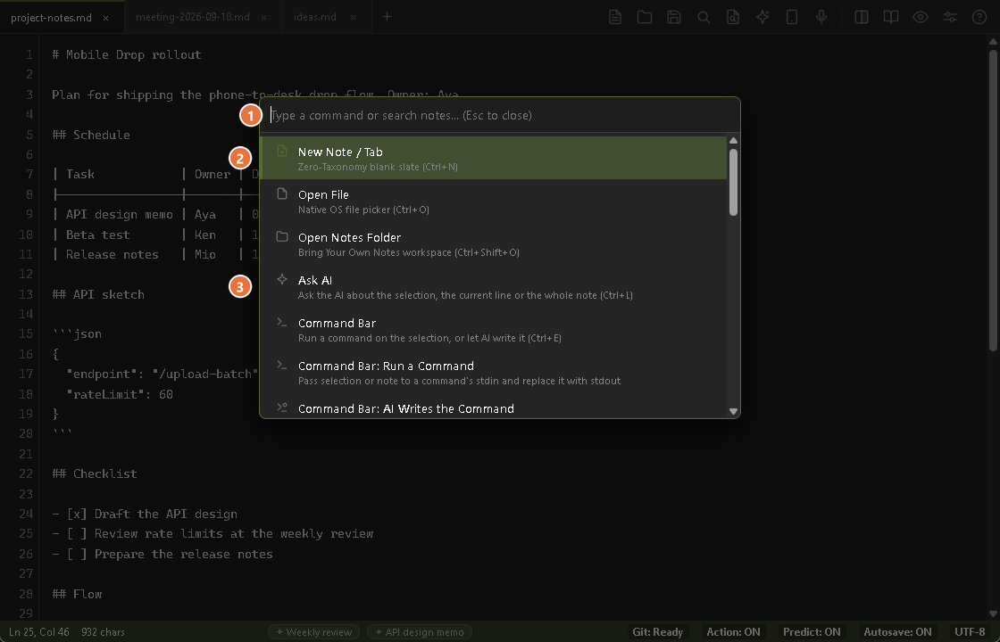
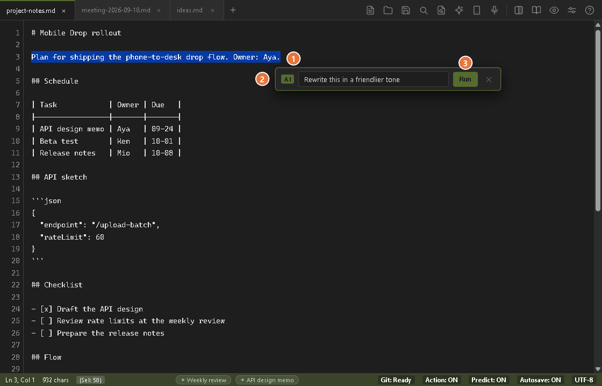
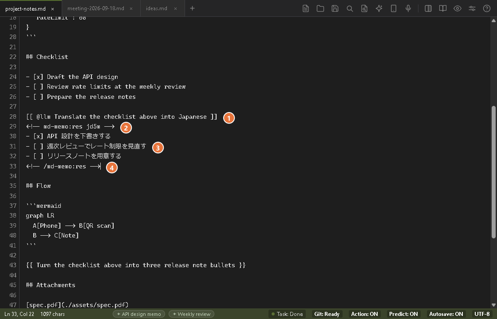

# MD-Memo

> A zero-latency, local-first Markdown scratchpad engineered for instant capture.

[](LICENSE)
[](https://golang.org/)
[](#quick-start)
[](https://youshinh.github.io/md-memo/manual.html)

**MD-Memo** is a high-bandwidth capture instrument that sits quietly in your system tray. Built with a compiled Go core and OS-native webviews, it wakes in milliseconds, manages multilingual IME states autonomously, and vanishes when you're done.

[Official Manual](https://youshinh.github.io/md-memo/manual.html) • [日本語マニュアル](https://youshinh.github.io/md-memo/manual_ja.html) • [Releases](https://github.com/youshinh/md-memo/releases) • [The Scratchpad Paradox](#the-scratchpad-paradox) • [Which One Do I Use?](#which-one-do-i-use) • [Architecture & Capabilities](#architecture--capabilities) • [Programmable Control Hub](#programmable-control-hub--json-rpc-20) • [For AI Agents](#using-md-memo-from-an-ai-agent) • [Quick Start](#quick-start) • [日本語ドキュメント (JA)](README_JA.md)

---

## Visual Showcase

| Live Split View & Mermaid Diagrams (`Ctrl+\`) | Command & Navigation Palette (`Ctrl+Shift+P`) |
|:---:|:---:|
|  |  |

| Ask AI (`Ctrl+L`) | Command Bar (`Ctrl+E`) |
|:---:|:---:|
|  |  |

| Auto Selector (`Ctrl+Enter`) |
|:---:|
|  |

| Parallel Daily Scrap Search (`Ctrl+Shift+F`) | Autonomous Agent & Orchestration Settings |
|:---:|:---:|
|  |  |

---

## The Scratchpad Paradox

Modern knowledge bases (like Obsidian or Notion) are phenomenal for structuring long-term data, but their architectures inherently introduce startup latency and heavy memory footprints. When you need to capture a fleeting thought or pipe an ephemeral error log, a 2-second Electron initialization breaks cognitive momentum.

**MD-Memo is not a replacement for your vault; it is the zero-friction buffer in front of it.**

| Dimension | Standard Text Editor | Knowledge Vaults | MD-Memo |
|---|---|---|---|
| **Architecture** | C++ / Swift | Electron / JVM | **Go 1.26 + OS-Native WebView** |
| **Summon Latency** | ~100ms (Cold) | 2.0s – 5.0s | **< 15ms (from System Tray)** |
| **Idle Memory** | ~15 MB | 400 MB – 800 MB+ | **5 – 15 MB (Aggressive GC)** |
| **Storage Model** | Plain text | Internal DB / Proprietary | **100% Local POSIX Plain Text** |
| **Programmable IPC** | Socket plugin / none | Heavy HTTP plugins | **Zero-latency JSON-RPC 2.0 TCP** |
| **File Dialogs** | OS Native | Node.js IPC wrapper | **Windows: native COM `IFileDialog`. macOS: system file chooser via AppleScript.** |

> **Workflow Tip**: Point MD-Memo directly at your Obsidian Vault, Git repository, or daily log directory to use it as an instant-entry terminal.

---

## Which One Do I Use?

Everything AI-related is organized around three verbs — Write, Run, and Delegate — and each has a single entry point to remember: Ask AI is `Ctrl+L`, the Command Bar is `Ctrl+E`, and Delegate is `Ctrl+Enter`. `Ctrl+Enter` is also the do-what-I-mean key: it reads the line you are on and picks the action, and `Ctrl+J` suggests a next step when you are not sure.

| What you want | Entry point | What it does |
|---|---|---|
| **Write** — fix or draft the text in front of you | Ask AI `Ctrl+L` / `Cmd+L` | The built-in LLM works on your selection (or the current line) and inserts its answer right below it, in seconds |
| **Run** — execute a command | Command Bar `Ctrl+E` / `Cmd+E` (type the command yourself; press `Tab` for AI mode, where you describe it in plain language and the AI writes it) | Pipes your selection through a shell command and adds the output below it (a setting can replace the selection instead) |
| **Delegate** — hand off a whole investigation or implementation, or let one key work out what a line asks | Auto selector: `Ctrl+Enter` / `Cmd+Enter` on a line (or write `{{ @agent instruction }}` yourself) | Decides from the line whether to ask the built-in LLM, hand it to an external agent CLI (which works in the background for minutes) or run a command, and writes the result below the line |
| **Not sure what to do** | `Ctrl+J` / `Cmd+J` | Suggests up to three next steps for what you are writing (Quick Actions) |

*(See the [Official Manual](https://youshinh.github.io/md-memo/manual.html) for the full walkthrough of each)*

---

## Architecture & Capabilities

### 1. Minimal Footprint & Sub-Millisecond Wake
Built to run 24/7 without taxing your system.
- **Instant Summon (`Ctrl+Alt+M` / `Option+Cmd+M`)**: Bypasses heavy rendering pipelines to wake instantly with your cursor exactly where you left it. On Windows this wakes it from the system tray; on macOS, where there is no menu-bar icon, it brings the app forward from the Dock (clicking the Dock icon does the same — quit with `Cmd+Q`).
- **Aggressive Idle Reclamation**: Leverages `debug.FreeOSMemory()` to compress the active working set down to 5–15 MB when the window is minimized or idle.
- **Native OS Dialogs**: Windows uses native COM `IFileDialog` panels; macOS uses the system file chooser via AppleScript. Both keep file operations instantaneous without an Electron-style wrapper.

### 2. Autonomous IME Shield (IME Guardian)
Technical writing in multilingual CJK environments often suffers from IME mode-switching friction. MD-Memo handles this algorithmically:
- **Lexical Scope Protection**: Inside inline code (`` `...` ``), code blocks, and URLs, the editor intercepts full-width characters and forces alphanumeric mode with negligible overhead (~11 µs per keystroke).
- **Phonological Auto-Correction**: Detects Romaji cadence typed in direct input mode and can silently convert it into composition.
- **Powered by LLRT**: Computational linguistics via Log-Likelihood Ratio Testing ensures your typing speed is never compromised.
- **Platform note**: On Windows the Guardian switches the OS input source for you, and it starts on when your system language is Japanese. macOS can't switch the input source automatically yet, so it starts off there.

### 3. Write, Delegate, Suggest — Local-First AI
AI should act as an unobtrusive shadow, not a distracting chat window.
- **Write: Ask AI (`Ctrl+L`)**: Give an instruction about the selection, the current line, or the whole note (when the caret is on a blank line), and the built-in LLM inserts its answer right below it in seconds; your own text is never replaced. `Alt+C` proofreads without needing an instruction at all, and the command palette ships presets for polishing, bullet summaries, and action-item extraction.
- **Ghost Text (the passive form of Write)**: Offline predictive completion powered by your local Ollama, LM Studio, or vLLM instance.
- **Delegate (`{{ instruction }}`, `{{ @agent instruction }}`)**: Hand an instruction written in the note to an external agent CLI (Claude Code, Codex, Hermes, Antigravity, …). Press `Ctrl+Enter` with the caret in the block, or click the **Run** button that appears beside a complete block. It runs in the background and progress shows in the task panel (`Alt+T`). A classic `{{ }}` slot is replaced by the result, as before; a `{{ @agent ... }}` task, named by an `agents.yaml` key or an alias such as `claude` or `cc`, keeps its line and gets the result below it. Notations, agents and aliases are fully customizable in `agents.yaml` (internal name: Slot). With the Auto selector switched off, or on a blank line, `Ctrl+Enter` keeps the classic rule: the slot under the caret, else the next slot after it, else the first slot in the note.
- **Auto selector (`Ctrl+Enter`)**: Press it on a line and fixed local rules (no network) decide what the line asks: an instruction for the built-in LLM, a job for an agent, or a command. Your instruction line stays and the result is written below it, between two comment lines. Because the rules can be wrong, an agent or command request is rewritten first and runs on a second `Ctrl+Enter` (`Ctrl+Z` undoes the rewrite; the confirmation can be turned off), and when the rules are unsure, such as on an ordinary sentence, the Ask AI bar opens and your note is not changed by itself. You can also write `[[ @llm instruction ]]`, `[[ $ command ]]` (checked by the Command Bar's safety guard) or `{{ @agent instruction }}` yourself and insert snippets (type `{{`, use the command palette, or type a short word such as `;sum` and press `Tab`); the automatic decision can be turned off in Settings → Agent.
- **Quick Actions (`Ctrl+J`)**: Suggests up to three next steps based on what you are writing, each mapping to Write, Run, or Delegate. Run a card with `Ctrl+1`–`3` (`Cmd+1`–`3` on macOS), or move with `Ctrl+Tab` and confirm with `Enter`. Click the **Action** badge in the status bar to cycle On → Manual → Off. By default it runs on built-in local rules and nothing from your note leaves your machine; only if you enter an API key or a custom endpoint does it send an excerpt of about 2,000 characters around your caret to an external inference model such as Jev (internal names: System 1 / 3-Beam / MAP-Elites).
- **Deterministic AST Guardrail**: Shell commands offered as suggestions are parsed by an AST safety checker before they run, refusing destructive operations such as `rm -rf /` and writes into protected system directories.
- **Transparent Stream Cleaning**: Automatically strips reasoning tokens (e.g., `<think>` tags from DeepSeek models) before they hit the canvas.

### 4. UNIX Pipeline & CLI Automation
Treat your notes as standard output streams.
- **CLI Standard Input (`cat log | md-memo`)**: Pipe terminal output directly into a running MD-Memo instance via local TCP IPC. Transmits instantly or cold-boots the app if closed.
- **Command Bar (`Ctrl+E`; `Tab` switches CLI / AI mode)**: One bar with two modes, and `Ctrl+E` reopens it in the mode you used last. In CLI mode, feed the selection (or the whole note when nothing is selected) through external utilities (`jq`, `sort`, `tr`, `prettier`, `duckdb`); the output goes right below the selection, which stays (Settings → Agent → Commands can make it replace the selection instead), and, by default, also opens in a result tab; with nothing selected only the result tab opens. In AI mode, describe OS tasks naturally (*"find files modified today"*) and it writes the shell command into the field; the bar then returns to CLI mode so you can check it (a safety check flags risky commands) and press Enter to run it in a background goroutine. Clicking the badge on the bar switches modes too.

### 5. High-Speed Parallel Scrap Search
- **Zero-Allocation Multithreaded Scan**: Uses `runtime.NumCPU()` worker threads and `bufio.Scanner` to execute parallel, in-memory grep matching across your daily scraps (`scraps/YYYY-MM-DD.md`) in <150ms.
- **Debounced Incremental Search**: 150ms debounce ensures fluid typing, while click-to-jump instantly scrolls to the matched line with an ambient UI highlight.

### 6. Background Git Sync
Keep your plain-text data durable and synchronized across machines.
- **Silent Operations**: Automatically runs `git pull --rebase` on launch and debounces `git add/commit/push` after 30 seconds of idle time.
- **Zero-Conflict Setup**: Simply provide an empty GitHub/GitLab repository URL in the settings to establish a bulletproof, automated cloud backup.
- **Settings packages**: Export settings, agent definitions and this project's skills into one `.mdmemopack` file (Settings → Export...) and import it on another PC (Settings → Import...). API keys are left out unless you tick **Include API keys**; agent definitions and skills that would be overwritten are backed up first.

### 7. Mobile Drop — Send From Your Phone (`Ctrl+Shift+U`)
Scan a QR code and push photos, files, a voice note, and text from your phone straight into the active note. No app, no account.

<p align="center"></p>

- **Send tray**: add up to 10 photos/files (60 MB total; per item: image ≤ 20 MB, audio ≤ 25 MB, text file ≤ 2 MB), record a voice note, and type text, then send it all with one **"Send all"** button. Photos are OCR'd, voice notes transcribed, text files appended. Composing on the phone keeps the session alive, so filling a batch never hits the idle timeout below. Each item lands under its own heading, `## Mobile Drop [14:20:05] — <filename>`, and one item that cannot be processed never stops the rest of the batch.
- **Two-way text sharing**: the text selected on the PC (or the clipboard text if nothing is selected) is shown at the top of the phone page with a one-tap copy button (refreshed every 2 seconds, up to 64 KB), and the PC dialog shows what is being shared, truncated to 80 characters.
- **Local by default**: a one-shot server on your LAN (random one-time token, checked before the request body is read; it closes after one submission or 60 seconds without activity). Nothing leaves your network.
- **Photos become text**: pictures are transcribed by the vision model you configured for `Ctrl+V` image OCR (a local Ollama or LM Studio model needs no key). With a cloud model the photo goes to that provider, exactly as with paste.
- **Never lost**: if OCR or transcription is not configured, or fails for any reason (missing API key, unsupported model, empty transcript, network error, timeout), the photo or voice note is saved like a pasted image, into `./assets/` next to the note, and linked (`` for photos, `[name](./assets/...)` for voice notes) with a one-line reason under the link. The reason is written in Japanese in both UI languages, and a toast tells how many items were saved this way. Only if saving the file fails too does an inline `[Mobile Drop: <filename> の処理に失敗しました: <error>]` line appear.
- **Robust on the phone**: right before it hands over to the camera, file picker or recorder app, the page asks the PC to keep the session open for up to 120 seconds longer, so the 60-second idle limit does not end the session while the recorder app is in front. If a send fails it is retried once when the PC session is still alive; otherwise the page says the connection to the PC is gone and asks you to reopen Mobile Drop on the PC and scan the QR code again.
- **Optional location (tunnel only)**: connected through the Cloudflare tunnel (HTTPS), the phone may attach its location once as a single silent attempt, shown only on the first item's heading as `## Mobile Drop [14:20:05] — <filename> (34.693, 135.502)`. Never requested or attached over plain LAN HTTP.
- **Optional outside access**: a button in the dialog switches to a [Cloudflare Quick Tunnel](https://developers.cloudflare.com/cloudflare-one/connections/connect-networks/do-more-with-tunnels/trycloudflare/) for mobile data or another Wi-Fi. It also enables in-page voice recording over the tunnel (plain LAN opens the phone's own recorder instead). It needs `cloudflared` installed, and the transfer then passes through Cloudflare's servers.

### 8. Smart Paste (`Ctrl+V` / `Ctrl+Shift+V`)
Two paste shortcuts, tuned for what is actually on the clipboard.
- **`Ctrl+V` pastes as Markdown**: `text/html` with structure (from a web page, Word, Google Docs or Excel) is converted to Markdown with a built-in converter — headings, lists, tables with alignment, task checkboxes, code blocks, and more — stripping `script`/`style`/`iframe`/`svg` content and `javascript:`/`data:` links for safety. HTML without structure (code and logs copied from an editor or a terminal, a single spreadsheet cell) is pasted as it is. When the clipboard holds an image and nothing else, vision OCR turns it into Markdown/Mermaid; if OCR is switched off or has no API setup, the image is saved to `./assets/` and linked instead (like `Ctrl+Shift+V` and Mobile Drop), and the message says why.
- **`Ctrl+Shift+V` pastes as it is**: plain text with no conversion; an image-only clipboard is saved to `./assets/` (extension follows the image type) and linked in, without OCR. Text alongside an image (as Excel and Word both put there) pastes the text and ignores the image.
- **Settings → General**: "Ctrl+V turns web, Word and Excel content into Markdown" (on by default). Switch it off to get the old split back: `Ctrl+V` plain, `Ctrl+Shift+V` converts.

### 9. Voice Input (`Ctrl+Shift+R`)
Press to record; a marker at the caret shows recording, then transcribing, status. The default model is Google's `gemini-3.5-transcribe`, called through the Interactions API with `store: false`, so Google does not keep your recording or transcript. Older models such as `gemini-2.5-flash` still work through the generateContent path.
- **Start it your way**: the shortcut (`Ctrl+Shift+R` / `Cmd+Shift+R` by default, and configurable in Settings → Shortcuts), the microphone button in the toolbar, the right-click menu, or the command palette. While recording, a small indicator at the bottom left shows the elapsed time; its **Stop** button ends the recording and starts the transcription (the same as pressing the shortcut again), and `Esc` discards it.
- **Settings (Settings → AI Models → Voice input)**: model, API style (Auto / Interactions API / generateContent), language codes (e.g. `ja-JP, en-US`; empty = auto-detect, mixed languages included), mode (Smart removes fillers and tidies the text; Verbatim keeps every word), custom vocabulary, and the silence timeout. The API key and base URL come from the Image OCR settings.
- **Rescue**: if transcription fails, the audio is kept for a one-click retry, save, or discard — even after restarting the app.

### 10. File Links & Drag & Drop
Drop any file onto the editor text to insert a Markdown link at the caret (`` for images, `[name](...)` otherwise), copying it into `./assets/` (up to 25 MB) since the browser cannot see the original path. `Ctrl+Click` opens a link with the OS default app (a web address opens in the browser); `Alt+Click` reveals a file in Explorer/Finder. Every link in the editor is underlined (dotted for an image, which also previews on hover), so you can tell what is clickable; the underline is skipped for very large notes (over 100,000 characters), where Ctrl+Click still works.

### 11. Discord Bridge — Capture From Anywhere, Even While Closed
DM your own Discord bot from your phone; the message lands in today's scrap the next time MD-Memo runs — even if it was closed when you sent it.

- **No hosting, no account beyond the bot**: unlike Mobile Drop, there is nothing to run and nothing to be on the same network for. MD-Memo polls the bot's own DM channel over plain outbound HTTPS on an interval (default 45s); there is no inbound port, no relay, and no Cloudflare/cloud account of any kind — only the free bot you create yourself in the [Discord Developer Portal](https://discord.com/developers/applications), then invite to one server you're in (Discord won't let a bot DM someone it shares no server with — a private server just for this is enough; no slash command, no ongoing bot activity there).
- **Works while closed**: a message sent while MD-Memo isn't running just waits in Discord's own history; the first poll after the next launch catches up on everything since the last one it saw.
- **One person only**: messages are accepted only from the single Discord account you pair (its user ID), matched against the message author on every poll; anything else is silently ignored.
- **Same media pipeline as Mobile Drop**: photos are OCR'd, voice notes transcribed, using the vision/voice settings you already configured; a failure of either falls back to saving the file under `./assets/` with a reason, exactly like Mobile Drop and `Ctrl+V`.
- **Settings → Sync → "Mobile capture via Discord"**: paste the bot token and your Discord user ID, enable it, and press **Test Connection** to confirm before relying on it.

---

## Programmable Control Hub & JSON-RPC 2.0

MD-Memo is fully controllable from external scripts, terminals, Neovim, VS Code, or autonomous AI agents via its built-in JSON-RPC 2.0 TCP server (`127.0.0.1:49152` by default; the port actually in use, and a session token, are written to `ipc-session.json` in the app's config folder).

### CLI Subcommands
`buffer` (`get`, `set`, `append`, `replace`, `replace-selection`), `tab` and `ui` commands drive a running MD-Memo; `jev` and `agent` run standalone. `--json` is supported on every `buffer` subcommand. `--tab <id>` only takes effect for `buffer get` (also with `--selection`) and `buffer replace-selection`; `set`, `append` and `replace` always act on the active tab of the primary pane.

```bash
# 1. Read current active buffer (plain text in a terminal; JSON with a content hash when piped or with --json; --text forces plain text)
md-memo buffer get
md-memo buffer get --json

# 2. Replace buffer atomically with optimistic lock protection
#    (the hash is the first 16 hex characters of the buffer's SHA-256, as returned by `buffer get --json`)
echo "# New Content" | md-memo buffer set --expected-hash a1b2c3d4e5f60718

# 3. Append terminal output to active buffer
echo "- [ ] Next Action Item" | md-memo buffer append

# 4. Selective line/column range replacement
echo "Replaced Text" | md-memo buffer replace --start 2:1 --end 2:15

# 5. Print only the current selection; exits 1 with "no active selection" on stderr if none
md-memo buffer get --selection
md-memo buffer get --selection --json

# 6. Replace the selection with piped text, as one undo step
#    (refuses with a conflict error if the selection changed since it was read)
cat formatted.txt | md-memo buffer replace-selection

# 7. Verify shell command safety against the deterministic AST engine (standalone; exit code 1 when blocked)
md-memo jev verify "git status && npm test"
# [SAFE] Command passed AST validation: git status && npm test
md-memo jev verify --json "rm -rf /"
# {"isSafe": false, "reason": "破壊的コマンド \"rm\" は安全基準により実行を拒否されました (Destructive command blocked)",
#  "command": "rm -rf /", "rule": "destructive", "subject": "rm"}

# 8. Same check, with --mode controlling how seriously a finding is treated:
#    strict (default, one-click paths nobody reviews) / reviewed (a person confirms first) / unattended (hooks)
#    Exit codes: 0 safe, 1 blocked, 2 warning (not known to be destructive, but unverifiable)
md-memo jev verify --mode reviewed "git status"

# 9. Extract only the relevant parts of a Markdown file before handing it to an agent (Headless)
md-memo agent prune --query "authentication bug" --file notes.md
```

---

## Using MD-Memo from an AI Agent

The repository ships an agent skill, [`skills/md-memo/`](https://github.com/youshinh/md-memo/tree/main/skills/md-memo): a source-verified reference of every interface, config file and setup step, so a coding agent can operate MD-Memo, or set it up for you, without guessing. Copy the folder into your agent's skills directory, or just tell the agent to read `skills/md-memo/SKILL.md` first. You can then ask it to configure voice input, OCR, Ollama or Git sync, or to add an agent CLI: it edits `config.json` only while MD-Memo is fully closed, never prints your API keys, and never starts a second instance of your running app.

| What the agent gets | Where it is described |
|---|---|
| **CLI**: `md-memo buffer` (`get`, `set`, `append`, `replace`, `replace-selection`), `tab`, `ui`, plus standalone `jev verify` and `agent prune` | `SKILL.md` and `references/interfaces.md` (section 1) |
| **JSON-RPC 2.0** on `127.0.0.1` (port and session token in `ipc-session.json`): the same operations from code, with error codes and `expected_hash` locking | `references/interfaces.md` (section 2) |
| **Files it may edit**: `config.json` (MD-Memo closed), `agents.yaml`, and the project `.env` used by slot agents, with the full schema and a per-feature checklist with verification commands | `references/setup-guide.md` |
| **Safety rules**: never read or print keys, never start or kill the live instance, always pass `--expected-hash`, treat `ui eval` as full control of the UI, `jev verify` is not a sandbox | `SKILL.md`; symptom-to-fix list in `references/troubleshooting.md` |

Full folder on GitHub: [github.com/youshinh/md-memo/tree/main/skills/md-memo](https://github.com/youshinh/md-memo/tree/main/skills/md-memo).

---

## Quick Start

Distributed as an unbundled, standalone binary with zero installer overhead.

**Requirements**: Windows (x64) with the Microsoft Edge WebView2 Runtime (included with Windows 11), or macOS 10.15 or later. Linux is not supported yet.

### Package Managers

#### Windows
There is no WinGet package yet (a manifest is prepared in `packaging/winget`). Until it is published, install from the release zip (see [Standalone Binaries](#standalone-binaries)); from PowerShell:

```powershell
Invoke-WebRequest https://github.com/youshinh/md-memo/releases/latest/download/md-memo-windows-x64.zip -OutFile md-memo.zip
Expand-Archive md-memo.zip -DestinationPath md-memo
md-memo\md-memo.exe
```

#### macOS
```bash
brew install --cask youshinh/tap/md-memo
```

> **macOS first launch**: releases are ad-hoc signed, not notarized by Apple, so Gatekeeper refuses to open `MD-Memo.app` the first time. On **macOS 15 (Sequoia) or later**, click **Done** in the dialog (not *Move to Trash*), then open **System Settings → Privacy & Security**, scroll down to **Security**, click **Open Anyway** and enter your login password (the button is shown for about an hour after you try to open the app). On macOS 14 or earlier, right-click the app in Finder and choose **Open**. On any version you can instead clear the quarantine flag once, in the folder that holds the app: `xattr -dr com.apple.quarantine "MD-Memo.app"`. Since v1.6.0 the macOS build is a **universal binary** supporting both Apple Silicon and Intel Macs.

### Standalone Binaries
Zero-installer executables are available directly from the [GitHub Releases](https://github.com/youshinh/md-memo/releases) page.

### No Mac? Get a macOS Build from CI
Every push to this repository builds a ready-to-run `MD-Memo.app` on GitHub-hosted macOS runners — useful if you want to test a change without owning a Mac:
1. Push to GitHub (or open the **Actions** tab and run the **CI** workflow manually via **Run workflow**).
2. Open the latest **CI** run → **Artifacts** → download `md-memo-macos-<commit-sha>`.
3. Unzip it, then follow the same first-launch step above (the steps for your macOS version, or `xattr -dr com.apple.quarantine "MD-Memo.app"`) — CI builds are ad-hoc signed the same way release builds are.

---

## Command Palette & Hotkeys

| Action | Windows | macOS |
|---|---|---|
| Global Summon (brings the window forward) | `Ctrl + Alt + M` | `Option + Cmd + M` |
| High-speed Scrap Search | `Ctrl + Shift + F` | `Cmd + Shift + F` |
| Command Palette | `Ctrl + Shift + P` | `Cmd + Shift + P` |
| Ask AI (the answer is inserted below the target) | `Ctrl + L` | `Cmd + L` |
| AI Proofreading & Correction | `Alt + C` | `Cmd + Shift + C` |
| Suggest Quick Actions | `Ctrl + J` | `Cmd + J` |
| Run a Quick Actions Card | `Ctrl + 1` – `3` | `Cmd + 1` – `3` |
| Command Bar (opens in the mode you used last; `Tab` switches CLI / AI mode) | `Ctrl + E` | `Cmd + E` |
| Mobile Drop (send from your phone via QR) | `Ctrl + Shift + U` | `Cmd + Shift + U` |
| Auto Selector (decides from the line: ask the AI, hand it to an agent or run a command; also runs the `{{ }}` slot at the caret) | `Ctrl + Enter` | `Cmd + Enter` |
| Toggle Task Panel | `Alt + T` | `Option + T` |
| Split Editor Right | `Ctrl + \` | `Cmd + \` |
| Preview to the Side | `Ctrl + Alt + V` | `Cmd + Option + V` |
| Paste as it is (plain text, images saved as files; fixed) | `Ctrl + Shift + V` | `Cmd + Shift + V` |
| Voice Input (default; configurable) | `Ctrl + Shift + R` | `Cmd + Shift + R` |
| Open Link | `Ctrl + Click` | `Cmd + Click` |
| Reveal Link (Explorer / Finder) | `Alt + Click` | `Option + Click` |
| Zen Mode | `Shift + F11` | `Ctrl + Cmd + Z` |
| Full Screen | `F11` | `Ctrl + Cmd + F` |
| Accept Ghost Text (Word) | `Ctrl + →` | `Option + →` |
| Insert Date / Time | `F5` | `Cmd + Shift + I` |

Most actions can be rebound in **Settings → Shortcuts**: click the key button, then press the new combination. A combination already used by another action asks before it is overwritten, reserved combinations are refused, `Backspace` clears a key (the action then does nothing), and **Reset to Defaults** restores everything. Fixed and not rebindable: Paste as it is `Ctrl+Shift+V`, Auto Selector `Ctrl+Enter`, Task Panel `Alt+T`, Preview to the Side `Ctrl+Alt+V`, Ghost Text word `Ctrl+→`, Quick Actions cards `Ctrl+1`–`3`, and `Ctrl+Click` / `Alt+Click` on links.

*(See complete interactive shortcuts guide in the [Official Manual](https://youshinh.github.io/md-memo/manual.html))*

---

## System Topology

```text
[ Frontend: Monospaced Canvas / Ghost Overlay / Scrap Search UI / Split View ]
                                      ▲
                                      │ Bi-directional RPC Bridge
                                      ▼
[ Core Engine: Go 1.26 / OS Native WebView (WebView2 · WKWebView) ]
       │
       ├─► Programmable JSON-RPC 2.0 TCP Server (127.0.0.1:49152 / ipc-session.json)
       │    ├─► buffer.get / set / append / replace (Optimistic Locking)
       │    ├─► buffer.get_selection / replace_selection
       │    ├─► tab.list / switch
       │    └─► ui.toggle_split / activate / eval
       │
       ├─► Jev Autonomous Action Architecture
       │    ├─► System 1 Predictive Action Bar (3-Beam Contextual)
       │    ├─► Deterministic AST Guardrail (ASTCommandVerifier)
       │    └─► MAP-Elites Behavioral Diversity Selector
       │
       ├─► Local & Cloud AI Inference
       │    ├─► Air-gapped Ollama / Gemma 4 E2B One-Click Integration
       │    ├─► Gemini Flash Lite Vision OCR (Clipboard Paste Ctrl+V)
       │    └─► OpenRouter & OpenAI-compatible Endpoints
       │
       ├─► High-Speed Storage & Search
       │    ├─► Daily Scraps Aggregator (scraps/YYYY-MM-DD.md)
       │    ├─► Parallel Grep Engine (runtime.NumCPU() Worker Pool)
       │    └─► Background Git Sync (Silent Rebase & Idle Commit/Push)
       │
       ├─► Autonomous IME Guardian (Lexical Scope Alphanumeric Shield)
       └─► Aggressive Memory Reclaimer (debug.FreeOSMemory() -> 5-15MB idle)
```

---

## Documentation & Manuals

- [Official User Manual (EN)](https://youshinh.github.io/md-memo/manual.html)
- [公式マニュアル・詳細設定ガイド (JA)](https://youshinh.github.io/md-memo/manual_ja.html)

---

## License

Distributed under the [MIT License](LICENSE). Free for personal and commercial use.
