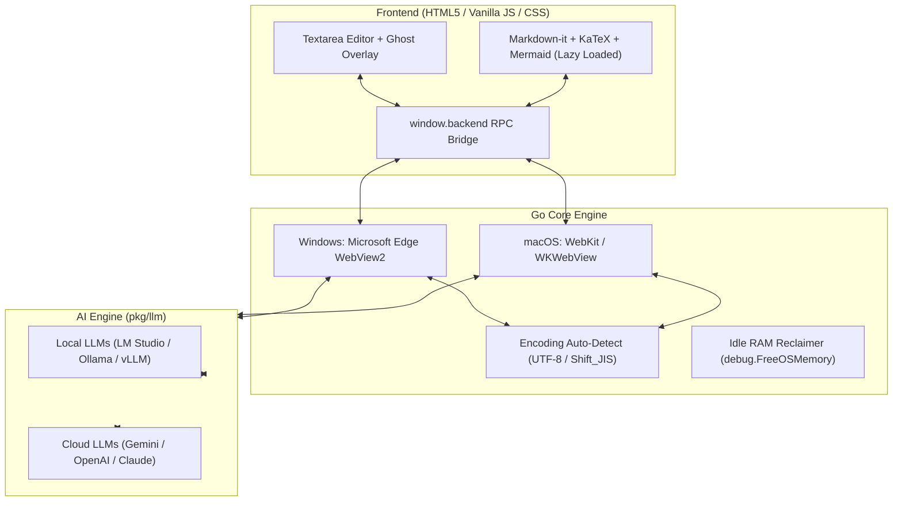

# 📝 MD-Memo

> **The speed of Notepad (<0.01s), the intelligence of Copilot, completely local.**  
> An ultra-lightweight, native-backed Markdown scratchpad that never interrupts your train of thought.

[](https://github.com/youshinh/md-memo/releases)
[](https://golang.org)
[](#)
[](LICENSE)

**English Documentation** | [🇯🇵 日本語のドキュメントはこちら (Japanese Documentation)](README_JA.md)

---

## 💡 Why MD-Memo?

We all love modern tools like Obsidian, VS Code, and Notion. But when an idea flashes through your mind, you shouldn't have to wait 3 seconds for a heavy Electron app to load, pick a vault, or navigate cloud databases.

Yet, traditional scratchpads (like Notepad.exe or TextEdit) lack the tools modern writers and engineers need: **AI autocomplete, Mermaid diagrams, Math equations, and Markdown preview.**

| | Notepad / TextEdit | VS Code / Obsidian | **MD-Memo** |
| :--- | :---: | :---: | :---: |
| **Startup Speed** | ⚡ Instant (<0.1s) | ⏳ Slow (2–5s) | ⚡ **Instant (0.01s background / <0.1s cold)** |
| **RAM Consumption**| ~15 MB | ~300–800 MB (Electron) | 🍃 **~40 MB (compressed to 5–15 MB)** |
| **Offline Local AI** | ❌ None | ⚠️ Heavy Plugins | ✅ **Native Ghost Text (Ollama/LM Studio)** |
| **Markdown / KaTeX / Mermaid**| ❌ Plain text only | ✅ Supported | ✅ **1-Key Split Preview (`Ctrl+\`)** |
| **Image-to-Table OCR** | ❌ None | ❌ Manual typing | ✅ **Paste & Convert (`Ctrl+V`)** |
| **Data Sovereign** | ✅ Local | ⚠️ Vault / Cloud Sync | ✅ **100% Plain Text / Local Files** |

**MD-Memo gives you the best of both worlds**: A native Go core (~3.5MB runtime) + native OS WebView engine (Edge WebView2 / WebKit) that acts as a frictionless, transparent vessel for your thinking speed.

---

## 📸 See It in Action

| Live Split View & Mermaid 11 Diagrams (<kbd>Ctrl+\</kbd>) | Quick Pick Command & Search Palette (<kbd>Ctrl+Shift+P</kbd>) |
|:---:|:---:|
|  |  |

| In-Place AI Prompt Bar (<kbd>Ctrl+K</kbd>) | AI Models & Themes Configuration (Local & Cloud) |
|:---:|:---:|
|  |  |

---

## ⚡ 3 Killer Features That Set MD-Memo Apart

### 1. 🚀 Zero-Latency Native Engine (<0.01s Reopen, ~40MB RAM)
- **No Electron bloat**: Powered by a compiled Go backend (~3.5MB runtime) and native OS WebViews (Edge WebView2 on Windows, WKWebView on macOS).
- **Instant Scratchpad**: Kept resident in the system tray, it restores in **0.01 seconds** with zero input lag. Idle RAM reclaimer automatically compresses memory down to **5–15MB**.
- **Native OS Dialogs**: Blazing-fast Windows COM `IFileDialog` and macOS open/save panels with zero PowerShell overhead and instant response.

### 2. 🧠 Private & Offline Ghost Autocomplete (Copilot-Style)
- **Real-time inline predictions** as you write. Press <kbd>Tab</kbd> or <kbd>→</kbd> to accept all, or <kbd>Ctrl</kbd>+<kbd>→</kbd> (<kbd>⌥ Option</kbd>+<kbd>→</kbd> on macOS) to accept word-by-word.
- **100% Offline & Private**: Seamlessly connects to local LLMs via **Ollama, LM Studio, or vLLM** (Qwen 2.5, Gemma 2, Llama 3) with zero API costs and total privacy. Also supports Gemini, OpenAI, and Claude.
- **Thoughtful Polish**: Intelligent debounce and IME composition handling prevent premature triggers; `<think>` reasoning tags and runaway newlines are automatically stripped.

### 3. 🎯 Effortless Multimodal Input (Frictionless Capture)
- **Screenshot to Markdown Table (`Ctrl+V`)**: Simply paste an image from your clipboard. Powered by Gemini Vision OCR, it automatically transcribes tables, documents, and whiteboard sketches directly into clean Markdown text.
- **Text to Mermaid 11 Diagram**: Highlight rough bullet points or notes, hit right-click or prompt bar, and watch it transform into sequence diagrams, flowcharts, or mindmaps with full <kbd>Ctrl+Z</kbd> Undo support.
- **Mermaid to Infographic Image**: Turn diagrams into publication-ready modern vector visuals via Gemini 3.1 (`gemini-3.1-flash-lite-image` / Imagen 3) with automatic local preview resolution.

---

## 📦 Everything Else You Need

- 🔄 **1-Screen Toggle (`Ctrl+P`) & Split View (`Ctrl+\`)**: Live GFM, KaTeX math (`$...$`, `$$...$$`), Mermaid 11 diagrams, and sandboxed HTML preview with synchronized scrolling.
- 📑 **Session & Buffer Persistence & Tab Drag Reordering**: Never lose a thought. Unsaved scratchpads are automatically preserved. Easily reorder tabs via smooth pointer-based drag-and-drop.
- 🗂️ **Workspace Folder & Direct File Drag-Drop**: Open entire workspace folders with fast non-blocking scanning, or drop text/markdown files directly into the window. Smart filename derivation extracts clean titles from note content upon saving.
- 🔤 **Smart Encoding**: Flawless UTF-8 and Shift_JIS (CP932) auto-detection and preservation.
- 📄 **Clean Plain Text Export**: One-click strip formatting to clean `.txt` for legacy systems or pure copy-pasting.
- ⌨️ **Fully Customizable Shortcuts & Window Controls**: Rebind all keyboard shortcuts in Settings, toggle Fullscreen / Maximize (<kbd>F11</kbd>), Zen Focus mode (<kbd>Ctrl+Shift+Z</kbd>), command palette (<kbd>Ctrl+Shift+P</kbd>), and global restore hotkey (<kbd>Ctrl+Alt+M</kbd>).
- 🛡️ **4-Layer IME Guardian & Instant AI Typo Fix**: Real-time Romaji-to-Hiragana auto-conversion when typing Japanese with IME off, and instant 1-click AI correction (<kbd>Alt+C</kbd>).
- 🌌 **Subtle Cursor Aura (Ambient Affordance)**: Gently brightens around the cursor when paused, naturally guiding your focus without distraction.
- 🌐 **Zero-Overhead Multilingual (i18n)**: Seamless English (Default) and Japanese interface.

---

## 📥 Download & Installation

### 🪟 Windows (x64)

#### Option 1: WinGet Package Manager (Recommended)
Install or update with a single command via Windows Package Manager:
```powershell
winget install youshinh.md-memo
```
> [!TIP]
> To test or install immediately from the local manifest in this repository:
> ```powershell
> winget install --manifest packaging/winget/youshinh.md-memo.yaml
> ```

#### Option 2: Portable Direct Download
1. Download `md-memo-windows-x64.zip` from the [Releases Page](https://github.com/youshinh/md-memo/releases).
2. Extract the zip and launch `md-memo.exe` (Standalone portable single binary, no installer needed).

---

### 🍏 macOS (Apple Silicon / Intel)

#### Option 1: Homebrew Tap (Recommended)
Install with a single command via Homebrew Cask:
```bash
brew install --cask youshinh/tap/md-memo
```
*(Or add the tap first: `brew tap youshinh/tap && brew install --cask md-memo`)*

> [!TIP]
> To test or install directly from the local formula file:
> ```bash
> brew install --cask packaging/homebrew/md-memo.rb
> ```

#### Option 2: Direct App Download
1. Download `md-memo-macos.zip` from the [Releases Page](https://github.com/youshinh/md-memo/releases).
2. Extract the zip, move `MD-Memo.app` to your `/Applications` folder, and open it.

---

## ⚙️ LLM API Setup Guide

Click the **"Settings"** button at the top right (or right-click anywhere for Context Menu) to configure your AI providers.  
You can assign different models for Text Generation, Autocomplete, and Vision OCR independently.

### 1. 🌐 Google Gemini (Google AI Studio)
Ultra-fast and low-latency multimodal LLM. Highly recommended for text generation, autocomplete, image OCR, and diagram image generation.

| Setting | Value |
|---|---|
| **API Base URL** | `https://generativelanguage.googleapis.com/v1beta` |
| **Model Name (Text & Vision)** | `gemini-flash-latest` (fast & smart) / `gemini-flash-lite-latest` (ultra-fast) / `gemini-pro-latest` |
| **Model Name (Image Generation)** | `gemini-3.1-flash-lite-image` (cutting-edge lightweight visual generation) / `imagen-3.0-generate-002` |
| **API Key** | Get your free API key at [Google AI Studio](https://aistudio.google.com/) |

---

### 2. 🟢 OpenAI (ChatGPT / GPT-5.6 / o4-mini)
Standard OpenAI API integration.

| Setting | Value |
|---|---|
| **API Base URL** | `https://api.openai.com/v1` |
| **Model Name (Recommended)** | `gpt-5.6-luna` (ultra-fast & lightweight) / `gpt-5.6-sol` (top flagship) / `gpt-5.6-terra` (balanced) / `o4-mini` (deep reasoning) |
| **API Key** | Get your API key (`sk-...`) at [OpenAI Platform](https://platform.openai.com/api-keys) |

---

### 3. 🟣 Anthropic Claude (via LiteLLM / Proxy)
Connect Claude via any OpenAI-compatible proxy (LiteLLM, Cloudflare AI Gateway, One-API).

| Setting | Value |
|---|---|
| **API Base URL** | `http://localhost:4000/v1` (Proxy address) |
| **Model Name (Recommended)** | `claude-sonnet-5` (flagship balanced) / `claude-haiku-4.5` (ultra-fast) / `claude-opus-5` (deep coding & agent) / `claude-fable-5` |
| **API Key** | Proxy key or `sk-ant-...` |

---

### 4. 💻 LM Studio (Free & Offline Local LLM)
Start the LM Studio Local Server. Excellent for zero-cost, private autocomplete ghost text.

| Setting | Value |
|---|---|
| **API Base URL** | `http://localhost:1234/v1` (or LAN IP `http://192.168.x.x:1234/v1`) |
| **Model Name** | Loaded model identifier (e.g. `google/gemma-4-12b-qat`, `prism-ml/bonsai-27b`, `qwen2.5-coder-7b-instruct`) |
| **API Key** | Leave empty or `not-needed` |
| **Autocomplete Config** | Delay: `500` ms / Max tokens: `30`-`50` |

---

### 5. 🦙 Ollama (Free Local LLM)
Direct connection to Ollama server.

| Setting | Value |
|---|---|
| **API Base URL** | `http://localhost:11434` or `http://localhost:11434/v1` |
| **Model Name** | `qwen2.5-coder:7b`, `llama3.3:latest`, `deepseek-r1:8b` |
| **API Key** | Leave empty |

---

### 6. 🚀 vLLM / llama-server / Text Generation WebUI
Compatible with any standard OpenAI `/v1/chat/completions` or `/v1/completions` endpoint.

| Setting | Value |
|---|---|
| **API Base URL** | `http://localhost:8000/v1` |
| **Model Name** | Server model identifier |
| **API Key** | As required by your server |

---

## ⌨️ Keyboard Shortcuts

| <kbd>F11</kbd> | <kbd>F11</kbd> | **Toggle Fullscreen / Window Maximize** |
| <kbd>Ctrl</kbd> + <kbd>Shift</kbd> + <kbd>Z</kbd> | <kbd>⌘ Cmd</kbd> + <kbd>Shift</kbd> + <kbd>Z</kbd> | **Toggle Zen Focus Mode** (hides toolbar & status bar) |
| <kbd>Tab</kbd> / <kbd>→</kbd> | <kbd>Tab</kbd> / <kbd>→</kbd> | **Accept full autocomplete suggestion (Ghost Text)** |
| <kbd>Ctrl</kbd> + <kbd>→</kbd> | <kbd>⌥ Option</kbd> + <kbd>→</kbd> | **Accept autocomplete suggestion word-by-word (Word Ghost Accept)** |
| <kbd>Esc</kbd> | <kbd>Esc</kbd> | **Cancel composition / Dismiss autocomplete suggestion / Close search bar or modal** |
| <kbd>Alt</kbd> + <kbd>C</kbd> | <kbd>⌥ Option</kbd> + <kbd>C</kbd> | **AI Typo & Input Correction (Instant fix selection or current line)** |
| <kbd>Ctrl</kbd> + <kbd>Alt</kbd> + <kbd>M</kbd> | <kbd>⌃</kbd> + <kbd>⌥</kbd> + <kbd>M</kbd> | **Restore / Bring window to front from anywhere (Global Hotkey)** |
| <kbd>Ctrl</kbd> + <kbd>F</kbd> | <kbd>⌘ Cmd</kbd> + <kbd>F</kbd> | **Find in text** (supports Regex, Whole Word, Case Match) |
| <kbd>Ctrl</kbd> + <kbd>H</kbd> | <kbd>⌘ Cmd</kbd> + <kbd>H</kbd> | **Find & Replace** (Replace / Replace All) |
| <kbd>F3</kbd> / <kbd>Shift</kbd>+<kbd>F3</kbd> | <kbd>F3</kbd> / <kbd>Shift</kbd>+<kbd>F3</kbd> | Find next / previous match |
| <kbd>Ctrl</kbd> + <kbd>G</kbd> | <kbd>⌘ Cmd</kbd> + <kbd>G</kbd> | **Go to Line** |
| <kbd>Ctrl</kbd> + <kbd>K</kbd> | <kbd>⌘ Cmd</kbd> + <kbd>K</kbd> | **Open inline AI prompt bar (quick instruction on selection)** |
| <kbd>Ctrl</kbd> + <kbd>L</kbd> | <kbd>⌘ Cmd</kbd> + <kbd>L</kbd> | **Open LLM prompt & instruction modal (with target preview)** |
| <kbd>Ctrl</kbd> + <kbd>Enter</kbd> | <kbd>⌘ Cmd</kbd> + <kbd>Enter</kbd> | Send LLM prompt immediately from modal |
| <kbd>Ctrl</kbd> + <kbd>P</kbd> / <kbd>Ctrl</kbd> + <kbd>E</kbd> | <kbd>⌘ Cmd</kbd> + <kbd>P</kbd> / <kbd>⌘ Cmd</kbd> + <kbd>E</kbd> | **Toggle Edit ⇄ Preview mode** |
| <kbd>Ctrl</kbd> + <kbd>\</kbd> | <kbd>⌘ Cmd</kbd> + <kbd>\</kbd> | **Toggle Split View** (Side-by-side Editor & Live Preview) |
| <kbd>Ctrl</kbd> + <kbd>S</kbd> | <kbd>⌘ Cmd</kbd> + <kbd>S</kbd> | Save file (<kbd>Shift</kbd> for Save As) |
| <kbd>Ctrl</kbd> + <kbd>O</kbd> | <kbd>⌘ Cmd</kbd> + <kbd>O</kbd> | Open file (Markdown, JSON, YAML, code files, etc.) |
| <kbd>Ctrl</kbd> + <kbd>N</kbd> / <kbd>Ctrl</kbd> + <kbd>T</kbd> | <kbd>⌘ Cmd</kbd> + <kbd>N</kbd> / <kbd>⌘ Cmd</kbd> + <kbd>T</kbd> | Create new tab |
| <kbd>Ctrl</kbd> + <kbd>W</kbd> | <kbd>⌘ Cmd</kbd> + <kbd>W</kbd> | **Close current tab** (Closing last tab exits application) |
| <kbd>Ctrl</kbd> + <kbd>Tab</kbd> | <kbd>⌃ Control</kbd> + <kbd>Tab</kbd> | Switch to next tab |
| <kbd>Ctrl</kbd> + <kbd>V</kbd> | <kbd>⌘ Cmd</kbd> + <kbd>V</kbd> | Paste (Triggers Gemini Vision OCR automatically on image paste) |
| <kbd>Ctrl</kbd> + <kbd>A</kbd> | <kbd>⌘ Cmd</kbd> + <kbd>A</kbd> | Select all text in editor |
| <kbd>Ctrl</kbd> + <kbd>+</kbd> / <kbd>-</kbd> | <kbd>⌘ Cmd</kbd> + <kbd>+</kbd> / <kbd>-</kbd> | **Zoom in / out** (editor font size) |
| <kbd>Ctrl</kbd> + <kbd>0</kbd> | <kbd>⌘ Cmd</kbd> + <kbd>0</kbd> | Reset zoom to default (14px) |
| <kbd>F5</kbd> | <kbd>F5</kbd> | Insert current timestamp (`YYYY/MM/DD HH:mm:ss`) |

> [!TIP]
> All in-app shortcuts can be customized under **Settings (`⚙️`) > Shortcuts** tab! Right-click context menus and tooltips automatically synchronize with your custom shortcuts.

---

## 🛠️ Build from Source

### Prerequisites
- [Go 1.22+](https://golang.org/dl/)

### 🪟 Build on Windows
```powershell
# Clone repository
git clone https://github.com/youshinh/md-memo.git
cd md-memo

# Run tests
go test -v ./...

# Build optimized Windows GUI binary
go build -ldflags="-H windowsgui -s -w" -trimpath -o md-memo.exe .
```

### 🍏 Build on macOS
```bash
# Clone repository
git clone https://github.com/youshinh/md-memo.git
cd md-memo

# Run build script to generate MD-Memo.app bundle
chmod +x build_mac.sh
./build_mac.sh

# Launch App
open MD-Memo.app
```

---

## 📐 Architecture



---

## 📜 License

Distributed under the [MIT License](LICENSE). Free for both personal and commercial use.
