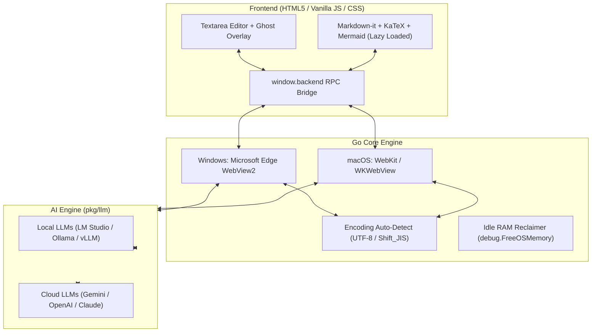

# 📝 MD-Notepad

> **超軽量・超高速起動の AI ネイティブ マークダウン & テキストエディタ**  
> **Ultra-lightweight, High-speed, AI-native Markdown & Text Editor for Windows & macOS**

[](https://github.com/youshinh/md-notepad/releases)
[](https://golang.org)
[](#)
[](LICENSE)

---

## ✨ 主な特徴 (Key Features)

- ⚡ **超高速起動 & 極小メモリ**: 起動時間 0.2秒以下、常駐メモリ（Working Set）約 40MB（Goランタイム単体は約 3.5MB）。
- 💡 **インライン入力予測（Ghost Text）**: GitHub Copilot 感覚で次の文章やアイデアをリアルタイム補完（`Tab` または `→` キーで確定）。
  - ローカルLLM（LM Studio / Ollama / vLLM）およびクラウドLLM（Gemini / OpenAI）に対応。
  - 日本語 IME 変換中の誤送信を防止するスマートデバウンス制御。
  - `<think>` 思考タグの自動ストリップ & 次行暴走の自動カット。
- 🤖 **コンテキスト LLM 指示モード (`Ctrl+L`)**: 選択範囲や全文に対して「要約して」「日本語に翻訳して」「コードをリファクタして」等の指示をワンタップで送信・インライン挿入。
- 👁️ **Gemini 画像 OCR (`Ctrl+V`)**: スクリーンショットや画像をエディタにペーストするだけで、Gemini Vision が自動で高精度マークダウンテキストに書き起こし。
- 🔄 **1画面トグルプレビュー (`Ctrl+P`)**:
  - GFM マークダウンレンダリング
  - KaTeX 数式表示（インライン `$..$`、ブロック `$$..$$`）
  - Mermaid ダイアグラム描画（フローチャート、シーケンス図、ガントチャート等）
- 📑 **マルチタブ & 自動保存**: 複数ファイルを同時に作業可能。1.5秒入力停止時のスマート自動保存。
- 🔤 **文字コード自動判別 & 保持**: UTF-8 および Shift_JIS（CP932）を自動検出・そのまま保存。
- 📄 **装飾なしテキスト (.txt) エクスポート**: マークダウン記号（`#`, `*`, `[]()`等）を自動除去してクリーンなプレーンテキストで保存。
- 🍏 **クロスプラットフォーム対応**: Windows（Edge WebView2）および macOS（WebKit / WKWebView）両対応。

---

## 📥 ダウンロード & インストール (Download)

### 🪟 Windows の場合
1. [Releases ページ](https://github.com/youshinh/md-notepad/releases) から最新の `md-notepad-windows-x64.zip` をダウンロードします。
2. zip ファイルを展開し、`md-notepad.exe` を実行するだけですぐに使えます（インストーラー不要・単一バイナリ）。

### 🍏 macOS の場合
1. [Releases ページ](https://github.com/youshinh/md-notepad/releases) から `md-notepad-macos.zip` をダウンロードして展開するか、後述のソースコードからビルドします。
2. `MD-Notepad.app` を「アプリケーション」フォルダに移動して起動します。

---

## ⚙️ LLM API 設定ガイド (LLM Configuration)

画面右上の **「設定」** ボタン（または右クリックメニュー）から、利用したい LLM サービスを設定できます。  
テキスト生成用・入力予測用・画像解析用でそれぞれお好みのモデルを自由に割り当て可能です。

### 1. 🌐 Google Gemini (Google AI Studio)
最も低遅延かつ高精度なマルチモーダル対応モデルです。画像貼り付け OCR にも推奨されます。

| 項目 | 設定値例 |
|---|---|
| **API Base URL** | `https://generativelanguage.googleapis.com/v1beta` |
| **モデル名 (推奨)** | `gemini-2.5-flash` / `gemini-2.5-pro` / `gemini-flash-latest` |
| **API キー** | [Google AI Studio](https://aistudio.google.com/) で取得した API キー |

---

### 2. 🟢 OpenAI (ChatGPT / GPT-4o)
OpenAI の公式 API を利用する場合の設定です。

| 項目 | 設定値例 |
|---|---|
| **API Base URL** | `https://api.openai.com/v1` |
| **モデル名 (推奨)** | `gpt-4o-mini` / `gpt-4.1-mini` / `gpt-4o` / `o3-mini` |
| **API キー** | [OpenAI API Keys](https://platform.openai.com/api-keys) で取得した API キー (`sk-...`) |

---

### 3. 🟣 Anthropic Claude (via LiteLLM / OpenAI Proxy)
LiteLLM、Cloudflare AI Gateway、または One-API などの OpenAI 互換プロキシを経由して Claude を使用します。

| 項目 | 設定値例 |
|---|---|
| **API Base URL** | `http://localhost:4000/v1` (LiteLLM プロキシのアドレス) |
| **モデル名 (推奨)** | `claude-3-7-sonnet` / `claude-3-5-sonnet` / `claude-3-5-haiku` |
| **API キー** | プロキシに設定したキー、または `sk-ant-...` |

---

### 4. 💻 LM Studio (完全無料・オフライン ローカルLLM)
LM Studio の「Local Server」を起動して接続します。入力予測（Ghost Text）でコストを気にせず高速補完したい場合に最適です。

| 項目 | 設定値例 |
|---|---|
| **API Base URL** | `http://localhost:1234/v1` (LAN内別PCの場合は `http://192.168.x.x:1234/v1`) |
| **モデル名** | LM Studio でロードした識別子 (例: `google/gemma-4-12b-qat`, `prism-ml/bonsai-27b`, `qwen2.5-coder-7b-instruct`) |
| **API キー** | 空欄または `not-needed` |
| **入力予測設定** | 遅延: `500` ms / 最大トークン: `30`〜`50` |

---

### 5. 🦙 Ollama (完全無料・ローカルLLM)
Ollama が起動している環境であれば、直接または OpenAI 互換エンドポイントで接続可能です。

| 項目 | 設定値例 |
|---|---|
| **API Base URL** | `http://localhost:11434` (Ollamaネイティブ) または `http://localhost:11434/v1` |
| **モデル名** | `qwen2.5-coder:7b`, `llama3.3:latest`, `deepseek-r1:8b` |
| **API キー** | 空欄 |

---

### 6. 🚀 vLLM / llama-server / Text Generation WebUI
OpenAI 互換のローカル推論サーバー全般に対応しています。

| 項目 | 設定値例 |
|---|---|
| **API Base URL** | `http://localhost:8000/v1` |
| **モデル名** | サーバー側でロードしているモデル名 |
| **API キー** | 設定されている場合は入力、なければ空欄 |

---

## ⌨️ キーボードショートカット一覧 (Keyboard Shortcuts)

| ショートカット | 機能 |
|---|---|
| <kbd>Tab</kbd> / <kbd>→</kbd> | **入力予測（ゴーストテキスト）を確定・挿入** |
| <kbd>Esc</kbd> | 入力予測候補を破棄 / モーダルを閉じる |
| <kbd>Ctrl</kbd> + <kbd>L</kbd> | **LLM への送信・指示モーダルを開く** |
| <kbd>Ctrl</kbd> + <kbd>Enter</kbd> | LLM 指示モーダルから即時送信 |
| <kbd>Ctrl</kbd> + <kbd>P</kbd> / <kbd>Ctrl</kbd> + <kbd>E</kbd> | **編集 ⇄ プレビュー表示切替** |
| <kbd>Ctrl</kbd> + <kbd>S</kbd> | 上書き保存（<kbd>Shift</kbd> 同時押しで「名前を付けて保存」） |
| <kbd>Ctrl</kbd> + <kbd>O</kbd> | ファイルを開く（Markdown, JSON, YAML, 各種ソースコード等） |
| <kbd>Ctrl</kbd> + <kbd>N</kbd> / <kbd>Ctrl</kbd> + <kbd>T</kbd> | 新規タブを作成 |
| <kbd>Ctrl</kbd> + <kbd>W</kbd> | 現在のタブを閉じる |
| <kbd>Ctrl</kbd> + <kbd>Tab</kbd> | 次のタブに切り替え |
| <kbd>Ctrl</kbd> + <kbd>V</kbd> | 貼り付け（画像をペーストした場合は自動で Gemini OCR 実行） |
| <kbd>F5</kbd> | カーソル位置に現在日時（`YYYY/MM/DD HH:mm:ss`）を挿入 |

---

## 🛠️ ソースコードからのビルド方法 (Build from Source)

### 前提条件 (Prerequisites)
- [Go 1.22+](https://golang.org/dl/) がインストールされていること

### 🪟 Windows でのビルド
```powershell
# クローン
git clone https://github.com/youshinh/md-notepad.git
cd md-notepad

# テストの実行
go test -v ./...

# Windows GUI アプリとしてビルド (コンソール非表示・最適化)
go build -ldflags="-H windowsgui -s -w" -trimpath -o md-notepad.exe .
```

### 🍏 macOS でのビルド
```bash
# クローン
git clone https://github.com/youshinh/md-notepad.git
cd md-notepad

# ビルドスクリプトを実行 (MD-Notepad.app が生成されます)
chmod +x build_mac.sh
./build_mac.sh

# アプリを起動
open MD-Notepad.app
```

---

## 📐 アーキテクチャ (Architecture)



---

## 📜 ライセンス (License)

本ソフトウェアは [MIT License](LICENSE) のもとで公開されています。商用・非商用問わず自由にご利用いただけます。
