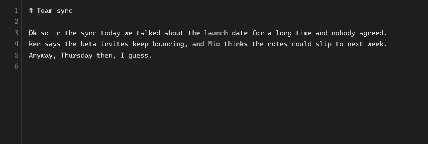
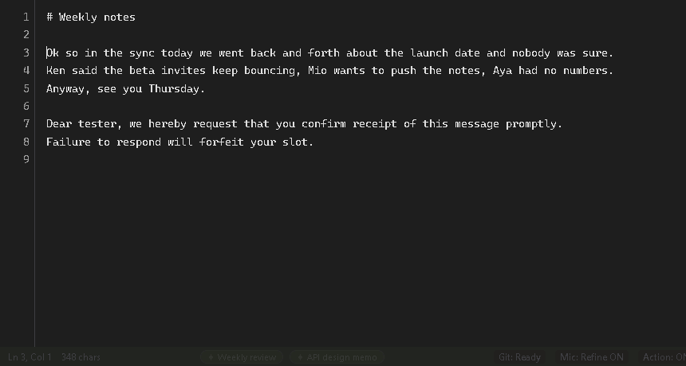
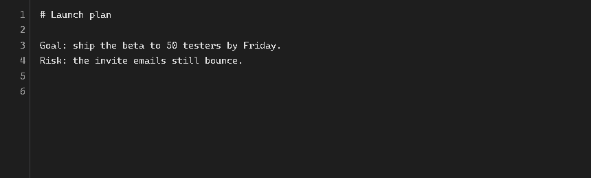
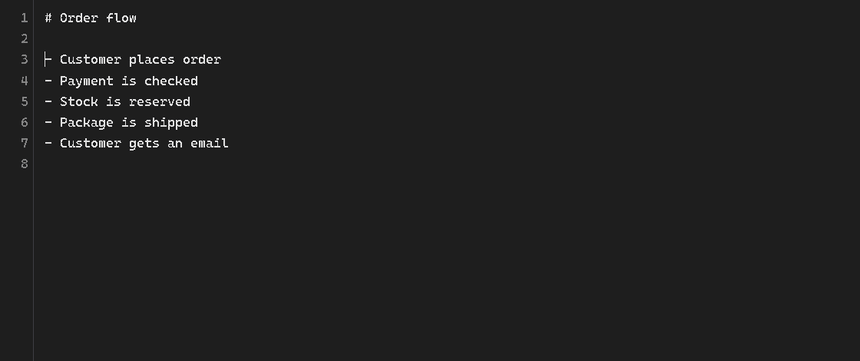
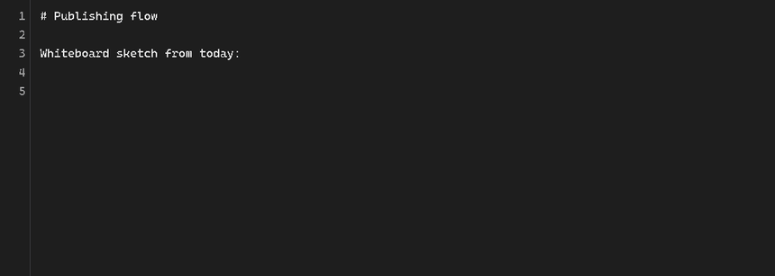
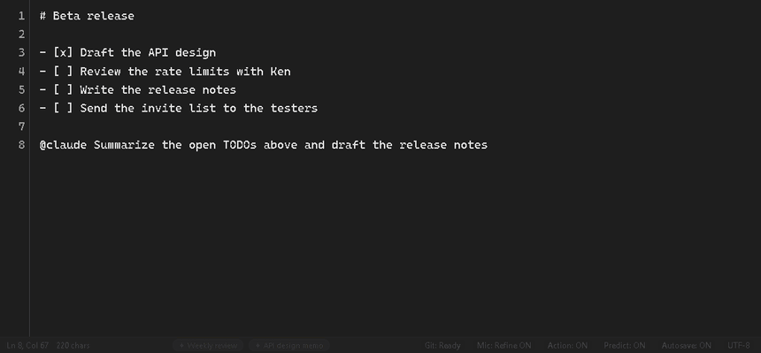
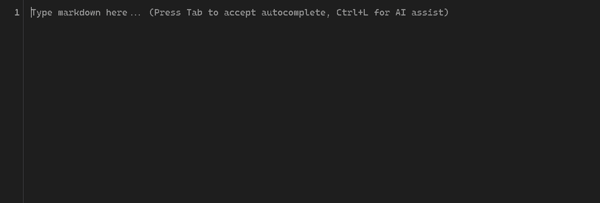
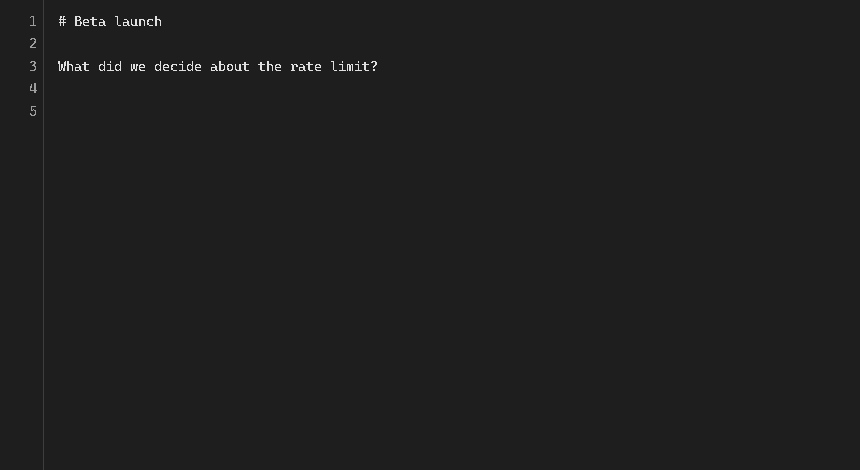
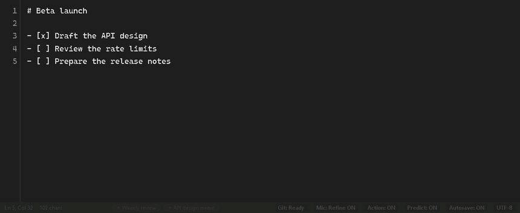

# MD-Memo

**A Markdown scratchpad with AI at the cursor. It is already open when the thought arrives.**

[](LICENSE)
[](#install)
[](https://github.com/youshinh/md-memo/releases/latest)
[](https://youshinh.github.io/md-memo/manual.html)

<p align="center"></p>

MD-Memo is a small desktop notepad for Windows and macOS. It comes back from the tray in a blink, keeps your notes as plain Markdown files on your own disk, and puts AI exactly where you are typing: no chat window, no copy and paste. Tidy a paragraph, run a shell command over your text, or hand a whole job to Claude Code or Codex, and the answer lands right below your words.

[**Download**](https://github.com/youshinh/md-memo/releases/latest) • [Manual](https://youshinh.github.io/md-memo/manual.html) • [日本語 README](README_JA.md) • [All features](docs/features.md)

## Why you will like it

- **You never wait.** Ask the AI two things, keep typing, and dictate by voice, all at once. Each answer lands in its own place when it is ready, and your typing is never blocked.
- **Instant.** It lives in the system tray (the Dock on macOS). One shortcut, `Ctrl+Alt+M`, brings it back with the caret where you left it. A Go core with the operating system's own web view, no Electron: about 5–15 MB when idle.
- **AI where you type.** `Ctrl+L` asks about your selection and inserts the answer below it; your own text is never replaced. As you write, grey predictions from a local model (Ollama, LM Studio, vLLM) appear and `Tab` accepts them. Use a cloud key or stay fully offline.
- **Diagrams and pictures, no detour.** One command turns a list into a Mermaid flowchart, the preview draws it live, and a pasted screenshot (with a vision model set up) is read into Markdown or a diagram.
- **Your text is the command line.** `Ctrl+E` pipes the selection through `sort`, `jq`, `prettier` or anything on your PATH and puts the output below. Risky commands are checked before they run.
- **Delegate the big jobs.** Write `{{ @claude summarize this and draft the release notes }}` and an agent CLI works on it in the background while you keep typing. `Ctrl+Enter` reads the line you are on and decides: ask the AI, hand it to an agent, or run a command.
- **Plain files, yours for good.** Notes are ordinary `.md` files in a folder you choose. Point it at an Obsidian vault or a Git repository; once you give it a remote, it commits and pushes in the background.
- **Scriptable.** `cat build.log | md-memo` pipes into the running app. A command line, a JSON-RPC port and a ready-made skill let scripts and AI agents read and edit your notes.

## See it work

### Never wait: AI, typing and voice at the same time
<p align="center"></p>

### Fix typos and slips in one key (`Alt+C`)
<p align="center"></p>

### Predictions as you type, `Tab` to accept
<p align="center"></p>

### Turn a list into a diagram
<p align="center"></p>

### Paste a picture, get Markdown or a diagram (`Ctrl+V`)
<p align="center"></p>

### Run a command over your text (`Ctrl+E`)
<p align="center"></p>

### Hand a job to an agent (`Ctrl+Enter`)
<p align="center"></p>

### Live preview, Mermaid diagrams included (`Ctrl+Alt+V`)
<p align="center"></p>

### Search everything you ever jotted (`Ctrl+Shift+F`)
<p align="center"></p>

### Not sure what to do next? (`Ctrl+J`)
<p align="center"></p>

*These are recordings of the real interface with scripted AI answers, so they play the same every time.*

## Also built in

- **Smart Paste**: `Ctrl+V` turns web pages, Word and Excel content into clean Markdown; with a vision model set up, a copied screenshot is read into text.
- **Voice input** (`Ctrl+Shift+R`): dictate, and a second model tidies the transcript or applies it to your selection as an edit instruction.
- **Mobile Drop** (`Ctrl+Shift+U`): scan a QR code and send photos, voice notes and text from your phone into the note. No app, no account.
- **Discord Bridge**: message your own bot from anywhere; it lands in today's note the next time MD-Memo runs, even if it was closed.
- **Hot folder** (Windows and macOS): drop an image or a recording into a folder and it becomes a note through OCR or transcription. **Quick Capture and screen capture** (Windows): a global hotkey opens a jotting popup.
- **IME Guardian**: inside code blocks, inline code and URLs it stops Japanese and other IMEs from turning your keystrokes into full-width text (switching the input source automatically is Windows-only).
- **Writing niceties**: Zen mode, `Ctrl+/` to comment lines out, correct line numbers on wrapped lines, files you can drop in as links and `Ctrl+Click` to open.

Every one of them is described in [docs/features.md](docs/features.md) and the [manual](https://youshinh.github.io/md-memo/manual.html).

## Install

**Windows** (x64, needs the Edge WebView2 Runtime, included with Windows 11). From PowerShell:

```powershell
Invoke-WebRequest https://github.com/youshinh/md-memo/releases/latest/download/md-memo-windows-x64.zip -OutFile md-memo.zip
Expand-Archive md-memo.zip -DestinationPath md-memo
md-memo\md-memo.exe
```

**macOS** (10.15 or later, Apple Silicon and Intel):

```bash
brew install --cask youshinh/tap/md-memo
```

The macOS build is ad-hoc signed, not notarized, so the first launch needs one extra step: open **System Settings → Privacy & Security** and click **Open Anyway** (macOS 15 and later), or right-click the app and choose **Open**. Details are in [docs/features.md](docs/features.md#quick-start).

Zips for both systems are on the [Releases](https://github.com/youshinh/md-memo/releases) page; there is no installer. Linux is not supported yet. Quick Capture, screen capture, the Send To menu and on-device Whisper are Windows-only for now ([what works where](docs/features.md#windows-and-macos-what-works-where)).

## The shortcuts to know

| | Windows | macOS |
|---|---|---|
| Bring MD-Memo forward | `Ctrl+Alt+M` | `Option+Cmd+M` |
| Ask AI about the selection | `Ctrl+L` | `Cmd+L` |
| Fix typos and slips | `Alt+C` | `Cmd+Shift+C` |
| Command Bar (`Tab` switches to AI mode) | `Ctrl+E` | `Cmd+E` |
| Auto selector: ask, delegate or run, decided from the line | `Ctrl+Enter` | `Cmd+Enter` |
| Suggest next steps | `Ctrl+J` | `Cmd+J` |
| Search all notes | `Ctrl+Shift+F` | `Cmd+Shift+F` |
| Command palette | `Ctrl+Shift+P` | `Cmd+Shift+P` |
| Preview to the side | `Ctrl+Alt+V` | `Cmd+Option+V` |

Most keys can be changed in Settings → Shortcuts. The full list is in [docs/features.md](docs/features.md#command-palette--hotkeys).

## For scripts and AI agents

```bash
cat build.log | md-memo                 # send terminal output straight into the app
md-memo buffer get                      # read the open note
echo "- [ ] Next step" | md-memo buffer append
md-memo agent install-skill             # teach Claude Code how to operate MD-Memo
```

The same operations are available over JSON-RPC on `127.0.0.1`. See [CLI and JSON-RPC](docs/features.md#programmable-control-hub--json-rpc-20) and [using MD-Memo from an AI agent](docs/features.md#using-md-memo-from-an-ai-agent).

## Documentation

- [Official manual](https://youshinh.github.io/md-memo/manual.html) ([日本語](https://youshinh.github.io/md-memo/manual_ja.html)): walkthroughs with screenshots
- [Feature reference](docs/features.md) ([日本語](docs/features_ja.md)): every feature, shortcut and command-line option

## License

Distributed under the [MIT License](LICENSE). Free for personal and commercial use.
