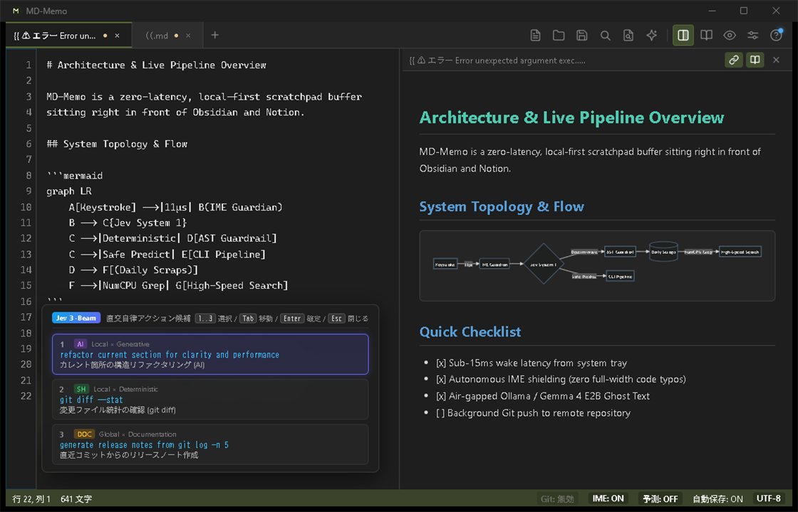
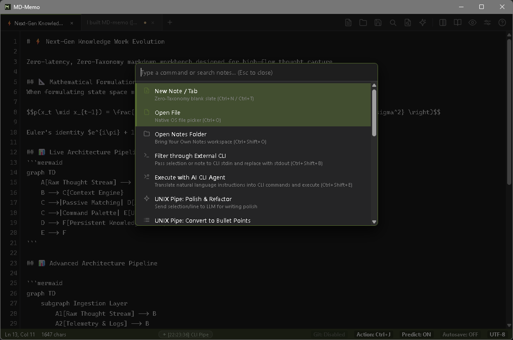
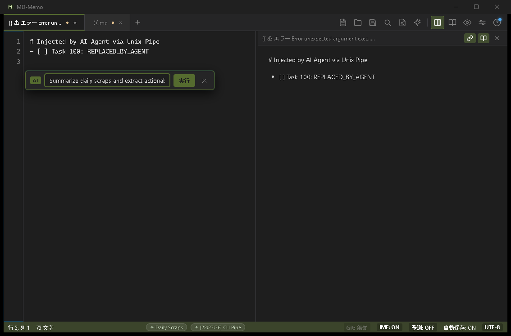
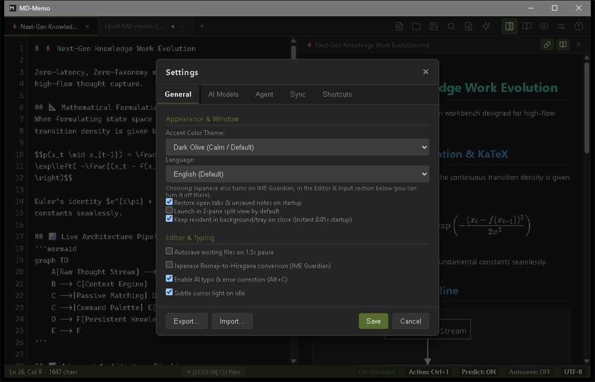
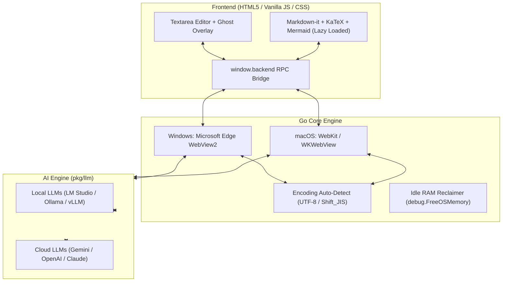

# 📝 MD-Memo

> **メモ帳の圧倒的な軽さ（0.01秒・40MB）で、CopilotとObsidianの知性を手元に。**  
> 思考の流れを絶対に止めない、完全ローカル・超軽量のネイティブマークダウン・スクラッチパッド。

[](https://github.com/youshinh/md-memo/releases)
[](https://golang.org)
[](#)
[](LICENSE)

[🇬🇧 English Documentation](README.md) | **🇯🇵 日本語ドキュメント**

---

## 💡 なぜ MD-Memo なのか？ (Why MD-Memo?)

私たちは皆、Obsidian、VS Code、Notionといったモダンなツールを愛用しています。しかし、ふとアイデアがひらめいたその瞬間に、重たいElectronアプリの起動（2〜5秒）を待たされたり、Vault（保管庫）を選ばされたり、クラウドデータベースを操作させられるべきではありません。

しかし一方で、従来の「Windows標準メモ帳」や「テキストエディット」では、現代のエンジニアや物書きに必要な武器——**AI入力補完、Mermaid図解、数式レンダリング、マークダウンプレビュー**——が完全に欠けています。

| 項目 | メモ帳 / TextEdit | VS Code / Obsidian | **MD-Memo** |
| :--- | :---: | :---: | :---: |
| **起動速度** | ⚡ 一瞬 (<0.1秒) | ⏳ もたつく (2–5秒) | ⚡ **瞬時復帰 (0.01秒 常駐 / <0.1秒 コールド)** |
| **メモリ消費 (RAM)** | ~15 MB | ~300–800 MB (Electron) | 🍃 **~40 MB (非表示時は 5–15 MB に自動圧縮)** |
| **オフライン・完全ローカルAI** | ❌ 非対応 | ⚠️ 重い拡張機能が必要 | ✅ **ネイティブ補完 (Ollama / LM Studio)** |
| **Markdown / 数式 / Mermaid** | ❌ 平文のみ | ✅ 対応 | ✅ **1キー左右分割プレビュー (`Ctrl+\`)** |
| **画像貼り付け 表OCR** | ❌ 非対応 | ❌ 手作業で入力 | ✅ **クリップボードから即変換 (`Ctrl+V`)** |
| **データ主権 (プライバシー)** | ✅ ローカル | ⚠️ Vault / クラウド同期 | ✅ **100% プレーンテキスト / ローカル完結** |

**MD-Memoは両者の「良いとこ取り」を実現しました**：コンパイル済みGoエンジン（ランタイム約3.5MB）とOS標準のネイティブWebView（Windows: Edge WebView2 / macOS: WebKit）を採用し、人間の「思考速度」に一切の遅延なく追従する透明な器として機能します。

---

## 📸 実際の動作画面 (See It in Action)

| 左右分割プレビュー & Mermaid 11図解 (<kbd>Ctrl+\</kbd>) | クイックコマンドパレット (<kbd>Ctrl+Shift+P</kbd>) |
|:---:|:---:|
|  |  |

| インラインAI指示バー (<kbd>Ctrl+K</kbd>) | AIモデル & テーマ設定 (Dark Olive / 完全ローカル対応) |
|:---:|:---:|
|  |  |

---

## ⚡ MD-Memo を決定づける「3大キラー機能」

### 1. 🚀 ゼロ遅延・ネイティブエンジン (<0.01秒 復帰, ~40MB RAM)
- **脱Electronの極致**: 軽量Goバックエンド（ランタイム約3.5MB）とOSネイティブWebView（Edge WebView2 / WKWebView）で動作。
- **思考を逃さない即応性**: システムトレイ常駐時は **0.01秒（実質ゼロ遅延）** で瞬時にポップアップ。入力待機時は独自メモリリクレイマーが自動で **5〜15MB** までメモリを圧縮解放。
- **超高速OSネイティブダイアログ**: Windows COM `IFileDialog` を直接呼び出し、PowerShell等の外部プロセスを完全排除したミリ秒起動のフォルダ・ファイル選択を実現。

### 2. 🧠 完全オフライン・プライベートなゴースト補完 (Copilot感覚)
- **執筆を先回りする予測テキスト**: タイプする先から薄い文字で次の文やアイデアをリアルタイム提示。<kbd>Tab</kbd> または <kbd>→</kbd> で一括確定、<kbd>Ctrl</kbd>+<kbd>→</kbd>（macOSは <kbd>⌥ Option</kbd>+<kbd>→</kbd>）で**単語ごとの部分確定**も可能。
- **100% オフライン & 完全無料**: **Ollama、LM Studio、vLLM**（Qwen 2.5、Gemma 2、Llama 3等）とローカル接続可能。通信料ゼロ・社外秘メモの流出リスクゼロ。もちろんGemini、OpenAI、Claude等のクラウドAPIにもワンタッチ切り替え。
- **ストレスフリーな日本語配慮**: 日本語IME変換中の誤発火を防ぐスマートデバウンス制御、`<think>` 思考タグの自動除去、改行暴走のカットを完備。

### 3. 🎯 摩擦ゼロのマルチモーダル入力 (Frictionless Capture)
- **スクショ貼り付け ➔ Markdown表 OCR (`Ctrl+V`)**: クリップボードのスクショや画像をペーストするだけで、Gemini Vision が自動で高精度なマークダウン表や構造化テキストに瞬時書き起こし。
- **選択テキスト ➔ Mermaid 11図解 変換**: 殴り書きの箇条書きや仕様メモを選択して右クリックするだけで、美しいシーケンス図・フローチャート・マインドマップへ自動変換（<kbd>Ctrl+Z</kbd> で即復元可能）。
- **Mermaid図 ➔ AI画像生成**: 作成したMermaid図から、最新の Gemini 3.1 (`gemini-3.1-flash-lite-image` / Imagen 3) を使ってモダンなベクターインフォグラフィック画像をワンクリック生成。プレビュー内への自動ローカル配信にも完全対応。

---

## 📦 執筆・開発を支えるその他の充実機能

- 🔄 **1画面トグル (`Ctrl+P`) & 左右分割プレビュー (`Ctrl+\`)**: GFMマークダウン、KaTeX数式（`$...$`, `$$...$$`）、Mermaid図解、サンドボックスHTMLのスクロール同期プレビュー。
- 📑 **セッション & バッファ自動保持 & タブのドラッグ並び替え**: 保存していない書き殴りのメモも次回起動時に完全復元。タブのドラッグ＆ドロップによる自由な並び替えに対応。
- 🗂️ **ファイルドロップ読み込み & スマート自動命名**: 外部ファイルをエディタ画面にドラッグ＆ドロップして即新規タブで編集可能。保存時はメモ見出し・本文からファイル名を賢く自動推論。
- 🔤 **スマート文字コード判別**: UTF-8 および Shift_JIS（CP932）を自動検出・保持。
- 📄 **装飾なしテキスト (.txt) エクスポート**: Markdown記号（`#`, `*`, `[]()`等）をワンクリックで除去して平文保存。
- ⌨️ **キーボードファースト & グローバル復帰**: 正規表現・大小文字区別対応の検索 (<kbd>Ctrl+F</kbd>)・置換 (<kbd>Ctrl+H</kbd>)、行移動 (<kbd>Ctrl+G</kbd>)、コマンドパレット (<kbd>Ctrl+Shift+P</kbd>)、どこからでも画面復帰できる常駐ショートカット (<kbd>Ctrl+Alt+M</kbd>)。
- 🛡️ **4層ハイブリッド IME Guardian & AI入力間違い補正**: 半角のまま日本語を打ち始めた際の自動平仮名変換（リアルタイム合成）およびワンキーAI自動校正 (<kbd>Alt+C</kbd>) を新搭載。
- 🌌 **カーソル静止時の微光アフォーダンス (Subtle Cursor Aura)**: タイピング停止時にカーソル周囲をうっすらと発光させ、無意識の視線誘導を実現。
- 🌐 **ゼロオーバーヘッド多言語 (i18n)**: 英語（デフォルト）と日本語を完全サポート。

---

## 📥 ダウンロード & インストール (Download & Installation)

### 🪟 Windows の場合

#### 方法 1: WinGet パッケージマネージャー（推奨）
Windows 標準のパッケージマネージャーからワンコマンドでインストール・更新できます：
```powershell
winget install youshinh.md-memo
```
> [!TIP]
> 本リポジトリ内のローカルマニフェストから直接インストールして動作確認する場合：
> ```powershell
> winget install --manifest packaging/winget/youshinh.md-memo.yaml
> ```

#### 方法 2: ポータブル版 ZIP の直接ダウンロード
1. [Releases ページ](https://github.com/youshinh/md-memo/releases) から最新の `md-memo-windows-x64.zip` をダウンロードします。
2. zip ファイルを展開し、`md-memo.exe` を実行するだけですぐに使えます（インストーラー不要・単一バイナリ）。

---

### 🍏 macOS の場合

#### 方法 1: Homebrew Tap（推奨）
Homebrew Cask を使ってワンコマンドで `/Applications` にインストールできます：
```bash
brew install --cask youshinh/tap/md-memo
```
*(または Tap を追加してからインストール: `brew tap youshinh/tap && brew install --cask md-memo`)*

> [!TIP]
> 本リポジトリ内のローカルフォーミュラから直接インストールして動作確認する場合：
> ```bash
> brew install --cask packaging/homebrew/md-memo.rb
> ```

#### 方法 2: アプリ ZIP の直接ダウンロード
1. [Releases ページ](https://github.com/youshinh/md-memo/releases) から `md-memo-macos.zip` をダウンロードして展開します。
2. `MD-Memo.app` を「アプリケーション」フォルダに移動して起動します。

---

## ⚙️ LLM API 設定ガイド (LLM Configuration)

画面右上の **「設定 (Settings)」** ボタン（または右クリックメニュー）から、利用したい LLM サービスを設定できます。  
テキスト生成用・入力予測用・画像解析用でそれぞれお好みのモデルを自由に割り当て可能です。

### 1. 🌐 Google Gemini (Google AI Studio)
最も低遅延かつ高精度なマルチモーダル対応モデルです。テキスト指示・入力予測・画像貼り付け OCR、および Mermaid 図からの画像生成にも最適です。

| 項目 | 設定値例 |
|---|---|
| **API Base URL** | `https://generativelanguage.googleapis.com/v1beta` |
| **モデル名 (テキスト & Vision)** | `gemini-flash-latest` (標準・高速) / `gemini-flash-lite-latest` (超軽量・最高速) / `gemini-pro-latest` (高精度) |
| **モデル名 (画像生成)** | `gemini-3.1-flash-lite-image` (最新・超軽量画像生成) / `imagen-3.0-generate-002` |
| **API キー** | [Google AI Studio](https://aistudio.google.com/) で取得した API キー |

---

### 2. 🟢 OpenAI (ChatGPT / GPT-5.6 / o4-mini)
OpenAI の公式 API を利用する場合の設定です。

| 項目 | 設定値例 |
|---|---|
| **API Base URL** | `https://api.openai.com/v1` |
| **モデル名 (推奨)** | `gpt-5.6-luna` (最新・超高速軽量) / `gpt-5.6-sol` (最高性能フラグシップ) / `gpt-5.6-terra` (高バランス) / `o4-mini` (推論モデル) |
| **API キー** | [OpenAI API Keys](https://platform.openai.com/api-keys) で取得した API キー (`sk-...`) |

---

### 3. 🟣 Anthropic Claude (via LiteLLM / OpenAI Proxy)
LiteLLM、Cloudflare AI Gateway、または One-API などの OpenAI 互換プロキシを経由して Claude を使用します。

| 項目 | 設定値例 |
|---|---|
| **API Base URL** | `http://localhost:4000/v1` (LiteLLM プロキシ等のアドレス) |
| **モデル名 (推奨)** | `claude-sonnet-5` (最新フラグシップ・高速高精度) / `claude-haiku-4.5` (超高速) / `claude-opus-5` (複雑なエージェント・コーディング) / `claude-fable-5` |
| **API キー** | プロキシに設定したキー、または `sk-ant-...` |

---

### 4. 💻 LM Studio (完全無料・オフライン ローカルLLM)
LM Studio の「Local Server」を起動して接続します。入力予測（Ghost Text）でコストを気にせず高速補完したい場合に最適です。

| 項目 | 設定値例 |
|---|---|
| **API Base URL** | `http://localhost:1234/v1` (LAN内別PCの場合は `http://192.168.x.x:1234/v1`) |
| **モデル名** | LM Studio でロードした識別子 (例: `google/gemma-4-12b-qat`, `prism-ml/bonsai-27b`, `qwen2.5-coder-7b-instruct`) |
| **API キー** | 空欄または `not-needed` |
| **入力予測設定** | 遅延: `500` ms / 最大トークン: `30`〜`50` |

---

### 5. 🦙 Ollama (完全無料・ローカルLLM)
Ollama が起動している環境であれば、直接または OpenAI 互換エンドポイントで接続可能です。

| 項目 | 設定値例 |
|---|---|
| **API Base URL** | `http://localhost:11434` (Ollamaネイティブ) または `http://localhost:11434/v1` |
| **モデル名** | `qwen2.5-coder:7b`, `llama3.3:latest`, `deepseek-r1:8b` |
| **API キー** | 空欄 |

---

### 6. 🚀 vLLM / llama-server / Text Generation WebUI
OpenAI 互換のローカル推論サーバー全般に対応しています。

| 項目 | 設定値例 |
|---|---|
| **API Base URL** | `http://localhost:8000/v1` |
| **モデル名** | サーバー側でロードしているモデル名 |
| **API キー** | 設定されている場合は入力、なければ空欄 |

---

## ⌨️ キーボードショートカット一覧 (Keyboard Shortcuts)

| Windows / Linux | macOS | 機能 |
|:---|:---|:---|
| <kbd>Tab</kbd> / <kbd>→</kbd> | <kbd>Tab</kbd> / <kbd>→</kbd> | **入力予測（ゴーストテキスト）を全文確定・挿入** |
| <kbd>Ctrl</kbd> + <kbd>→</kbd> | <kbd>⌥ Option</kbd> + <kbd>→</kbd> | **入力予測を単語単位で部分確定（Word Ghost Accept）** |
| <kbd>Esc</kbd> | <kbd>Esc</kbd> | **仮想変換のロールバック / 入力予測候補を破棄 / 検索バー・モーダルを閉じる** |
| <kbd>Alt</kbd> + <kbd>C</kbd> | <kbd>⌥ Option</kbd> + <kbd>C</kbd> | **AI入力間違い補正（選択テキストまたは現在行をAIで即座に自然補正）** |
| <kbd>Ctrl</kbd> + <kbd>Alt</kbd> + <kbd>M</kbd> | <kbd>⌃</kbd> + <kbd>⌥</kbd> + <kbd>M</kbd> | **どこからでも画面を最前面に復帰（グローバルホットキー）** |
| <kbd>Ctrl</kbd> + <kbd>F</kbd> | <kbd>⌘ Cmd</kbd> + <kbd>F</kbd> | **文字列検索**（正規表現・単語単位・大小文字区別対応） |
| <kbd>Ctrl</kbd> + <kbd>H</kbd> | <kbd>⌘ Cmd</kbd> + <kbd>H</kbd> | **文字列置換**（単一置換 / すべて置換） |
| <kbd>F3</kbd> / <kbd>Shift</kbd>+<kbd>F3</kbd> | <kbd>F3</kbd> / <kbd>Shift</kbd>+<kbd>F3</kbd> | 次の一致 / 前の一致箇所へ移動 |
| <kbd>Ctrl</kbd> + <kbd>G</kbd> | <kbd>⌘ Cmd</kbd> + <kbd>G</kbd> | **指定行へジャンプ (Go to Line)** |
| <kbd>Ctrl</kbd> + <kbd>K</kbd> | <kbd>⌘ Cmd</kbd> + <kbd>K</kbd> | **インラインAIプロンプトバーを開く（選択範囲のクイック指示・編集）** |
| <kbd>Ctrl</kbd> + <kbd>L</kbd> | <kbd>⌘ Cmd</kbd> + <kbd>L</kbd> | **LLM への送信・指示モーダルを開く（対象テキストプレビュー付き）** |
| <kbd>Ctrl</kbd> + <kbd>Enter</kbd> | <kbd>⌘ Cmd</kbd> + <kbd>Enter</kbd> | LLM 指示モーダルから即時送信 |
| <kbd>Ctrl</kbd> + <kbd>P</kbd> / <kbd>Ctrl</kbd> + <kbd>E</kbd> | <kbd>⌘ Cmd</kbd> + <kbd>P</kbd> / <kbd>⌘ Cmd</kbd> + <kbd>E</kbd> | **編集 ⇄ プレビュー表示切替** |
| <kbd>Ctrl</kbd> + <kbd>\</kbd> | <kbd>⌘ Cmd</kbd> + <kbd>\</kbd> | **左右分割表示切替 (Split View)**（エディタとリアルタイム同期プレビュー） |
| <kbd>Ctrl</kbd> + <kbd>S</kbd> | <kbd>⌘ Cmd</kbd> + <kbd>S</kbd> | 上書き保存（<kbd>Shift</kbd> 同時押しで「名前を付けて保存」） |
| <kbd>Ctrl</kbd> + <kbd>O</kbd> | <kbd>⌘ Cmd</kbd> + <kbd>O</kbd> | ファイルを開く（Markdown, JSON, YAML, 各種ソースコード等） |
| <kbd>Ctrl</kbd> + <kbd>N</kbd> / <kbd>Ctrl</kbd> + <kbd>T</kbd> | <kbd>⌘ Cmd</kbd> + <kbd>N</kbd> / <kbd>⌘ Cmd</kbd> + <kbd>T</kbd> | 新規タブを作成 |
| <kbd>Ctrl</kbd> + <kbd>W</kbd> | <kbd>⌘ Cmd</kbd> + <kbd>W</kbd> | **現在のタブを閉じる**（最後のタブを閉じた場合はアプリ終了） |
| <kbd>Ctrl</kbd> + <kbd>Tab</kbd> | <kbd>⌃ Control</kbd> + <kbd>Tab</kbd> | 次のタブに切り替え |
| <kbd>Ctrl</kbd> + <kbd>V</kbd> | <kbd>⌘ Cmd</kbd> + <kbd>V</kbd> | 貼り付け（画像をペーストした場合は自動で Gemini OCR 実行） |
| <kbd>Ctrl</kbd> + <kbd>A</kbd> | <kbd>⌘ Cmd</kbd> + <kbd>A</kbd> | エディタ内のテキストを全選択 |
| <kbd>Ctrl</kbd> + <kbd>+</kbd> / <kbd>-</kbd> | <kbd>⌘ Cmd</kbd> + <kbd>+</kbd> / <kbd>-</kbd> | **文字サイズ拡大 / 縮小 (Zoom)** |
| <kbd>Ctrl</kbd> + <kbd>0</kbd> | <kbd>⌘ Cmd</kbd> + <kbd>0</kbd> | 文字サイズを既定 (14px) にリセット |
| <kbd>F5</kbd> | <kbd>F5</kbd> | カーソル位置に現在日時（`YYYY/MM/DD HH:mm:ss`）を挿入 |

---

## 🛠️ ソースコードからのビルド方法 (Build from Source)

### 前提条件 (Prerequisites)
- [Go 1.22+](https://golang.org/dl/) がインストールされていること

### 🪟 Windows でのビルド
```powershell
# クローン
git clone https://github.com/youshinh/md-memo.git
cd md-memo

# テストの実行
go test -v ./...

# Windows GUI アプリとしてビルド (コンソール非表示・最適化)
go build -ldflags="-H windowsgui -s -w" -trimpath -o md-memo.exe .
```

### 🍏 macOS でのビルド
```bash
# クローン
git clone https://github.com/youshinh/md-memo.git
cd md-memo

# ビルドスクリプトを実行 (MD-Memo.app が生成されます)
chmod +x build_mac.sh
./build_mac.sh

# アプリを起動
open MD-Memo.app
```

---

## 📐 アーキテクチャ (Architecture)



---

## 📜 ライセンス (License)

本ソフトウェアは [MIT License](LICENSE) のもとで公開されています。商用・非商用問わず自由にご利用いただけます。
