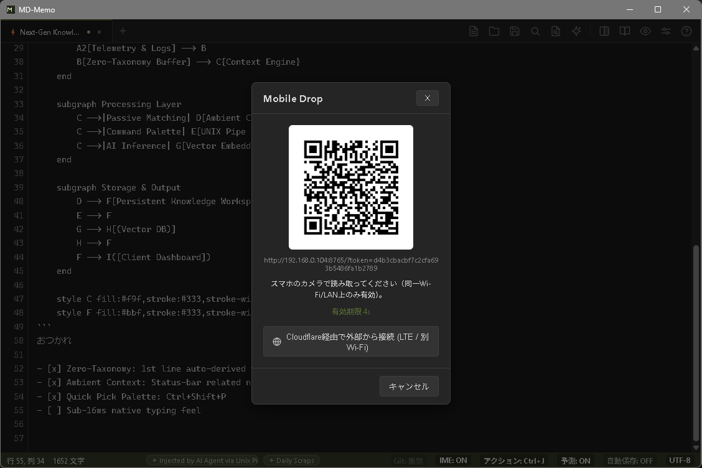

# MD-Memo (日本語ドキュメント)

> 一瞬の思考を、ゼロの摩擦で。思考キャプチャのためのローカルファースト・マークダウンスクラッチパッド。

[](LICENSE)
[](https://golang.org/)
[](#クイックスタート)
[](https://youshinh.github.io/md-memo/manual_ja.html)

**MD-Memo** は、システムトレイに静かに常駐する高帯域な入力端末です。コンパイルされたGo言語コアとOSネイティブWebViewで構築され、ミリ秒で復帰し、多言語IMEの状態を自律管理し、用が済めば瞬時にバックグラウンドへ潜みます。

[公式マニュアル・詳細設定ガイド](https://youshinh.github.io/md-memo/manual_ja.html) • [English Manual](https://youshinh.github.io/md-memo/manual.html) • [リリースページ](https://github.com/youshinh/md-memo/releases) • [スクラッチパッドの逆説](#スクラッチパッドの逆説) • [迷ったらこの表](#迷ったらこの表) • [設計思想と機能一覧](#設計思想と機能一覧) • [プログラマブル制御ハブ](#プログラマブル制御ハブ--json-rpc-20) • [クイックスタート](#クイックスタート) • [English (README.md)](README.md)

---

## スクリーンショット・ショーケース

| 左右分割プレビュー & Mermaid 構文図解 (`Ctrl+\`) | コマンドパレット (`Ctrl+Shift+P`) |
|:---:|:---:|
|  |  |

| AI プロンプトダイアログ (`Ctrl+L`。`Ctrl+K` ならインラインバー) | CLI パイプライン・フィルタバー (`Ctrl+Shift+B`) |
|:---:|:---:|
|  |  |

| デイリースクラップ高速並列検索 (`Ctrl+Shift+F`) | 自律エージェント連携 & 実行ポリシー設定 |
|:---:|:---:|
|  |  |

---

## スクラッチパッドの逆説

NotionやObsidianのような巨大なナレッジベースは、長期的な情報整理には極めて優れています。しかし、そのアーキテクチャは本質的に起動遅延と大きなメモリ消費を伴います。一瞬のひらめきを書き留めたい時や、エラーログを急いで貼り付けたい時、2〜5秒の起動待ちは思考の勢いを完全に断ち切ってしまいます。

**MD-Memoは保管庫の代替品ではありません。保管庫の「直前に置く、ゼロ抵抗の即時バッファ」です。**

| 比較項目 | 一般的なテキストエディタ | ナレッジ保管庫 (Notion/Obsidian) | MD-Memo |
|---|---|---|---|
| **アーキテクチャ** | C++ / Swift | Electron / JVM | **Go 1.26 + OSネイティブ WebView** |
| **起動・復帰遅延** | ~100ms (Cold) | 2.0秒 – 5.0秒 | **&lt; 15ms (トレイ常駐からの瞬時復帰)** |
| **待機時メモリ** | ~15 MB | 400 MB – 800 MB+ | **5 – 15 MB (積極的GCによる圧縮)** |
| **保存モデル** | プレーンテキスト | 内部DB / 独自フォーマット | **100% ローカル POSIX プレーンテキスト** |
| **外部遠隔制御** | プラグイン依存 / なし | 重量HTTPプラグイン | **ミリ秒応答 JSON-RPC 2.0 TCP IPC** |
| **ファイルダイアログ** | OSネイティブ | Node.js IPCラッパー | **Windows: ネイティブ COM `IFileDialog`。macOS: AppleScript経由のシステムファイル選択。** |

> **おすすめ運用法**: MD-Memoの保存先を作業中のObsidian Vault（`Daily Notes/` 等）やGitリポジトリに直接指定することで、瞬時メモ端末として機能します。

---

## 迷ったらこの表

AI まわりの機能は「書く」「実行する」「任せる」の3つの動詞に整理されています。それぞれ覚えるべき入口はひとつだけです。

| やりたいこと | 入口 | どんな機能か |
|---|---|---|
| **書く** — 選択した文を直したい・書いてほしい | `Ctrl+K` / `Cmd+K` | 内蔵のLLMが数秒で文章を書き換え・生成します |
| **実行する** — コマンドを走らせたい | コマンドバー `Ctrl+Shift+B`（自分でコマンドを書く）/ `Ctrl+Shift+E`（日本語で説明するとAIが書く） | 選択範囲をシェルコマンドに通し、その出力で置き換えます |
| **任せる** — 調査や実装をまるごと頼みたい | ノートに `{{ 指示 }}` と書く | 外部のエージェントCLIがバックグラウンドで数分かけて作業します |
| **何をすべきか分からない** | `Ctrl+J` / `Cmd+J` | いま書いている内容に合う次の一手を最大3件提案します（アクション候補） |

*(各機能の詳しい使い方は [公式マニュアル](https://youshinh.github.io/md-memo/manual_ja.html) をご覧ください)*

---

## 設計思想と機能一覧

### 1. 極小フットプリント & サブミリ秒復帰
24時間365日常駐してもPCリソースを圧迫しません。
- **瞬時召喚 (`Ctrl+Alt+M` / `Option+Cmd+M`)**: 重い描画パイプラインをバイパスし、直前のカーソル位置に即座に復帰します。Windowsではシステムトレイから15ms未満で前面化。macOSにはメニューバー常駐アイコンがないため、Dockから前面に呼び出します（Dockアイコンをクリックしても同じ動作です。終了は `Cmd+Q`）。
- **積極的アイドルメモリ回収**: ウィンドウ最小化時やアイドル時に `debug.FreeOSMemory()` を自動発行し、ワーキングセットを5〜15MBまで瞬時に圧縮します。
- **ネイティブOSダイアログ**: Windowsはネイティブ COM `IFileDialog`、macOSはAppleScript経由のシステムファイル選択を使用します。いずれもElectron風のラッパーなしで瞬時に動作します。

### 2. 自律型 IME シールド (IME Guardian)
日本語入力時の「全角英数誤爆」ストレスを根絶します。
- **レキシカルスコープ保護**: インラインコード（`` `...` ``）、コードブロック、URLの中では全角入力を自動遮断し、11µsの極小オーバーヘッドで半角英数モードへ誘導します。
- **直接入力の自動救済**: 半角直接入力モードのまま「konnitiha」と打ってしまった場合、自動でひらがな変換へ救済します。
- **LLRT言語モデル**: 統計的仮説検定（Log-Likelihood Ratio Testing）に基づく高速判定により、タイピング速度を損ないません。
- **プラットフォームの注意**: WindowsではOSの入力ソースを自動で切り替えます（システム言語が日本語なら既定でオン）。macOSでは入力ソースの自動切替にまだ対応していないため、既定ではオフです。

### 3. 書く・任せる・提案する — ローカルファースト AI
AIは邪魔なチャット画面ではなく、静かな影として寄り添います。
- **書く (`Ctrl+K` / `Ctrl+L`)**: 選択した文章をその場で数秒で書き換え・生成。`Alt+C` なら指示を書かずに校正だけ、コマンドパレットには推敲・箇条書き要約・タスク抽出のプリセットも用意しています。
- **ゴーストテキスト（受け身の「書く」）**: ローカルのOllama（Gemma 4 E2B等）やLM Studioと連携し、タイピングを中断しない予測補完を提供。
- **任せる (`{{ 指示 }}`)**: ノートに書いた指示を外部のエージェントCLI（Claude Code / Codex / Hermes / Antigravity など）へ委譲します。`Ctrl+Enter`、または完結したブロックの横に表示される **▶ 実行** ボタンで開始し、バックグラウンドで実行されます。進行状況はタスクパネル（`Alt+T`）で確認でき、結果はノートに差し込まれます。記法もエージェントも `agents.yaml` で自由に追加・変更できます（内部名称: Slot）。
- **アクション候補 (`Ctrl+J`)**: いま書いている内容から次の一手を最大3件提案。各カードは「書く」「実行」「任せる」のいずれかに対応します。`Ctrl+1`〜`3`（macOSは `Cmd+1`〜`3`）でカードを実行、`Ctrl+Tab` で移動して `Enter` で決定できます。ステータスバーの **アクション** バッジをクリックすると ON → 手動 → OFF と切り替わります。既定では内蔵のローカル規則だけで動作し、ノートの内容は外部に送信されません。APIキーやカスタムエンドポイントを設定した場合に限り、カーソル周辺の約2,000文字が外部の推論モデル（Jev など）へ送られます（内部名称: System 1 / 3-Beam / MAP-Elites）。
- **決定論的 AST ガードレール**: 候補として提示されたシェルコマンドは、実行前にAST構文検証エンジンでチェック。`rm -rf /` などの破壊的コマンドやシステム領域への書き込みを検出すると実行を拒否します。
- **思考トークンの自動除去**: DeepSeek等の推論モデルが出力する `<think>` タグを、描画前に透過的にクリーニングします。

### 4. UNIX パイプライン & CLI 自動化
メモ帳を標準入出力のストリームとして扱えます。
- **CLI パイプ入力 (`cat log | md-memo`)**: ターミナルの出力を実行中インスタンスへミリ秒転送し、当日のデイリースクラップ（`scraps/YYYY-MM-DD.md`）へ即座に追記。
- **コマンドバー: CLI モード (`Ctrl+Shift+B`)**: 選択したテキストを `jq`, `sort`, `tr`, `prettier`, `duckdb` などのローカルコマンドに流し込み、インプレース置換。
- **コマンドバー: AI CLI モード (`Ctrl+Shift+E`)**: 同じバーのAIモード。やりたいことを日本語で入力すればコマンドを自動生成し、安全性チェックを通してから実行します。バッジのクリックでいつでもモードを切り替えられます。

### 5. 高速並列スクラップ検索 (`Ctrl+Shift+F`)
- **CPU全コア並列スキャン**: `runtime.NumCPU()` のワーカースレッドと `bufio.Scanner` により、数年分の過去スクラップを150ms未満で高速Grep検索。
- **ダイレクトジャンプ**: 検索結果をクリックまたはEnterキーで、該当行へスムーズスクロール＆ハイライト。

### 6. バックグラウンド Git 自動同期
- **サイレント同期**: アプリ起動時に `git pull --rebase` を実行し、編集後30秒アイドルが続くと自動で `git add/commit/push` をバックグラウンド処理。
- **1クリック初期化**: 設定画面でGitHub等の空リポジトリURLを入力するだけで、自動でローカルGitリポジトリを初期化・紐付けします。

### 7. Mobile Drop — スマホから送る (`Ctrl+Shift+U`)
QRコードを読み取るだけで、スマホの写真・ファイル・ボイスメモ・テキストを、開いているメモへ直接送れます。アプリもアカウントも不要です。

<p align="center"></p>

- **送信トレイ**: 写真・ファイルを最大10件（合計60MBまで）追加し、ボイスメモを録音し、テキストを入力して、まとめて1回のボタンで送信できます。写真はOCR、ボイスメモは文字起こし、テキストファイルは追記されます。
- **双方向のテキスト共有**: PCで選択中のテキスト（選択がなければクリップボードのテキスト）がワンタップコピー付きでスマホのページ上部に表示され、PC側のダイアログにも共有内容が表示されます。
- **既定はローカルのみ**: 同一LAN上で一度きりのサーバーを起動します（ランダムな使い捨てトークン。1回の送信、または60秒間操作がないと自動終了）。ネットワークの外には出ません。
- **写真はテキストに**: 写真は、`Ctrl+V` の画像OCRに設定したビジョンモデルで文字起こしします。クラウドのモデルを設定している場合は、貼り付けと同様にそのプロバイダーへ画像が送られます。
- **位置情報は任意（トンネル使用時のみ）**: Cloudflareトンネル経由（HTTPS）のときだけ、スマホは位置情報を1回だけ添付でき、見出しは `## Mobile Drop [14:20:05] (34.693, 135.502)` のようになります。通常のLAN（HTTP）では要求も添付もしません。
- **外部ネットワーク（任意）**: ダイアログのボタンで [Cloudflare Quick Tunnel](https://developers.cloudflare.com/cloudflare-one/connections/connect-networks/do-more-with-tunnels/trycloudflare/) に切り替えると、LTEや別のWi-Fiからも送れます。トンネル経由ではページ内でのボイスメモ録音も使えます（通常のLANではスマホ本体の録音アプリが開きます）。`cloudflared` のインストールが必要で、送信内容はCloudflareのサーバーを経由します。

---

## プログラマブル制御ハブ & JSON-RPC 2.0

MD-Memoは、内蔵のJSON-RPC 2.0 TCPサーバー（既定は `127.0.0.1:49152`。実際に使われているポートとセッショントークンは、アプリの設定フォルダの `ipc-session.json` に書き込まれます）を介して、Neovim、VS Code、シェルスクリプト、自律AIエージェントから完全に外部遠隔操作できます。

### CLI サブコマンド
`buffer`（`get`、`set`、`append`、`replace`、`replace-selection`） / `tab` / `ui` は起動中のMD-Memoを操作します。`jev` と `agent` は単体で動作します。`--json` と `--tab <id>` は `buffer` のすべてのサブコマンドで使えます。

```bash
# 1. アクティブなバッファ内容を取得 (端末ではプレーンテキスト。パイプ時や --json では内容ハッシュ付きJSON。--text でプレーンテキストを強制)
md-memo buffer get
md-memo buffer get --json

# 2. 楽観的ロック（競合検知）付きでバッファを置換
#    （ハッシュは `buffer get --json` が返すバッファのSHA-256の先頭16桁）
echo "# 新しいノート" | md-memo buffer set --expected-hash a1b2c3d4e5f60718

# 3. バッファ末尾へ追記
echo "- [ ] 新しいタスク" | md-memo buffer append

# 4. 指定した行・列の範囲のみを選択置換
echo "置換テキスト" | md-memo buffer replace --start 2:1 --end 2:15

# 5. 選択範囲だけを表示。選択がなければ終了コード1、標準エラーに "no active selection"
md-memo buffer get --selection
md-memo buffer get --selection --json

# 6. パイプで渡したテキストで選択範囲を置換（1回のUndoにまとまる。
#    読み取り後に選択範囲が変わっていた場合はconflictエラーで拒否されます）
cat formatted.txt | md-memo buffer replace-selection

# 7. コマンドの安全性をAST検証エンジンでテスト (単体動作。ブロック時は終了コード1)
md-memo jev verify "git status && npm test"
# [SAFE] Command passed AST validation: git status && npm test
md-memo jev verify --json "rm -rf /"
# {"isSafe": false, "reason": "破壊的コマンド \"rm\" は安全基準により実行を拒否されました (Destructive command blocked)",
#  "command": "rm -rf /", "rule": "destructive", "subject": "rm"}

# 8. エージェントに渡す前に、Markdownから関連する部分だけを抽出 (Headless)
md-memo agent prune --query "認証まわりの不具合" --file notes.md
```

---

## クイックスタート

インストーラー不要の単一バイナリとして配布されています。

**動作要件**: Windows（x64。Microsoft Edge WebView2 ランタイムが必要で、Windows 11 には標準搭載）、または macOS 10.15 以降。Linux は未対応です。

### パッケージマネージャー

#### Windows
```powershell
winget install youshinh.md-memo
```

#### macOS
```bash
brew install --cask youshinh/tap/md-memo
```

> **macOS初回起動について**: 配布物はアドホック署名のみでApple公証（notarize）は受けていないため、`MD-Memo.app` を開こうとするとGatekeeperに一度ブロックされます。Finderでアプリを右クリック（Controlクリック）して「開く」を選んで確認するか、`xattr -dr com.apple.quarantine "MD-Memo.app"` を一度実行して隔離属性を解除してください。次回リリースからはmacOSビルドが **ユニバーサルバイナリ** になり、Apple SiliconとIntel Macの両方に対応します。

### 単体バイナリ
[GitHub Releases](https://github.com/youshinh/md-memo/releases) ページから直接ダウンロード可能です。

### Macを持っていない場合: CIビルドを使う
このリポジトリへのプッシュのたびに、GitHub上のmacOSランナーがすぐ実行できる `MD-Memo.app` をビルドします。Macを持っていなくても動作確認ができます。
1. GitHubにプッシュする（または **Actions** タブから **CI** ワークフローを **Run workflow** で手動実行する）。
2. 最新の **CI** 実行を開き、**Artifacts** から `md-memo-macos-<commit-sha>` をダウンロードする。
3. 展開したら、上記と同じ初回起動手順（`xattr -dr com.apple.quarantine "MD-Memo.app"` または右クリック→開く）を行う。CIビルドもリリースビルドと同様にアドホック署名されています。

---

## ショートカット一覧

| 機能 / アクション | Windows | macOS |
|---|---|---|
| グローバル瞬時召喚 / 格納 | `Ctrl + Alt + M` | `Option + Cmd + M` |
| 高速スクラップ並列検索 | `Ctrl + Shift + F` | `Cmd + Shift + F` |
| コマンドパレット | `Ctrl + Shift + P` | `Cmd + Shift + P` |
| インライン AI プロンプトバー | `Ctrl + K` | `Cmd + K` |
| AI プロンプトモーダル | `Ctrl + L` | `Cmd + L` |
| AI 文章校正・誤字脱字修正 | `Alt + C` | `Cmd + Shift + C` |
| アクション候補を表示 | `Ctrl + J` | `Cmd + J` |
| アクション候補のカードを実行 | `Ctrl + 1` 〜 `3` | `Cmd + 1` 〜 `3` |
| コマンドバー: CLI モード | `Ctrl + Shift + B` | `Cmd + Shift + B` |
| コマンドバー: AI CLI モード | `Ctrl + Shift + E` | `Cmd + Shift + E` |
| Mobile Drop（QRでスマホから送信） | `Ctrl + Shift + U` | `Cmd + Shift + U` |
| スロットをエージェントで実行 | `Ctrl + Enter` | `Cmd + Enter` |
| タスクパネルの開閉 | `Alt + T` | `Option + T` |
| 左右分割（スプリットビュー） | `Ctrl + \` | `Cmd + \` |
| プレビューを横に開く | `Ctrl + Alt + V` | `Cmd + Option + V` |
| 特殊貼り付け（リッチHTML → Markdown） | `Ctrl + Shift + V` | `Cmd + Shift + V` |
| 音声入力 | `Ctrl + Shift + R` | `Cmd + Shift + R` |
| リンクを開く | `Ctrl + クリック` | `Cmd + クリック` |
| リンクを表示（エクスプローラー / Finder） | `Alt + クリック` | `Option + クリック` |
| Zenモード | `Ctrl + Shift + Z` | `Ctrl + Cmd + Z` |
| ゴーストテキスト単語採用 | `Ctrl + →` | `Option + →` |
| 現在の日時を挿入 | `F5` | `Cmd + Shift + I` |

*(詳細な操作ガイド・詳細設定の解説は [公式マニュアル](https://youshinh.github.io/md-memo/manual_ja.html) をご覧ください)*

---

## システムトポロジー

```text
[ フロントエンド: モノスペースCanvas / ゴーストオーバーレイ / 検索UI / 分割表示 ]
                                      ▲
                                      │ 双方向 RPC ブリッジ
                                      ▼
[ コアエンジン: Go 1.26 / OSネイティブ WebView (WebView2 · WKWebView) ]
       │
       ├─► プログラマブル JSON-RPC 2.0 TCP サーバー (127.0.0.1:49152 / ipc-session.json)
       │    ├─► buffer.get / set / append / replace (楽観的ロック & Undo履歴保護)
       │    ├─► tab.list / switch
       │    └─► ui.toggle_split / activate / eval
       │
       ├─► Jev 自律アクションアーキテクチャ
       │    ├─► System 1 予測アクションバー (3-Beam コンテキスト推論)
       │    ├─► 決定論的 AST ガードレール (ASTCommandVerifier)
       │    └─► MAP-Elites 多様性セレクタ
       │
       ├─► ローカル & クラウド AI 推論
       │    ├─► オフライン Ollama / Gemma 4 E2B ワンクリック連携
       │    ├─► Gemini Flash Lite Vision OCR (クリップボード画像 Ctrl+V)
       │    └─► OpenRouter & OpenAI互換エンドポイント
       │
       ├─► 高速ストレージ & 並列検索
       │    ├─► デイリースクラップ集約 (scraps/YYYY-MM-DD.md)
       │    ├─► 並列 Grep エンジン (runtime.NumCPU() マルチスレッド)
       │    └─► バックグラウンド Git 同期 (サイレント Rebase & 自動コミット/Push)
       │
       ├─► 自律型 IME Guardian (コードブロック全角英数自動遮断)
       └─► 積極的メモリ回収エンジン (debug.FreeOSMemory() -> アイドル時 5-15MB)
```

---

## 公式ドキュメント・マニュアル

- [公式マニュアル・詳細設定ガイド (日本語)](https://youshinh.github.io/md-memo/manual_ja.html)
- [Official User Manual (English)](https://youshinh.github.io/md-memo/manual.html)

---

## ライセンス

[MIT License](LICENSE) のもとで配布されています。個人利用・商用利用ともに完全無料です。
