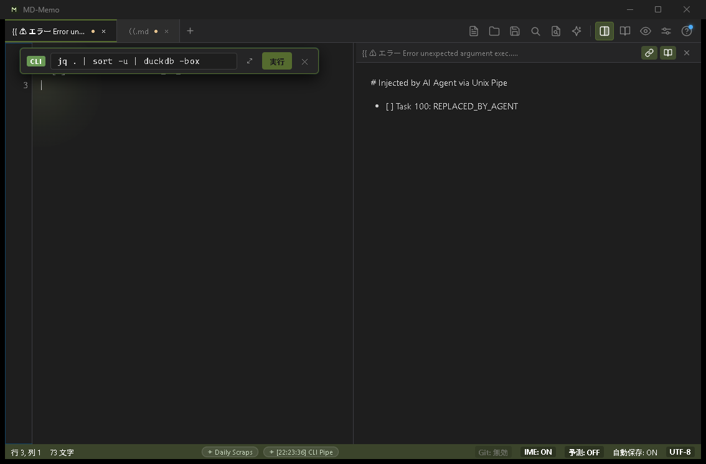
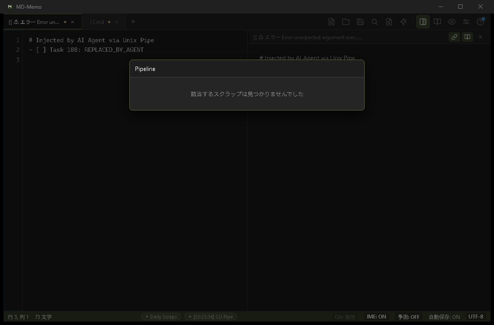
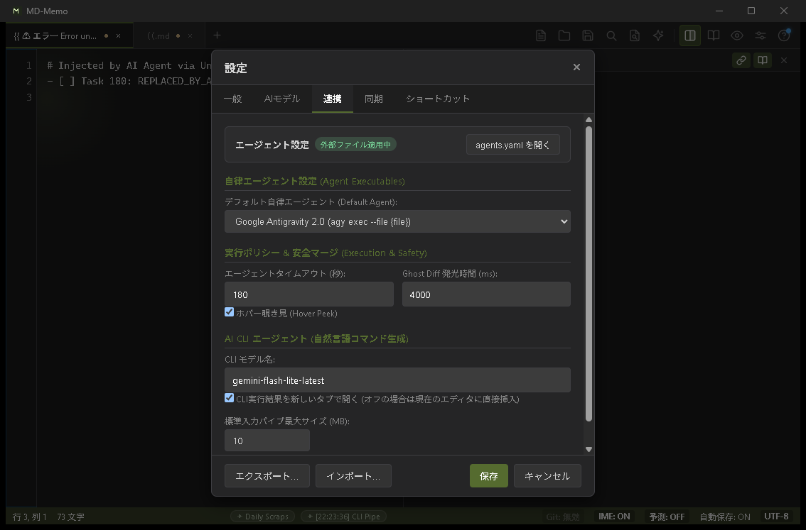

# MD-Memo (日本語ドキュメント)

> 一瞬の思考を、ゼロの摩擦で。思考キャプチャのためのローカルファースト・マークダウンスクラッチパッド。

[](LICENSE)
[](https://golang.org/)
[](#クイックスタート)
[](https://youshinh.github.io/md-memo/manual_ja.html)

**MD-Memo** は、システムトレイに静かに常駐する高帯域な入力端末です。コンパイルされたGo言語コアとOSネイティブWebViewで構築され、ミリ秒で復帰し、多言語IMEの状態を自律管理し、用が済めば瞬時にバックグラウンドへ潜みます。

[公式マニュアル・詳細設定ガイド](https://youshinh.github.io/md-memo/manual_ja.html) • [English Manual](https://youshinh.github.io/md-memo/manual.html) • [リリースページ](https://github.com/youshinh/md-memo/releases) • [スクラッチパッドの逆説](#スクラッチパッドの逆説) • [設計思想と機能一覧](#設計思想と機能一覧) • [プログラマブル制御ハブ](#プログラマブル制御ハブ--json-rpc-20) • [クイックスタート](#クイックスタート) • [English (README.md)](README.md)

---

## スクリーンショット・ショーケース

| 左右分割プレビュー & Mermaid 構文図解 (`Ctrl+\`) | コマンドパレット (`Ctrl+Shift+P`) |
|:---:|:---:|
|  |  |

| インライン AI プロンプトバー (`Ctrl+K`) | CLI パイプライン・フィルタバー (`Ctrl+Shift+B`) |
|:---:|:---:|
|  |  |

| デイリースクラップ高速並列検索 (`Ctrl+Shift+F`) | 自律エージェント連携 & 実行ポリシー設定 |
|:---:|:---:|
|  |  |

---

## スクラッチパッドの逆説

NotionやObsidianのような巨大なナレッジベースは、長期的な情報整理には極めて優れています。しかし、そのアーキテクチャは本質的に起動遅延と大きなメモリ消費を伴います。一瞬のひらめきを書き留めたい時や、エラーログを急いで貼り付けたい時、2〜5秒の起動待ちは思考の勢いを完全に断ち切ってしまいます。

**MD-Memoは保管庫の代替品ではありません。保管庫の「直前に置く、ゼロ抵抗の即時バッファ」です。**

| 比較項目 | 一般的なテキストエディタ | ナレッジ保管庫 (Notion/Obsidian) | MD-Memo |
|---|---|---|---|
| **アーキテクチャ** | C++ / Swift | Electron / JVM | **Go 1.26 + OSネイティブ WebView** |
| **起動・復帰遅延** | ~100ms (Cold) | 2.0秒 – 5.0秒 | **&lt; 15ms (トレイ常駐からの瞬時復帰)** |
| **待機時メモリ** | ~15 MB | 400 MB – 800 MB+ | **5 – 15 MB (積極的GCによる圧縮)** |
| **保存モデル** | プレーンテキスト | 内部DB / 独自フォーマット | **100% ローカル POSIX プレーンテキスト** |
| **外部遠隔制御** | プラグイン依存 / なし | 重量HTTPプラグイン | **ミリ秒応答 JSON-RPC 2.0 TCP IPC** |
| **ファイルダイアログ** | OSネイティブ | Node.js IPCラッパー | **COM `IFileDialog` / Cocoa Native** |

> **おすすめ運用法**: MD-Memoの保存先を作業中のObsidian Vault（`Daily Notes/` 等）やGitリポジトリに直接指定することで、瞬時メモ端末として機能します。

---

## 設計思想と機能一覧

### 1. 極小フットプリント & サブミリ秒復帰
24時間365日常駐してもPCリソースを圧迫しません。
- **瞬時召喚 (`Ctrl+Alt+M` / `Option+Cmd+M`)**: 重い描画パイプラインをバイパスし、トレイから15ms未満で前面化。直前のカーソル位置に即座に復帰します。
- **積極的アイドルメモリ回収**: ウィンドウ最小化時やアイドル時に `debug.FreeOSMemory()` を自動発行し、ワーキングセットを5〜15MBまで瞬時に圧縮します。
- **ネイティブOSダイアログ**: Windows COM / macOS Cocoaと直結し、ファイル選択も一瞬です。

### 2. 自律型 IME シールド (IME Guardian)
日本語入力時の「全角英数誤爆」ストレスを根絶します。
- **レキシカルスコープ保護**: インラインコード（`` `...` ``）、コードブロック、URLの中では全角入力を自動遮断し、11µsの極小オーバーヘッドで半角英数モードへ誘導します。
- **直接入力の自動救済**: 半角直接入力モードのまま「konnitiha」と打ってしまった場合、自動でひらがな変換へ救済します。
- **LLRT言語モデル**: 統計的仮説検定（Log-Likelihood Ratio Testing）に基づく高速判定により、タイピング速度を損ないません。

### 3. ローカルファースト AI & Jev 自律アクション
AIは邪魔なチャット画面ではなく、静かな影として寄り添います。
- **完全オフラインのゴーストテキスト**: ローカルのOllama（Gemma 4 E2B等）やLM Studioと連携し、タイピングを中断しない予測補完を提供。
- **Jev System 1 自律アクション**: メモ内のタスクやコマンドをリアルタイム解析し、3-Beamアクションバーで安全な実行候補を提案。
- **決定論的 AST ガードレール**: AIが生成・予測したコマンドは、内蔵のAST構文検証エンジンで厳格にチェック。`rm -rf /` やディスク破壊コマンドを完全に遮断します。
- **思考トークンの自動除去**: DeepSeek等の推論モデルが出力する `<think>` タグを、描画前に透過的にクリーニングします。

### 4. UNIX パイプライン & CLI 自動化
メモ帳を標準入出力のストリームとして扱えます。
- **CLI パイプ入力 (`cat log | md-memo`)**: ターミナルの出力を実行中インスタンスへミリ秒転送し、当日のデイリースクラップ（`scraps/YYYY-MM-DD.md`）へ即座に追記。
- **外部 CLI フィルタ (`Ctrl+Shift+B`)**: 選択したテキストを `jq`, `sort`, `tr`, `prettier`, `duckdb` などのローカルコマンドに流し込み、インプレース置換。
- **自然言語 AI CLI (`Ctrl+Shift+E`)**: やりたいことを日本語で入力するだけで、安全なコマンドを自動生成・AST検証の上で非同期実行。

### 5. 高速並列スクラップ検索 (`Ctrl+Shift+F`)
- **CPU全コア並列スキャン**: `runtime.NumCPU()` のワーカースレッドと `bufio.Scanner` により、数年分の過去スクラップを150ms未満で高速Grep検索。
- **ダイレクトジャンプ**: 検索結果をクリックまたはEnterキーで、該当行へスムーズスクロール＆ハイライト。

### 6. バックグラウンド Git 自動同期
- **サイレント同期**: アプリ起動時に `git pull --rebase` を実行し、編集後30秒アイドルが続くと自動で `git add/commit/push` をバックグラウンド処理。
- **1クリック初期化**: 設定画面でGitHub等の空リポジトリURLを入力するだけで、自動でローカルGitリポジトリを初期化・紐付けします。

---

## プログラマブル制御ハブ & JSON-RPC 2.0

MD-Memoは、内蔵のJSON-RPC 2.0 TCPサーバー（`127.0.0.1:49152` / `session.json`）を介して、Neovim、VS Code、シェルスクリプト、自律AIエージェントから完全に外部遠隔操作できます。

### Headless CLI コマンド
```bash
# 1. アクティブなバッファ内容を取得 (プレーンテキスト または JSON)
md-memo buffer get
md-memo buffer get --json

# 2. 楽観的ロック（競合検知）付きでバッファを置換
echo "# 新しいノート" | md-memo buffer set --expected-hash a1b2c3d4

# 3. バッファ末尾へ追記
echo "- [ ] 新しいタスク" | md-memo buffer append

# 4. 指定した行・列の範囲のみを選択置換
echo "置換テキスト" | md-memo buffer replace --start 2:0 --end 2:15

# 5. コマンドの安全性をAST検証エンジンでテスト (Headless)
md-memo jev verify "git status && npm test"
# 出力: {"is_safe": true, "reason": "Deterministic AST check passed"}

# 6. 自律エージェントの実行
md-memo agent run "今日のスクラップを要約して箇条書きで整理"
```

---

## クイックスタート

インストーラー不要の単一バイナリとして配布されています。

### パッケージマネージャー

#### Windows
```powershell
winget install youshinh.md-memo
```

#### macOS
```bash
brew install --cask youshinh/tap/md-memo
```

### 単体バイナリ
[GitHub Releases](https://github.com/youshinh/md-memo/releases) ページから直接ダウンロード可能です。

---

## ショートカット一覧

| 機能 / アクション | Windows / Linux | macOS |
|---|---|---|
| グローバル瞬時召喚 / 格納 | `Ctrl + Alt + M` | `Option + Cmd + M` |
| 高速スクラップ並列検索 | `Ctrl + Shift + F` | `Cmd + Shift + F` |
| コマンドパレット | `Ctrl + Shift + P` | `Cmd + Shift + P` |
| インライン AI プロンプトバー | `Ctrl + K` | `Cmd + K` |
| AI プロンプトモーダル | `Ctrl + L` | `Cmd + L` |
| AI 文章校正・誤字脱字修正 | `Alt + C` | `Option + C` |
| CLI パイプライン・フィルタ | `Ctrl + Shift + B` | `Cmd + Shift + B` |
| 自然言語 AI CLI エージェント | `Ctrl + Shift + E` | `Cmd + Shift + E` |
| 左右分割（スプリットビュー） | `Ctrl + \` | `Cmd + \` |
| ゴーストテキスト単語採用 | `Ctrl + →` | `Option + →` |
| 現在の日時を挿入 | `F5` | `F5` |

*(詳細な操作ガイド・詳細設定の解説は [公式マニュアル](https://youshinh.github.io/md-memo/manual_ja.html) をご覧ください)*

---

## システムトポロジー

```text
[ フロントエンド: モノスペースCanvas / ゴーストオーバーレイ / 検索UI / 分割表示 ]
                                      ▲
                                      │ 双方向 RPC ブリッジ
                                      ▼
[ コアエンジン: Go 1.26 / OSネイティブ WebView / DirectComposition 高速ウィンドウ ]
       │
       ├─► プログラマブル JSON-RPC 2.0 TCP サーバー (127.0.0.1:49152 / session.json)
       │    ├─► buffer.get / set / append / replace (楽観的ロック & Undo履歴保護)
       │    ├─► tab.list / switch
       │    └─► ui.toggle_split / activate / eval
       │
       ├─► Jev 自律アクションアーキテクチャ
       │    ├─► System 1 予測アクションバー (3-Beam コンテキスト推論)
       │    ├─► 決定論的 AST ガードレール (ASTCommandVerifier)
       │    └─► MAP-Elites 多様性セレクタ
       │
       ├─► ローカル & クラウド AI 推論
       │    ├─► オフライン Ollama / Gemma 4 E2B ワンクリック連携
       │    ├─► Gemini Flash Lite Vision OCR (クリップボード画像 Ctrl+V)
       │    └─► OpenRouter & OpenAI互換エンドポイント
       │
       ├─► 高速ストレージ & 並列検索
       │    ├─► デイリースクラップ集約 (scraps/YYYY-MM-DD.md)
       │    ├─► 並列 Grep エンジン (runtime.NumCPU() マルチスレッド)
       │    └─► バックグラウンド Git 同期 (サイレント Rebase & 自動コミット/Push)
       │
       ├─► 自律型 IME Guardian (コードブロック全角英数自動遮断)
       └─► 積極的メモリ回収エンジン (debug.FreeOSMemory() -> アイドル時 5-15MB)
```

---

## 公式ドキュメント・マニュアル

- [公式マニュアル・詳細設定ガイド (日本語)](https://youshinh.github.io/md-memo/manual_ja.html)
- [Official User Manual (English)](https://youshinh.github.io/md-memo/manual.html)

---

## ライセンス

[MIT License](LICENSE) のもとで配布されています。個人利用・商用利用ともに完全無料です。
