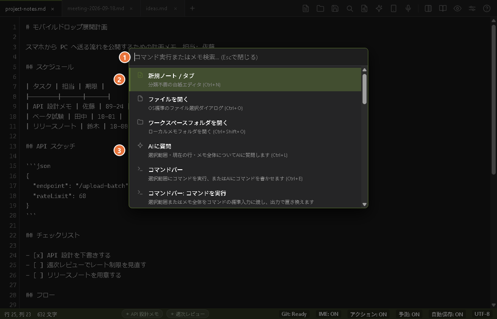
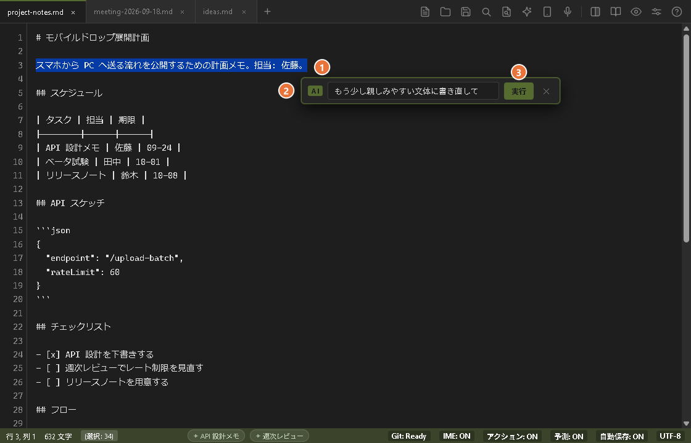
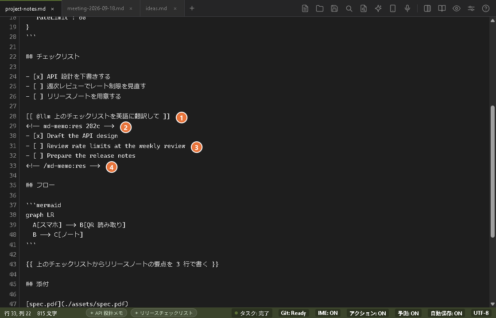

# MD-Memo (日本語ドキュメント)

> 一瞬の思考を、ゼロの摩擦で。思考キャプチャのためのローカルファースト・マークダウンスクラッチパッド。

[](LICENSE)
[](https://golang.org/)
[](#クイックスタート)
[](https://youshinh.github.io/md-memo/manual_ja.html)

**MD-Memo** は、システムトレイに静かに常駐する高帯域な入力端末です。コンパイルされたGo言語コアとOSネイティブWebViewで構築され、ミリ秒で復帰し、多言語IMEの状態を自律管理し、用が済めば瞬時にバックグラウンドへ潜みます。

[公式マニュアル・詳細設定ガイド](https://youshinh.github.io/md-memo/manual_ja.html) • [English Manual](https://youshinh.github.io/md-memo/manual.html) • [リリースページ](https://github.com/youshinh/md-memo/releases) • [スクラッチパッドの逆説](#スクラッチパッドの逆説) • [迷ったらこの表](#迷ったらこの表) • [設計思想と機能一覧](#設計思想と機能一覧) • [プログラマブル制御ハブ](#プログラマブル制御ハブ--json-rpc-20) • [AIエージェント向け](#aiエージェントから-md-memo-を使う) • [クイックスタート](#クイックスタート) • [English (README.md)](README.md)

---

## スクリーンショット・ショーケース

| 左右分割プレビュー & Mermaid 構文図解 (`Ctrl+\`) | コマンドパレット (`Ctrl+Shift+P`) |
|:---:|:---:|
|  |  |

| AIに質問 (`Ctrl+L`) | コマンドバー (`Ctrl+E`) |
|:---:|:---:|
|  |  |

| 自動セレクター (`Ctrl+Enter`) |
|:---:|
|  |

| デイリースクラップ高速並列検索 (`Ctrl+Shift+F`) | 自律エージェント連携 & 実行ポリシー設定 |
|:---:|:---:|
|  |  |

---

## スクラッチパッドの逆説

NotionやObsidianのような巨大なナレッジベースは、長期的な情報整理には極めて優れています。しかし、そのアーキテクチャは本質的に起動遅延と大きなメモリ消費を伴います。一瞬のひらめきを書き留めたい時や、エラーログを急いで貼り付けたい時、2〜5秒の起動待ちは思考の勢いを完全に断ち切ってしまいます。

**MD-Memoは保管庫の代替品ではありません。保管庫の「直前に置く、ゼロ抵抗の即時バッファ」です。**

| 比較項目 | 一般的なテキストエディタ | ナレッジ保管庫 (Notion/Obsidian) | MD-Memo |
|---|---|---|---|
| **アーキテクチャ** | C++ / Swift | Electron / JVM | **Go 1.26 + OSネイティブ WebView** |
| **起動・復帰遅延** | ~100ms (Cold) | 2.0秒 – 5.0秒 | **&lt; 15ms (トレイ常駐からの瞬時復帰)** |
| **待機時メモリ** | ~15 MB | 400 MB – 800 MB+ | **5 – 15 MB (積極的GCによる圧縮)** |
| **保存モデル** | プレーンテキスト | 内部DB / 独自フォーマット | **100% ローカル POSIX プレーンテキスト** |
| **外部遠隔制御** | プラグイン依存 / なし | 重量HTTPプラグイン | **ミリ秒応答 JSON-RPC 2.0 TCP IPC** |
| **ファイルダイアログ** | OSネイティブ | Node.js IPCラッパー | **Windows: ネイティブ COM `IFileDialog`。macOS: AppleScript経由のシステムファイル選択。** |

> **おすすめ運用法**: MD-Memoの保存先を作業中のObsidian Vault（`Daily Notes/` 等）やGitリポジトリに直接指定することで、瞬時メモ端末として機能します。

---

## 迷ったらこの表

AI まわりの機能は「書く」「実行する」「任せる」の3つの動詞に整理されています。それぞれ覚えるべき入口はひとつだけです。AIに質問は `Ctrl+L`、コマンドバーは `Ctrl+E`、任せるは `Ctrl+Enter` です。`Ctrl+Enter` は書いた行の内容から動作を選ぶ「おまかせ」も兼ね、迷ったときは `Ctrl+J` が次の一手を提案します。

| やりたいこと | 入口 | どんな機能か |
|---|---|---|
| **書く** — 選択した文を直したい・書いてほしい | AIに質問 `Ctrl+L` / `Cmd+L` | 内蔵のLLMが選択範囲（なければ現在の行）に対する指示に答え、その結果を数秒で直下に挿入します |
| **実行する** — コマンドを走らせたい | コマンドバー `Ctrl+E` / `Cmd+E`（自分でコマンドを書く。`Tab` でAIモードに切り替えると、日本語で説明するだけでAIが書く） | 選択範囲をシェルコマンドに通し、その出力を下に挿入します（設定で置き換えに変えられます） |
| **任せる** — 調査や実装をまるごと頼みたい。または、行の内容から動作を自動で選ばせたい | 自動セレクター: 行の上で `Ctrl+Enter` / `Cmd+Enter`（`{{ @エージェント 指示 }}` を自分で書いても構いません） | 行の内容から、内蔵LLMに質問するか、外部のエージェントCLI（バックグラウンドで数分かけて作業）に任せるか、コマンドを実行するかを判定し、結果を行の下に書きます |
| **何をすべきか分からない** | `Ctrl+J` / `Cmd+J` | いま書いている内容に合う次の一手を最大3件提案します（アクション候補） |

*(各機能の詳しい使い方は [公式マニュアル](https://youshinh.github.io/md-memo/manual_ja.html) をご覧ください)*

---

## 設計思想と機能一覧

### 1. 極小フットプリント & サブミリ秒復帰
24時間365日常駐してもPCリソースを圧迫しません。
- **瞬時召喚 (`Ctrl+Alt+M` / `Option+Cmd+M`)**: 重い描画パイプラインをバイパスし、直前のカーソル位置に即座に復帰します。Windowsではシステムトレイから15ms未満で前面化。macOSにはメニューバー常駐アイコンがないため、Dockから前面に呼び出します（Dockアイコンをクリックしても同じ動作です。終了は `Cmd+Q`）。
- **積極的アイドルメモリ回収**: ウィンドウ最小化時やアイドル時に `debug.FreeOSMemory()` を自動発行し、ワーキングセットを5〜15MBまで瞬時に圧縮します。
- **ネイティブOSダイアログ**: Windowsはネイティブ COM `IFileDialog`、macOSはAppleScript経由のシステムファイル選択を使用します。いずれもElectron風のラッパーなしで瞬時に動作します。

### 2. 自律型 IME シールド (IME Guardian)
日本語入力時の「全角英数誤爆」ストレスを根絶します。
- **レキシカルスコープ保護**: インラインコード（`` `...` ``）、コードブロック、URLの中では全角入力を自動遮断し、11µsの極小オーバーヘッドで半角英数モードへ誘導します。
- **直接入力の自動救済**: 半角直接入力モードのまま「konnitiha」と打ってしまった場合、自動でひらがな変換へ救済します。
- **LLRT言語モデル**: 統計的仮説検定（Log-Likelihood Ratio Testing）に基づく高速判定により、タイピング速度を損ないません。
- **プラットフォームの注意**: WindowsではOSの入力ソースを自動で切り替えます（システム言語が日本語なら既定でオン）。macOSでは入力ソースの自動切替にまだ対応していないため、既定ではオフです。

### 3. 書く・任せる・提案する — ローカルファースト AI
AIは邪魔なチャット画面ではなく、静かな影として寄り添います。
- **書く: AIに質問 (`Ctrl+L`)**: 選択範囲・現在の行・ノート全体（カーソルが空行にあるとき）に対して指示を出すと、内蔵のLLMが数秒でその直下に答えを挿入します。元の文章は置き換わりません。`Alt+C` なら指示を書かずに校正だけ、コマンドパレットには推敲・箇条書き要約・タスク抽出のプリセットも用意しています。
- **ゴーストテキスト（受け身の「書く」）**: ローカルのOllama（Gemma 4 E2B等）やLM Studioと連携し、タイピングを中断しない予測補完を提供。
- **任せる (`{{ 指示 }}`、`{{ @エージェント 指示 }}`)**: ノートに書いた指示を外部のエージェントCLI（Claude Code / Codex / Hermes / Antigravity など）へ委譲します。ブロックの中にカーソルを置いて `Ctrl+Enter`、または完結したブロックの横に表示される **実行** ボタンで開始し、バックグラウンドで実行されます。進行状況はタスクパネル（`Alt+T`）で確認できます。従来の `{{ }}` スロットは、これまでどおり結果で置き換わります。`{{ @エージェント ... }}` の依頼（`agents.yaml` のキー、または `claude` や `cc` のような別名で指名）は、指示の行を残して、結果をその下に入れます。記法・エージェント・別名は `agents.yaml` で自由に追加・変更できます（内部名称: Slot）。自動セレクターをオフにしているときや、行が空白のときは、`Ctrl+Enter` は従来の規則のままです。カーソル位置のスロット、なければその後ろの次のスロット、それもなければノート最初のスロットを実行します。
- **自動セレクター (`Ctrl+Enter`)**: 行の上で押すと、ローカルの決まりごと（ネットワークは使いません）が内容を判定し、内蔵LLMへの指示か、エージェントへの依頼か、コマンドかを選びます。指示の行は残り、結果はその下に、2行のコメントで挟んで書かれます。判定は外れることがあるため、エージェントとコマンドは行を書き換えたところで止まり、もう一度 `Ctrl+Enter` を押すと実行します（`Ctrl+Z` で書き換えを取り消せます。確認は設定でオフにできます）。普通の文章など判断に迷うときは「AIに質問」のバーが開き、ノートは勝手には変わりません。`[[ @llm 指示 ]]`、`[[ $ コマンド ]]`（コマンドバーと同じ安全チェックを通ります）、`{{ @エージェント 指示 }}` を自分で書くこともでき、ひな形（スニペット）は `{{` を入力する、コマンドパレットから選ぶ、`;sum` のような短い語を書いて `Tab` を押す、のいずれかで挿入できます。自動判定は 設定 → 連携 でオフにできます。
- **コメントにする (`Ctrl+/`)**: 選択した行を `<!-- -->` で隠し、同じキーで元に戻します（既定は 1 行ずつ。設定 → 一般 で、まとめて 1 つのコメントにもできます）。コメントの中身はプレビューに表示されず、中のタスク・スロット・承認ゲートは実行されません。カーソルがコメントの中にあるときの `Ctrl+Enter` は何もしません。
- **アクション候補 (`Ctrl+J`)**: いま書いている内容から次の一手を最大3件提案。各カードは「書く」「実行」「任せる」のいずれかに対応します。`Ctrl+1`〜`3`（macOSは `Cmd+1`〜`3`）でカードを実行、`Ctrl+Tab` で移動して `Enter` で決定できます。ステータスバーの **アクション** バッジをクリックすると ON → 手動 → OFF と切り替わります。既定では内蔵のローカル規則だけで動作し、ノートの内容は外部に送信されません。APIキーやカスタムエンドポイントを設定した場合に限り、カーソル周辺の約2,000文字が外部の推論モデル（Jev など）へ送られます（内部名称: System 1 / 3-Beam / MAP-Elites）。
- **決定論的 AST ガードレール**: 候補として提示されたシェルコマンドは、実行前にAST構文検証エンジンでチェック。`rm -rf /` などの破壊的コマンドやシステム領域への書き込みを検出すると実行を拒否します。
- **思考トークンの自動除去**: DeepSeek等の推論モデルが出力する `<think>` タグを、描画前に透過的にクリーニングします。

### 4. UNIX パイプライン & CLI 自動化
メモ帳を標準入出力のストリームとして扱えます。
- **CLI パイプ入力 (`cat log | md-memo`)**: ターミナルの出力を実行中インスタンスへミリ秒転送し、当日のデイリースクラップ（`scraps/YYYY-MM-DD.md`）へ即座に追記。
- **コマンドバー (`Ctrl+E`。`Tab` で CLI / AI モードを切り替え)**: 1つのバーに2つのモードがあり、`Ctrl+E` で前回使ったモードのまま開きます。CLI モードでは、選択範囲（選択がなければノート全体）を `jq`, `sort`, `tr`, `prettier`, `duckdb` などのローカルコマンドに流し込みます。出力は選択範囲の直下に挿入され、選択範囲は残ります（設定 → 連携 → コマンドで、選択範囲を置き換える動きにも変えられます）。既定では結果タブにも開きます。選択がなければ結果タブだけが開きます。AI モードでは、やりたいことを日本語で入力すれば、コマンドを入力欄に書いてくれます。バーは CLI モードに戻るので、内容を確かめて（危険なコマンドには安全性チェックの警告が付きます）Enter で実行します。バッジをクリックしてもモードを切り替えられます。

### 5. 高速並列スクラップ検索 (`Ctrl+Shift+F`)
- **CPU全コア並列スキャン**: `runtime.NumCPU()` のワーカースレッドと `bufio.Scanner` により、数年分の過去スクラップを150ms未満で高速Grep検索。
- **ダイレクトジャンプ**: 検索結果をクリックまたはEnterキーで、該当行へスムーズスクロール＆ハイライト。
- **選択やカーソル語で開始・引用**: `Ctrl+Shift+F` は、選択していた文字（なければカーソル直前の単語）を最初から検索した状態で開きます。結果の上で `Tab`（または `Shift+Enter`）を押すと、ファイルを開く代わりに、その行がカーソル位置へ挿入されます（`Ctrl+Z` で取り消し可）。`Ctrl+F` も、選択した文字から始まります。

### 6. バックグラウンド Git 自動同期
- **サイレント同期**: アプリ起動時に `git pull --rebase` を実行し、編集後30秒アイドルが続くと自動で `git add/commit/push` をバックグラウンド処理。
- **1クリック初期化**: 設定画面でGitHub等の空リポジトリURLを入力するだけで、自動でローカルGitリポジトリを初期化・紐付けします。
- **設定パッケージ**: 設定・エージェント定義・このプロジェクトのスキルを1つの `.mdmemopack` ファイルに書き出し（設定 → エクスポート...）、別のPCで読み込めます（設定 → インポート...）。APIキーは **API キーを含める** にチェックを入れない限り含まれず、上書きされるエージェント定義とスキルは先にバックアップされます。

### 7. Mobile Drop — スマホから送る (`Ctrl+Shift+U`)
QRコードを読み取るだけで、スマホの写真・ファイル・ボイスメモ・テキストを、開いているメモへ直接送れます。アプリもアカウントも不要です。

<p align="center"></p>

- **送信トレイ**: 写真・ファイルを最大10件（合計60MBまで。1件あたり画像20MB・音声25MB・テキストファイル2MBまで）追加し、ボイスメモを録音し、テキストを入力して、1つの**「まとめてPCへ送信」**ボタンで送信できます。写真はOCR、ボイスメモは文字起こし、テキストファイルは追記されます。スマホ側で作業（ファイル追加・録音・入力）している間はセッションが維持されるため、バッチ作成中に下記のアイドルタイムアウトにはかかりません。各項目は個別の見出し `## Mobile Drop [14:20:05] — <ファイル名>` の下に入り、処理できない項目が1つあっても残りの送信は止まりません。
- **双方向のテキスト共有**: PCで選択中のテキスト（選択がなければクリップボードのテキスト）がワンタップコピー付きでスマホのページ上部に表示され（2秒ごとに更新、最大64KB）、PC側のダイアログにも共有内容が80文字に切り詰めて表示されます。
- **既定はローカルのみ**: 同一LAN上で一度きりのサーバーを起動します（ランダムな使い捨てトークン。リクエスト本体を読む前にチェックされます。1回の送信、または60秒間操作がないと自動終了）。ネットワークの外には出ません。
- **写真はテキストに**: 写真は、`Ctrl+V` の画像OCRに設定したビジョンモデルで文字起こしします（ローカルのOllamaやLM Studioのモデルならキーは不要です）。クラウドのモデルを設定している場合は、貼り付けと同様にそのプロバイダーへ画像が送られます。
- **失われません**: OCRや文字起こしが未設定の場合、または何らかの理由（APIキー未設定・非対応モデル・空の文字起こし結果・ネットワークエラー・タイムアウトなど）で失敗した場合でも、写真やボイスメモは貼り付け画像と同じように、メモの隣の `./assets/` へ保存されてリンクされ、リンクの下に理由が1行付きます（写真は ``、ボイスメモは `[name](./assets/...)`）。理由の行はUI言語に関わらず日本語で、何件を保存したかがトーストで知らされます。ファイルの保存まで失敗した場合に限り、インラインの `[Mobile Drop: <ファイル名> の処理に失敗しました: <エラー>]` が入ります。
- **スマホ側の堅牢性**: カメラ・ファイル選択・録音アプリへ切り替える直前に、ページがPCへセッションの延長（最大120秒）を依頼するため、録音アプリを開いている間に60秒のアイドル制限でセッションが終わることはありません。送信に失敗した場合は、PC側のセッションが生きていれば1回だけ自動で再送し、そうでなければPCとの接続が切れている（閉じたか時間切れ）ことを知らせ、PCでMobile Dropを開き直してQRコードを読み取り直すよう案内します。
- **位置情報は任意（トンネル使用時のみ）**: Cloudflareトンネル経由（HTTPS）のときだけ、スマホは位置情報を1回だけ、1度限りの試行として添付でき、最初の項目の見出しだけが `## Mobile Drop [14:20:05] — <ファイル名> (34.693, 135.502)` のようになります。通常のLAN（HTTP）では要求も添付もしません。
- **外部ネットワーク（任意）**: ダイアログのボタンで [Cloudflare Quick Tunnel](https://developers.cloudflare.com/cloudflare-one/connections/connect-networks/do-more-with-tunnels/trycloudflare/) に切り替えると、LTEや別のWi-Fiからも送れます。トンネル経由ではページ内でのボイスメモ録音も使えます（通常のLANではスマホ本体の録音アプリが開きます）。`cloudflared` のインストールが必要で、送信内容はCloudflareのサーバーを経由します。

### 8. スマート貼り付け (`Ctrl+V` / `Ctrl+Shift+V`)
クリップボードの中身に応じて使い分ける2つの貼り付けショートカットです。
- **`Ctrl+V` はMarkdownにして貼る**: Webページ・Word・Google Docs・Excelの、構造のある `text/html` を内蔵コンバータでMarkdownに変換します（見出し・リスト・列揃え付きの表・タスクチェックボックス・コードブロックなど）。安全のため `script`・`style`・`iframe`・`svg` の中身と `javascript:`・`data:` リンクは除去します。構造のないHTML（エディタやターミナルからのコードとログ、1セルだけのコピー）は、そのまま貼ります。クリップボードに画像しかない場合は、ビジョンOCRでMarkdown/Mermaidに変換します。OCRがオフのとき、またはAPIが未設定のときは、画像を `./assets/` に保存してリンクで貼ります（`Ctrl+Shift+V` やMobile Dropと同じ）。理由はメッセージに出ます。
- **`Ctrl+Shift+V` はそのまま貼る**: 加工しないプレーンテキストを貼ります。画像のみのクリップボードは `./assets/`（拡張子は画像形式に合わせる）へ保存してリンクし、OCRには送りません。ExcelやWordのようにテキストと画像が両方乗っている場合は、テキストを貼り付け、画像は無視します。
- **設定 → 一般**: 「Ctrl+V で Web・Word・Excel の内容を Markdown にして貼る」（既定でオン）。オフにすると、以前の割り当て（`Ctrl+V` がプレーン、`Ctrl+Shift+V` が変換）に戻ります。

### 9. 音声入力 (`Ctrl+Shift+R`)
押すと録音を開始し、カーソル位置のマーカーで録音中・文字起こし中の状態が分かります。既定のモデルはGoogleの `gemini-3.5-transcribe` で、Interactions API に `store: false` を付けて呼び出すため、録音も文字起こし結果もGoogle側には保存されません。`gemini-2.5-flash` などの従来モデルも generateContent 方式でそのまま使えます。
- **好きな方法で開始**: ショートカット（既定は `Ctrl+Shift+R` / `Cmd+Shift+R`。設定 → ショートカットで変更できます）、ツールバーのマイクボタン、右クリックメニュー、コマンドパレットのいずれかで開始します。録音中は画面の左下に経過時間の表示が出て、**停止** ボタンで録音を止めて文字起こしを始められます（ショートカットをもう一度押すのと同じです）。`Esc` を押すと破棄します。
- **設定（設定 → AIモデル → 音声入力）**: モデル、API 形式（自動 / Interactions API / generateContent）、言語コード（例: `ja-JP, en-US`。空欄なら自動判定で、言語が混在していても使えます）、モード（スマートは言い淀みを除いて整形し、逐語は一言一句そのまま）、カスタム語彙、無音タイムアウト。APIキーとベースURLは画像OCRの設定を使います。
- **話した内容を整える・声で書き換える**: 文字起こしのあと、2 段目のモデル（`gemini-flash-lite-latest`）がフィラーや言い直しを取り除き、いまの行の書式（箇条書き・タスク・表）に合わせます。テキストを選択して話すと、話した内容を編集の指示として選択範囲に適用します。既定でオンで、`Ctrl+Shift+Alt+R` はその 1 回だけ整えずに入力、`Ctrl+Alt+R`（またはステータスバーのバッジ）でオン/オフを切り替えます。失敗したときや遅いときは、文字起こしをそのまま入れます。
- **失敗時の救済**: 文字起こしに失敗した場合は、音声を保持したまま再試行・保存・破棄をワンクリックで選べます（アプリを再起動しても機能します）。

### 10. ファイルリンク & ドラッグ&ドロップ
エディタの文章上にファイルをドロップすると、カーソル位置にMarkdownリンクが挿入されます（画像は ``、それ以外は `[name](...)`）。組み込みブラウザは元のパスを取得できないため、ファイル（最大25MB）は `./assets/` にコピーされます。`Ctrl+クリック` でOS既定のアプリで開き（Webのアドレスはブラウザで開きます）、`Alt+クリック` でファイルをエクスプローラー / Finder に表示します。エディタ内のリンク（Markdownのリンク、画像、`http://` / `https://` で始まるそのままのアドレス）には下線が付くので、クリックできる場所が分かります（画像は点線で、カーソルを重ねるとプレビューも出ます）。`mailto:` などそれ以外の形式には下線が付かず、エディタから開くこともできません。非常に大きなノート（10万文字超）では下線を省きますが、Ctrl+クリックは使えます。行番号は各行の最初の表示行に付き、折り返した行は1つの番号のまま、続きの表示行は空欄になります（12万文字を超えるノートでは、従来どおり単純な 1〜N の番号です）。

### 11. Discord連携 — 閉じていてもどこからでも取り込める
自分のDiscord Botへスマホからメッセージを送ると、次にMD-Memoを起動したときに今日のスクラップへ入ります。送った時にアプリが閉じていても構いません。

- **ホスティングもアカウントも不要（Bot以外は）**: Mobile Dropと違い、起動するサーバーも同じネットワークにいる必要もありません。MD-MemoはBotの当人DMを、外向きのHTTPS通信だけで定期的に確認します（既定45秒間隔）。受信用のポートも中継サーバーもCloudflareアカウントも一切不要で、必要なのは[Discord Developer Portal](https://discord.com/developers/applications)で自分で作る無料のBotと、それを自分がいるサーバーに1つ招待すること（DiscordはBotと1つもサーバーを共有していない相手へのDM開始を許さないため。自分専用の非公開サーバーで十分で、スラッシュコマンドの登録も継続的な活動も不要）だけです。
- **閉じている間も待っていてくれる**: MD-Memoが動いていない間に送ったメッセージも、Discord側の履歴にそのまま残っています。次に起動したときの最初の確認で、前回確認した時点からの分をまとめて取り込みます。
- **本人だけ**: 連携する1つのDiscordアカウント（ユーザーID）からのメッセージだけを受け付け、送信者を毎回照合します。それ以外からのメッセージは無視されます。
- **Mobile Dropと同じ処理経路**: 写真はOCR、ボイスメモは文字起こしを、設定済みのビジョン/音声設定でそのまま行います。失敗した場合は、Mobile DropやCtrl+Vと同様に理由付きで `./assets/` にファイルとして保存されます。
- **設定 → 同期 → 「Discordからのモバイル入力」**: Botトークンと自分のDiscordユーザーIDを貼り付けて有効化し、**接続テスト**で確認してから使えます。

### 12. クイックキャプチャ & 画面キャプチャ（Windowsのみ）
アプリを開かずに書き留められる、常に最前面の小さなポップアップです。入力欄と、**Send**・**AI Send**・**Capture** の3つのボタンがあります（ボタンの表記はどのUI言語でも英語です）。
- **クイックキャプチャ (`Ctrl+Shift+Q`)**: グローバルホットキー（設定 → ショートカットで変更・解除できます。他のプログラムがすでに使っている組み合わせは拒否されます）、ツールバーのボタン、トレイメニュー、コマンドパレットから開きます。`Enter`（Send）は入力したとおりのテキストを今日のスクラップに追記し（入力欄が空ならクリップボードのテキスト）、`Ctrl+Enter`（AI Send）は `Alt+C` と同じAIで先に校正してから追記し、`Esc` で閉じます。ホットキーで開いてAI校正つきで追記したときは（通常の送信は入力した文字だけです）、エントリーの先頭に、直前まで使っていたウィンドウのタイトルを示す `> [context: <ウィンドウのタイトル>]` の行が付きます。フォーカスを失って1秒たつと、ポップアップは自動で閉じます。
- **画面キャプチャ (ポップアップで `Ctrl+Shift+Enter`、または Capture ボタン)**: 選ぶまで画面は一切読み取りません。ウィンドウにカーソルを重ねてクリックするか、範囲をドラッグします。`Ctrl` を押したまま選ぶと複数をまとめて選べ、`Ctrl` を離すと全部を取り込みます。`Esc` か右クリックで取り消します。取り込んだ画像はPNGとして `assets/` に保存されて今日のノートにリンクされ、選んだ順にOCRで文字が読み取られます（OCRエンジンは次の節）。既定では画像は画像OCRに設定したビジョンモデルへ送られ、**画像をこのPCの外に出さない**（設定 → 同期 → ホットフォルダ）をオンにするとPC内だけで読み取ります。
- macOS: どちらもまだ使えません（ツールバーのボタンもショートカットの行も表示されません）。

### 13. ホットフォルダ — 画像と音声がそのままノートに（Windows / macOS）
設定 → 同期 → **ホットフォルダ** でオンにします（既定はオフ。既定のフォルダは `~/Documents/md-memo/inbox`）。すでに置かれているファイルは起動時に1回だけ処理し、以降は新しく届いたものを順に処理します。
- **動作**: 画像（`.png .jpg .jpeg .bmp .gif .webp`）はOCRで文字を読み取り、引用とリンクとして今日のノートに追記します。音声（`.mp3 .wav .m4a .ogg .flac`）は文字起こしして、時刻とリンク付きで追記します。処理したファイルはスクラップ横の `assets/` へ移動し、OCRや文字起こしに失敗しても削除しません（代わりに理由が1行、ノートに入ります）。
- **OCR**: まず 設定 → AIモデル → 画像OCR のクラウドのビジョンモデルで読み取り（精度が大幅に高いため）、失敗したときだけ端末内エンジンを使います。**画像をこのPCの外に出さない** をオンにすると端末内エンジンだけで読み取り、画像を外部へ送りません（精度は下がります）。macOSには端末内OCRエンジンがないため、画像はクラウドのビジョンモデルだけで読み取られ、このオプションは表示されません。
- **文字起こし**: 既定は Gemini です。Windows（x64）では 設定 → AIモデル → 音声入力 → エンジン で **Whisper（このPC内・オフライン）** に切り替えられます。Whisper 本体（約9MB）とモデル（既定は日本語に特化した kotoba-whisper で約513MB。多言語版・軽量版や、手元のファイル／URLも使えます）はこの画面から必要なときにダウンロードし、Gemini での再試行をオンにしない限り音声は外部へ送りません。エンジンはフォルダ監視とDiscord連携に適用され、画面での音声入力とMobile Dropは引き続きGeminiを使います。macOSでは音声はGeminiだけで文字起こしされます。
- **フォルダを開く**: ホットフォルダがオンの間、トレイメニューの **Open inbox folder**（Windows。表記は英語）、またはコマンドパレットの **受信フォルダを開く**（両OS）で開けます。

### 14. 「送る」と `md-memo ocr` — ウィンドウを開かずに画像を文字に
- **Windows、「送る」**: 設定 → 連携 → **OS連携（送る）** の「追加」で、エクスプローラーの「送る」メニューに **MD-Memo (OCR)** が入ります（「解除」で元に戻ります）。画像を右クリック → 送る → MD-Memo (OCR) を選ぶと、文字が今日のノートに追記され、ウィンドウは開きません。
- **ターミナル、WindowsとmacOS**: `md-memo ocr <画像>` で同じことができます（`--json` でJSON出力。MD-Memoを起動していなくても使えます）。画像OCRの設定とスクラップのフォルダは `config.json` から読み、ノートのパスを表示します（文字がなければ `(no text recognized)`）。macOSではクラウドOCRのみです。

### WindowsとmacOSの違い
WindowsとmacOSは同じコアを共有しており、上の各節にあるプラットフォームの注意（瞬時召喚・IME Guardian・ファイルダイアログ）はそのまま当てはまります。新しいキャプチャ系の機能は次のように違い、「なし」「非表示」とした項目は、いまのところmacOSでは使えません。

| 機能 | Windows | macOS |
|---|---|---|
| クイックキャプチャのポップアップ（ホットキー・ツールバーボタン・トレイ項目） | あり | なし |
| 画面キャプチャ | あり | なし（未実装） |
| ホットフォルダ（画像→文字、音声→文字） | あり | あり（ただし画像はクラウドのビジョンモデルのみ、音声はGeminiのみ） |
| **画像をこのPCの外に出さない**（端末内OCRのみ） | あり | 非表示（端末内OCRエンジンがないため） |
| このPC内 Whisper | あり（x64） | なし |
| 「送る」メニュー、トレイの **Open inbox folder** | あり | なし（トレイも「送る」もありません）。コマンドパレットの項目は両OSにあります |
| `md-memo ocr <画像>` | あり | あり（クラウドOCRのみ） |
| リンクの下線・`Cmd+クリック`・折り返した行の行番号 | あり | 動作する見込み（同じWebコードのため）。実機のMacではまだ未確認 |

---

## プログラマブル制御ハブ & JSON-RPC 2.0

MD-Memoは、内蔵のJSON-RPC 2.0 TCPサーバー（既定は `127.0.0.1:49152`。実際に使われているポートとセッショントークンは、アプリの設定フォルダの `ipc-session.json` に書き込まれます）を介して、Neovim、VS Code、シェルスクリプト、自律AIエージェントから完全に外部遠隔操作できます。

### CLI サブコマンド
`buffer`（`get`、`set`、`append`、`replace`、`replace-selection`） / `tab` / `ui` は起動中のMD-Memoを操作します。`jev`・`agent`・`ocr` は単体で動作します。`--json` は `buffer` のすべてのサブコマンドで使えます。`--tab <id>` が実際に効くのは `buffer get`（`--selection` 付きも含む）と `buffer replace-selection` だけで、`set`・`append`・`replace` は常に主ペインのアクティブなタブに対して動作します。`md-memo --help` は、何も起動せずに、全コマンドとそのフラグに加えて、パイプでテキストを渡す方法と JSON-RPC ポートを直接呼ぶ方法も表示します（1つのコマンドなら `md-memo help buffer`、版は `md-memo --version`）。スクリプトやAIエージェントが最初に実行するのはこれです。

```bash
# 1. アクティブなバッファ内容を取得 (端末ではプレーンテキスト。パイプ時や --json では内容ハッシュ付きJSON。--text でプレーンテキストを強制)
md-memo buffer get
md-memo buffer get --json

# 2. 楽観的ロック（競合検知）付きでバッファを置換
#    （ハッシュは `buffer get --json` が返すバッファのSHA-256の先頭16桁）
echo "# 新しいノート" | md-memo buffer set --expected-hash a1b2c3d4e5f60718

# 3. バッファ末尾へ追記
echo "- [ ] 新しいタスク" | md-memo buffer append

# 4. 指定した行・列の範囲のみを選択置換
echo "置換テキスト" | md-memo buffer replace --start 2:1 --end 2:15

# 5. 選択範囲だけを表示。選択がなければ終了コード1、標準エラーに "no active selection"
md-memo buffer get --selection
md-memo buffer get --selection --json

# 6. パイプで渡したテキストで選択範囲を置換（1回のUndoにまとまる。
#    読み取り後に選択範囲が変わっていた場合はconflictエラーで拒否されます）
cat formatted.txt | md-memo buffer replace-selection

# 7. コマンドの安全性をAST検証エンジンでテスト (単体動作。ブロック時は終了コード1)
md-memo jev verify "git status && npm test"
# [SAFE] Command passed AST validation: git status && npm test
md-memo jev verify --json "rm -rf /"
# {"isSafe": false, "reason": "破壊的コマンド \"rm\" は安全基準により実行を拒否されました (Destructive command blocked)",
#  "command": "rm -rf /", "rule": "destructive", "subject": "rm"}

# 8. 同じ検証を --mode で使い分ける:
#    strict（既定。誰もレビューしないワンクリック経路向け）/ reviewed（実行前に人が確認）/ unattended（フック向け）
#    終了コード: 0 安全, 1 ブロック, 2 警告（破壊的とは断定できないが安全を保証できない）
md-memo jev verify --mode reviewed "git status"

# 9. エージェントに渡す前に、Markdownから関連する部分だけを抽出 (Headless)
md-memo agent prune --query "認証まわりの不具合" --file notes.md

# 10. 画像の中の文字を読み取り、今日のスクラップへ追記 (単体動作: MD-Memoを起動していなくてもよい。--json でJSON出力)
md-memo ocr screenshot.png
# OCR text appended to <スクラップのフォルダ>/2026-09-24.md   (文字がなければ "(no text recognized)")

# 11. ヘルプと版: 標準出力に表示して終了コード0。ウィンドウの起動も前面化もしません
md-memo --help          # -h や "md-memo help" でも同じ
md-memo help buffer     # 1つのコマンド ("md-memo buffer --help" でも可)
md-memo help rpc        # JSON-RPC ポート: セッションファイル、通信形式、メソッド、エラーコード
md-memo help pipe       # パイプでテキストを渡す
md-memo --version
```

---

## AIエージェントから MD-Memo を使う

このリポジトリにはエージェント用スキル [`skills/md-memo/`](https://github.com/youshinh/md-memo/tree/main/skills/md-memo) が入っています。すべてのインターフェース・設定ファイル・セットアップ手順をソースで検証した内容にまとめたもので、コーディングエージェントが推測に頼らず MD-Memo を操作したり、あなたの代わりにセットアップしたりできます。このスキルは**プログラム本体には入っていません**。v1.7.1 以降は、配布 zip にプログラムと並んで `skills` フォルダとして入っているので、zip の中の `skills/md-memo` を使います。それ以前の zip や、別の方法（たとえば Homebrew）でインストールした場合は入っていないので、GitHub から入手してください。上のフォルダのアドレスをエージェントに渡すか、リポジトリを **Code → Download ZIP** または `git clone https://github.com/youshinh/md-memo.git` で取得して `skills/md-memo` フォルダを使います。どちらの場合も、最初に `SKILL.md` を読むよう伝えます。Web ページを読めるエージェントなら、`SKILL.md` からリンクされた 3 つの `references/` ファイルも自分で開きます。いつでも使えるようにするには、このフォルダ（Markdown ファイル 4 つ、約 280 KB）をエージェントのスキルフォルダへコピーしてください（Claude Code なら `~/.claude/skills/md-memo`）。そのうえで、音声入力・OCR・Ollama・Git同期の設定や、エージェントCLIの追加を頼めます。`config.json` の編集は MD-Memo を完全に終了している間だけで、APIキーを表示することはなく、起動中のアプリの2つ目のインスタンスも起動しません。

| エージェントが使えるもの | 説明の場所 |
|---|---|
| **CLI**: `md-memo buffer`（`get`、`set`、`append`、`replace`、`replace-selection`）、`tab`、`ui`、単体で動く `jev verify`・`agent prune`・`ocr` | `SKILL.md` と `references/interfaces.md`（1章） |
| **JSON-RPC 2.0**（`127.0.0.1`。ポートとセッショントークンは `ipc-session.json`）: 同じ操作をコードから、エラーコードと `expected_hash` によるロック付きで | `references/interfaces.md`（2章） |
| **編集してよいファイル**: `config.json`（MD-Memo の終了中のみ）、`agents.yaml`、スロットエージェントが使うプロジェクトの `.env`。全スキーマと、機能ごとの前提条件・確認コマンドのチェックリスト付き | `references/setup-guide.md` |
| **安全ルール**: キーを読まない・表示しない、起動中のインスタンスを起動・終了しない、必ず `--expected-hash` を付ける、`ui eval` はUIの完全な操作権と見なす、`jev verify` はサンドボックスではない | `SKILL.md`。症状別の対処は `references/troubleshooting.md` |

フォルダ全体はこちら: [github.com/youshinh/md-memo/tree/main/skills/md-memo](https://github.com/youshinh/md-memo/tree/main/skills/md-memo)

---

## クイックスタート

インストーラー不要の単一バイナリとして配布されています。

**動作要件**: Windows（x64。Microsoft Edge WebView2 ランタイムが必要で、Windows 11 には標準搭載）、または macOS 10.15 以降。Linux は未対応です。新しい機能のうち、クイックキャプチャ・画面キャプチャ・「送る」・このPC内 Whisper は、いまのところ Windows のみです。詳しくは [WindowsとmacOSの違い](#windowsとmacosの違い) を参照してください。

### パッケージマネージャー

#### Windows
WinGet 用のパッケージはまだ公開されていません（マニフェストは `packaging/winget` に用意してあります）。公開されるまでは、リリースの zip から入れてください（[単体バイナリ](#単体バイナリ)を参照）。PowerShell では次のとおりです。

```powershell
Invoke-WebRequest https://github.com/youshinh/md-memo/releases/latest/download/md-memo-windows-x64.zip -OutFile md-memo.zip
Expand-Archive md-memo.zip -DestinationPath md-memo
md-memo\md-memo.exe
```

#### macOS
```bash
brew install --cask youshinh/tap/md-memo
```

> **macOS初回起動について**: 配布物はアドホック署名のみでApple公証（notarize）は受けていないため、`MD-Memo.app` を初めて開こうとするとGatekeeperにブロックされます。**macOS 15（Sequoia）以降**では、ダイアログの「完了」を押してから（「ゴミ箱に入れる」は押さないでください）、**システム設定 → プライバシーとセキュリティ** を開き、「セキュリティ」の **「このまま開く」** を押してログインパスワードを入力します（このボタンはアプリを開こうとしてから約1時間表示されます）。macOS 14 以前では、Finderでアプリを右クリック（Controlクリック）して「開く」を選びます。どのバージョンでも、アプリのあるフォルダで `xattr -dr com.apple.quarantine "MD-Memo.app"` を一度実行して隔離属性を解除すれば開けます。v1.6.0 からはmacOSビルドが **ユニバーサルバイナリ** で、Apple SiliconとIntel Macの両方に対応します。

### 単体バイナリ
[GitHub Releases](https://github.com/youshinh/md-memo/releases) ページから直接ダウンロード可能です。

### Macを持っていない場合: CIビルドを使う
このリポジトリへのプッシュのたびに、GitHub上のmacOSランナーがすぐ実行できる `MD-Memo.app` をビルドします。Macを持っていなくても動作確認ができます。
1. GitHubにプッシュする（または **Actions** タブから **CI** ワークフローを **Run workflow** で手動実行する）。
2. 最新の **CI** 実行を開き、**Artifacts** から `md-memo-macos-<commit-sha>` をダウンロードする。
3. 展開したら、上記と同じ初回起動手順（お使いのmacOSのバージョンの手順、または `xattr -dr com.apple.quarantine "MD-Memo.app"`）を行う。CIビルドもリリースビルドと同様にアドホック署名されています。

---

## ショートカット一覧

| 機能 / アクション | Windows | macOS |
|---|---|---|
| グローバル瞬時召喚（ウィンドウを前面に出す） | `Ctrl + Alt + M` | `Option + Cmd + M` |
| 高速スクラップ並列検索 | `Ctrl + Shift + F` | `Cmd + Shift + F` |
| コマンドパレット | `Ctrl + Shift + P` | `Cmd + Shift + P` |
| AIに質問（答えは対象の直下に挿入） | `Ctrl + L` | `Cmd + L` |
| AI 文章校正・誤字脱字修正 | `Alt + C` | `Cmd + Shift + C` |
| アクション候補を表示 | `Ctrl + J` | `Cmd + J` |
| アクション候補のカードを実行 | `Ctrl + 1` 〜 `3` | `Cmd + 1` 〜 `3` |
| コマンドバー（前回使ったモードで開く。`Tab` で CLI / AI モードを切り替え） | `Ctrl + E` | `Cmd + E` |
| Mobile Drop（QRでスマホから送信） | `Ctrl + Shift + U` | `Cmd + Shift + U` |
| 自動セレクター（行の内容から、AIに質問・エージェントに任せる・コマンド実行を判定。カーソル位置の `{{ }}` スロットも実行） | `Ctrl + Enter` | `Cmd + Enter` |
| タスクパネルの開閉 | `Alt + T` | `Option + T` |
| 左右分割（スプリットビュー） | `Ctrl + \` | `Cmd + \` |
| プレビューを横に開く | `Ctrl + Alt + V` | `Cmd + Option + V` |
| そのまま貼る（プレーンテキスト・画像はファイル保存。固定） | `Ctrl + Shift + V` | `Cmd + Shift + V` |
| 音声入力（既定。変更可） | `Ctrl + Shift + R` | `Cmd + Shift + R` |
| クイックキャプチャのポップアップ（グローバル。キーを空にするとオフ） | `Ctrl + Shift + Q` | 利用不可 |
| 画面キャプチャ（クイックキャプチャのポップアップ内） | `Ctrl + Shift + Enter` | 利用不可 |
| リンクを開く（ファイル・フォルダ・Webのアドレス） | `Ctrl + クリック` | `Cmd + クリック` |
| リンクを表示（エクスプローラー / Finder） | `Alt + クリック` | `Option + クリック` |
| Zenモード | `Shift + F11` | `Ctrl + Cmd + Z` |
| 全画面表示 | `F11` | `Ctrl + Cmd + F` |
| ゴーストテキスト単語採用 | `Ctrl + →` | `Option + →` |
| 現在の日時を挿入 | `F5` | `Cmd + Shift + I` |
| コメントの切り替え（行を `<!-- -->` で隠す） | `Ctrl + /` | `Cmd + /` |

ほとんどの操作は **設定 → ショートカット** で割り当て直せます。キーのボタンをクリックして、新しい組み合わせを押してください。すでに別の操作で使われている組み合わせは、上書きするか確認されます。予約済みの組み合わせは割り当てできず、`Backspace` でキーを解除でき（その操作は何も起きなくなります）、**初期設定に戻す** ですべて元に戻ります。変更できない固定のショートカットは、そのまま貼る `Ctrl+Shift+V`、自動セレクター `Ctrl+Enter`、タスクパネル `Alt+T`、プレビューを横に開く `Ctrl+Alt+V`、ゴーストテキストの単語採用 `Ctrl+→`、アクション候補カードの実行 `Ctrl+1`〜`3`、リンクの `Ctrl+クリック` / `Alt+クリック` です。

*(詳細な操作ガイド・詳細設定の解説は [公式マニュアル](https://youshinh.github.io/md-memo/manual_ja.html) をご覧ください)*

---

## システムトポロジー

```text
[ フロントエンド: モノスペースCanvas / ゴーストオーバーレイ / 検索UI / 分割表示 ]
                                      ▲
                                      │ 双方向 RPC ブリッジ
                                      ▼
[ コアエンジン: Go 1.26 / OSネイティブ WebView (WebView2 · WKWebView) ]
       │
       ├─► プログラマブル JSON-RPC 2.0 TCP サーバー (127.0.0.1:49152 / ipc-session.json)
       │    ├─► buffer.get / set / append / replace (楽観的ロック & Undo履歴保護)
       │    ├─► buffer.get_selection / replace_selection
       │    ├─► tab.list / switch
       │    └─► ui.toggle_split / activate / eval
       │
       ├─► Jev 自律アクションアーキテクチャ
       │    ├─► System 1 予測アクションバー (3-Beam コンテキスト推論)
       │    ├─► 決定論的 AST ガードレール (ASTCommandVerifier)
       │    └─► MAP-Elites 多様性セレクタ
       │
       ├─► ローカル & クラウド AI 推論
       │    ├─► オフライン Ollama / Gemma 4 E2B ワンクリック連携
       │    ├─► Gemini Flash Lite Vision OCR (クリップボード画像 Ctrl+V)
       │    ├─► このPC内 Whisper (Windows x64・任意でダウンロード)
       │    └─► OpenRouter & OpenAI互換エンドポイント
       │
       ├─► 高速ストレージ & 並列検索
       │    ├─► デイリースクラップ集約 (scraps/YYYY-MM-DD.md)
       │    ├─► ホットフォルダ監視 (画像 / 音声 -> OCR / 文字起こし -> スクラップ)
       │    ├─► 並列 Grep エンジン (runtime.NumCPU() マルチスレッド)
       │    └─► バックグラウンド Git 同期 (サイレント Rebase & 自動コミット/Push)
       │
       ├─► 自律型 IME Guardian (コードブロック全角英数自動遮断)
       └─► 積極的メモリ回収エンジン (debug.FreeOSMemory() -> アイドル時 5-15MB)
```

---

## 公式ドキュメント・マニュアル

- [公式マニュアル・詳細設定ガイド (日本語)](https://youshinh.github.io/md-memo/manual_ja.html)
- [Official User Manual (English)](https://youshinh.github.io/md-memo/manual.html)

---

## ライセンス

[MIT License](LICENSE) のもとで配布されています。個人利用・商用利用ともに完全無料です。
