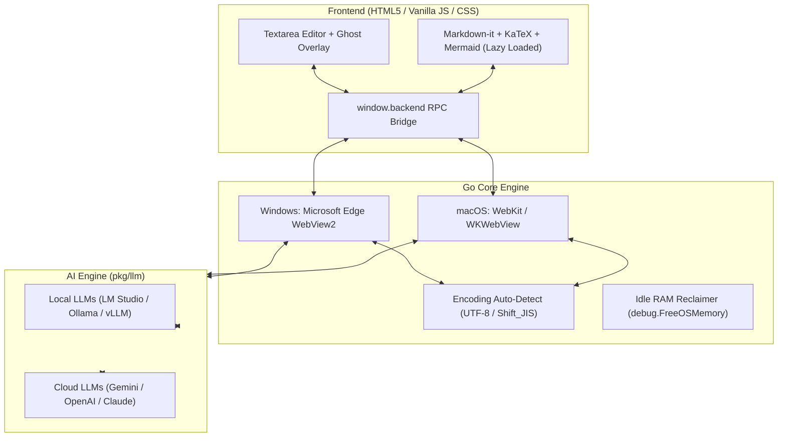

# 📝 MD-Memo

> **超軽量・超高速起動の AI ネイティブ マークダウン & テキストエディタ**  
> **Ultra-lightweight, High-speed, AI-native Markdown & Text Editor for Windows & macOS**

[](https://github.com/youshinh/md-memo/releases)
[](https://golang.org)
[](#)
[](LICENSE)

[🇬🇧 English Documentation](README.md) | **🇯🇵 日本語ドキュメント**

---

## 📸 スクリーンショット (Screenshots)

| エディタ & マークダウンプレビュー画面 | AI & 各種設定画面 |
|:---:|:---:|
|  |  |

---

## ✨ 主な特徴 (Key Features)

- ⚡ **超高速起動 & 極小メモリ**: 起動時間 0.2秒以下、常駐メモリ（Working Set）約 40MB（Goランタイム単体は約 3.5MB）。
- 🌐 **多言語対応 (i18n)**: 英語 (デフォルト) および日本語にワンタップで切り替え可能。
- 💡 **インライン入力予測（Ghost Text）**: GitHub Copilot 感覚で次の文章やアイデアをリアルタイム補完（`Tab` または `→` キーで確定）。
  - ローカルLLM（LM Studio / Ollama / vLLM）およびクラウドLLM（Gemini / OpenAI）に対応。
  - 日本語 IME 変換中の誤送信を防止するスマートデバウンス制御。
  - `<think>` 思考タグの自動ストリップ & 次行暴走の自動カット。
- 🤖 **コンテキスト LLM 指示モード (`Ctrl+L`)**: 選択範囲や全文に対して「要約して」「日本語に翻訳して」「コードをリファクタして」等の指示をワンタップで送信・インライン挿入。
- 👁️ **Gemini 画像 OCR (`Ctrl+V`)**: スクリーンショットや画像をエディタにペーストするだけで、Gemini Vision が自動で高精度マークダウンテキストに書き起こし。
- 🔄 **1画面トグルプレビュー (`Ctrl+P`)**:
  - GFM マークダウンレンダリング
  - KaTeX 数式表示（インライン `$..$`、ブロック `$$..$$`）
  - Mermaid ダイアグラム描画（フローチャート、シーケンス図、ガントチャート等）
- 📑 **マルチタブ & セッション自動復元**:
  - まだ保存していないメモや途中の入力内容もテンポラリに自動保持。
  - アプリを閉じても、次回起動時に**「前回のタブ・未保存内容・カーソル位置」を完全復元**（設定で新規ドキュメント起動との切り替え可能）。
  - 1.5秒入力停止時のスマート自動上書き保存。
- 🔤 **文字コード自動判別 & 保持**: UTF-8 および Shift_JIS（CP932）を自動検出・そのまま保存。
- 📄 **装飾なしテキスト (.txt) エクスポート**: マークダウン記号（`#`, `*`, `[]()`等）を自動除去してクリーンなプレーンテキストで保存。
- 🍏 **クロスプラットフォーム対応**: Windows（Edge WebView2）および macOS（WebKit / WKWebView）両対応。

---

## 📥 ダウンロード & インストール (Download)

### 🪟 Windows の場合
1. [Releases ページ](https://github.com/youshinh/md-memo/releases) から最新の `md-memo-windows-x64.zip` をダウンロードします。
2. zip ファイルを展開し、`md-memo.exe` を実行するだけですぐに使えます（インストーラー不要・単一バイナリ）。

### 🍏 macOS の場合
1. [Releases ページ](https://github.com/youshinh/md-memo/releases) から `md-memo-macos.zip` をダウンロードして展開するか、後述のソースコードからビルドします。
2. `MD-Memo.app` を「アプリケーション」フォルダに移動して起動します。

---

## ⚙️ LLM API 設定ガイド (LLM Configuration)

画面右上の **「設定 (Settings)」** ボタン（または右クリックメニュー）から、利用したい LLM サービスを設定できます。  
テキスト生成用・入力予測用・画像解析用でそれぞれお好みのモデルを自由に割り当て可能です。

### 1. 🌐 Google Gemini (Google AI Studio)
最も低遅延かつ高精度なマルチモーダル対応モデルです。画像貼り付け OCR やリアルタイム入力予測にも最適です。

| 項目 | 設定値例 |
|---|---|
| **API Base URL** | `https://generativelanguage.googleapis.com/v1beta` |
| **モデル名 (推奨)** | `gemini-flash-latest` (標準・高速) / `gemini-flash-lite-latest` (超軽量・最高速) / `gemini-pro-latest` (高精度) |
| **API キー** | [Google AI Studio](https://aistudio.google.com/) で取得した API キー |

---

### 2. 🟢 OpenAI (ChatGPT / GPT-5.6 / o4-mini)
OpenAI の公式 API を利用する場合の設定です。

| 項目 | 設定値例 |
|---|---|
| **API Base URL** | `https://api.openai.com/v1` |
| **モデル名 (推奨)** | `gpt-5.6-luna` (最新・超高速軽量) / `gpt-5.6-sol` (最高性能フラグシップ) / `gpt-5.6-terra` (高バランス) / `o4-mini` (推論モデル) |
| **API キー** | [OpenAI API Keys](https://platform.openai.com/api-keys) で取得した API キー (`sk-...`) |

---

### 3. 🟣 Anthropic Claude (via LiteLLM / OpenAI Proxy)
LiteLLM、Cloudflare AI Gateway、または One-API などの OpenAI 互換プロキシを経由して Claude を使用します。

| 項目 | 設定値例 |
|---|---|
| **API Base URL** | `http://localhost:4000/v1` (LiteLLM プロキシ等のアドレス) |
| **モデル名 (推奨)** | `claude-sonnet-5` (最新フラグシップ・高速高精度) / `claude-haiku-4.5` (超高速) / `claude-opus-5` (複雑なエージェント・コーディング) / `claude-fable-5` |
| **API キー** | プロキシに設定したキー、または `sk-ant-...` |

---

### 4. 💻 LM Studio (完全無料・オフライン ローカルLLM)
LM Studio の「Local Server」を起動して接続します。入力予測（Ghost Text）でコストを気にせず高速補完したい場合に最適です。

| 項目 | 設定値例 |
|---|---|
| **API Base URL** | `http://localhost:1234/v1` (LAN内別PCの場合は `http://192.168.x.x:1234/v1`) |
| **モデル名** | LM Studio でロードした識別子 (例: `google/gemma-4-12b-qat`, `prism-ml/bonsai-27b`, `qwen2.5-coder-7b-instruct`) |
| **API キー** | 空欄または `not-needed` |
| **入力予測設定** | 遅延: `500` ms / 最大トークン: `30`〜`50` |

---

### 5. 🦙 Ollama (完全無料・ローカルLLM)
Ollama が起動している環境であれば、直接または OpenAI 互換エンドポイントで接続可能です。

| 項目 | 設定値例 |
|---|---|
| **API Base URL** | `http://localhost:11434` (Ollamaネイティブ) または `http://localhost:11434/v1` |
| **モデル名** | `qwen2.5-coder:7b`, `llama3.3:latest`, `deepseek-r1:8b` |
| **API キー** | 空欄 |

---

### 6. 🚀 vLLM / llama-server / Text Generation WebUI
OpenAI 互換のローカル推論サーバー全般に対応しています。

| 項目 | 設定値例 |
|---|---|
| **API Base URL** | `http://localhost:8000/v1` |
| **モデル名** | サーバー側でロードしているモデル名 |
| **API キー** | 設定されている場合は入力、なければ空欄 |

---

## ⌨️ キーボードショートカット一覧 (Keyboard Shortcuts)

| Windows / Linux | macOS | 機能 |
|:---|:---|:---|
| <kbd>Tab</kbd> / <kbd>→</kbd> | <kbd>Tab</kbd> / <kbd>→</kbd> | **入力予測（ゴーストテキスト）を確定・挿入** |
| <kbd>Esc</kbd> | <kbd>Esc</kbd> | 入力予測候補を破棄 / モーダルを閉じる |
| <kbd>Ctrl</kbd> + <kbd>L</kbd> | <kbd>⌘ Cmd</kbd> + <kbd>L</kbd> | **LLM への送信・指示モーダルを開く** |
| <kbd>Ctrl</kbd> + <kbd>Enter</kbd> | <kbd>⌘ Cmd</kbd> + <kbd>Enter</kbd> | LLM 指示モーダルから即時送信 |
| <kbd>Ctrl</kbd> + <kbd>P</kbd> / <kbd>Ctrl</kbd> + <kbd>E</kbd> | <kbd>⌘ Cmd</kbd> + <kbd>P</kbd> / <kbd>⌘ Cmd</kbd> + <kbd>E</kbd> | **編集 ⇄ プレビュー表示切替** |
| <kbd>Ctrl</kbd> + <kbd>S</kbd> | <kbd>⌘ Cmd</kbd> + <kbd>S</kbd> | 上書き保存（<kbd>Shift</kbd> 同時押しで「名前を付けて保存」） |
| <kbd>Ctrl</kbd> + <kbd>O</kbd> | <kbd>⌘ Cmd</kbd> + <kbd>O</kbd> | ファイルを開く（Markdown, JSON, YAML, 各種ソースコード等） |
| <kbd>Ctrl</kbd> + <kbd>N</kbd> / <kbd>Ctrl</kbd> + <kbd>T</kbd> | <kbd>⌘ Cmd</kbd> + <kbd>N</kbd> / <kbd>⌘ Cmd</kbd> + <kbd>T</kbd> | 新規タブを作成 |
| <kbd>Ctrl</kbd> + <kbd>W</kbd> | <kbd>⌘ Cmd</kbd> + <kbd>W</kbd> | 現在のタブを閉じる |
| <kbd>Ctrl</kbd> + <kbd>Tab</kbd> | <kbd>⌃ Control</kbd> + <kbd>Tab</kbd> | 次のタブに切り替え |
| <kbd>Ctrl</kbd> + <kbd>V</kbd> | <kbd>⌘ Cmd</kbd> + <kbd>V</kbd> | 貼り付け（画像をペーストした場合は自動で Gemini OCR 実行） |
| <kbd>Ctrl</kbd> + <kbd>A</kbd> | <kbd>⌘ Cmd</kbd> + <kbd>A</kbd> | エディタ内のテキストを全選択 |
| <kbd>F5</kbd> | <kbd>F5</kbd> | カーソル位置に現在日時（`YYYY/MM/DD HH:mm:ss`）を挿入 |

---

## 🛠️ ソースコードからのビルド方法 (Build from Source)

### 前提条件 (Prerequisites)
- [Go 1.22+](https://golang.org/dl/) がインストールされていること

### 🪟 Windows でのビルド
```powershell
# クローン
git clone https://github.com/youshinh/md-memo.git
cd md-memo

# テストの実行
go test -v ./...

# Windows GUI アプリとしてビルド (コンソール非表示・最適化)
go build -ldflags="-H windowsgui -s -w" -trimpath -o md-memo.exe .
```

### 🍏 macOS でのビルド
```bash
# クローン
git clone https://github.com/youshinh/md-memo.git
cd md-memo

# ビルドスクリプトを実行 (MD-Memo.app が生成されます)
chmod +x build_mac.sh
./build_mac.sh

# アプリを起動
open MD-Memo.app
```

---

## 📐 アーキテクチャ (Architecture)



---

## 📜 ライセンス (License)

本ソフトウェアは [MIT License](LICENSE) のもとで公開されています。商用・非商用問わず自由にご利用いただけます。
