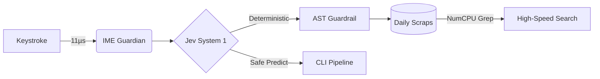

# Architecture & Live Pipeline Overview

MD-Memo is a zero-latency, local-first scratchpad buffer sitting right in front of Obsidian and Notion.

## System Topology & Flow

## Quick Checklist
- [x] Sub-15ms wake latency from system tray
- [x] Autonomous IME shielding (zero full-width code typos)
- [x] Air-gapped Ollama / Gemma 4 E2B Ghost Text
- [ ] Background Git push to remote repository
